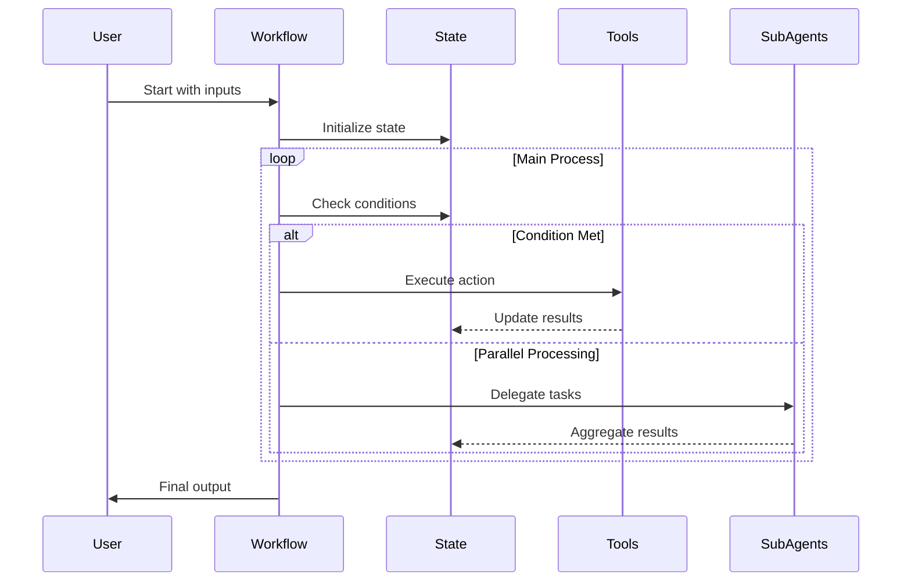

# /workflow:generate

**Purpose**: Generate a complete MCP workflow definition by asking questions to understand requirements, then create a ready-to-run workflow YAML file.

## Usage
- `/workflow:generate` - Start the workflow generation process
- `/workflow:generate --example` - Generate an example workflow template
- `/workflow:generate --type <type>` - Generate specific workflow type (file-processing, validation, deployment, etc.)

## Critical Rules
- ALWAYS ask clarifying questions until requirements are clear
- ALWAYS verify understanding with a sequence diagram before generating
- ALWAYS generate valid YAML that can be executed immediately
- ALWAYS include error handling and validation steps
- NEVER skip the verification step
- FOCUS on creating workflows that solve real problems

## Workflow YAML Schema Reference

### Top-Level Structure
```yaml
# Required fields
name: string                    # Format: "namespace:workflow_name"
description: string             # Human-readable description
version: string                 # Semantic version (e.g., "1.0.0")

# Optional fields
config: object                  # Workflow configuration options
default_state:                  # Initial state values
  raw: object                   # Direct writable values
  computed: object             # Read-only (usually empty initially)
  state: object                # Alternative writable tier

state_schema:                   # State field definitions
  raw: object                  # Type definitions for raw fields
  computed: object             # Computed field transformations
  state: object                # Type definitions for state fields

inputs: object                  # Input parameter definitions
steps: array                    # Workflow steps to execute
sub_agent_tasks: object        # Tasks for parallel sub-agent execution
```

### State Schema
```yaml
state_schema:
  raw:
    field_name: "string"        # Types: string, number, boolean, object, array
    
  computed:
    field_name:
      from: string | array      # Source path(s): "raw.value" or ["raw.a", "raw.b"]
      transform: string         # JavaScript expression
      on_error: string          # "use_fallback", "propagate", or "ignore"
      fallback: any             # Default value for errors
```

### Input Parameters
```yaml
inputs:
  parameter_name:
    type: string                # string, number, boolean, object, array
    description: string         # Parameter description
    required: boolean           # Default: true
    default: any               # Default value if not provided
    validation: object         # Optional validation rules
```

### Step Types

#### 1. state_update
```yaml
- type: "state_update"
  id: string                   # Optional (auto-generated if omitted)
  path: string                 # State path (e.g., "raw.counter")
  value: any                   # Value to set
  operation: string            # set (default), increment, decrement, append, multiply
```

#### 2. mcp_call
```yaml
- type: "mcp_call"
  tool: string                 # MCP tool name
  parameters: object           # Tool parameters
  store_result: string         # State path to store tool result (e.g., "raw.tool_output")
  timeout: number              # Optional timeout in seconds
```

#### 3. user_message
```yaml
- type: "user_message"
  message: string              # Supports {{ variable }} templates
  type: string                 # info (default), warning, error, success
  title: string                # Optional title
  format: string               # text (default), markdown, code
```

#### 4. user_input
```yaml
- type: "user_input"
  prompt: string               # Input prompt
  variable_name: string        # Variable name (default: "user_input")
  input_type: string           # string (default), number, boolean, json
  validation_pattern: string   # Optional regex
  required: boolean            # Default: true
  state_update:                # Optional
    path: string
```

#### 5. shell_command
```yaml
- type: "shell_command"
  command: string              # Shell command to execute
  state_update:                # Optional
    path: string
    value: string              # stdout (default), stderr, returncode, full_output
```

#### 6. conditional
```yaml
- type: "conditional"
  condition: string            # JavaScript expression
  then_steps: array            # Steps if true
  else_steps: array            # Steps if false (optional)
```

#### 7. while_loop
```yaml
- type: "while_loop"
  condition: string            # Loop condition
  max_iterations: number       # Default: 100
  body: array                  # Steps to repeat
```

#### 8. foreach
```yaml
- type: "foreach"
  items: string                # Expression returning array
  variable_name: string        # Loop variable (default: "item")
  index_name: string           # Index variable (default: "index")
  body: array                  # Steps to execute per item
```

#### 9. parallel_foreach
```yaml
- type: "parallel_foreach"
  items: string                # Expression returning array
  max_parallel: number         # Default: 10
  sub_agent_task: string       # Task name from sub_agent_tasks
  timeout_seconds: number      # Optional timeout
```

#### 10. break / continue
```yaml
- type: "break"                # Exit current loop
- type: "continue"             # Skip to next iteration
```

#### 11. batch_state_update
```yaml
- type: "batch_state_update"
  updates:                     # Array of updates
    - path: string
      value: any
    - path: string
      value: any
```

#### 12. agent_shell_command
```yaml
- type: "agent_shell_command"
  command: string              # Command for agent to execute
  reason: string               # Reason for command
  capture_output: boolean      # Default: true
  state_update: object         # Optional state update
```

#### 13. internal_mcp_call
```yaml
- type: "internal_mcp_call"
  tool: string                 # Internal MCP tool
  parameters: object           # Tool parameters
  state_update: object         # Optional state update
```

#### 14. conditional_message
```yaml
- type: "conditional_message"
  condition: string            # Condition to evaluate
  message: string              # Message if true
  type: string                 # Message type
  format: string               # Message format
```

#### 15. agent_task
```yaml
- type: "agent_task"
  prompt: string               # Task instruction for the agent
  context: object              # Optional additional context
```

### Sub-Agent Tasks
```yaml
sub_agent_tasks:
  task_name:
    description: string        # Task description
    inputs: object            # Same format as workflow inputs
    context_template: object  # Context for sub-agent
    prompt_template: string   # Prompt template
```

### Variable Templates
Use `{{ variable_name }}` in strings to reference:
- State values: `{{ raw.counter }}`, `{{ computed.total }}`
- Input parameters: `{{ project_path }}`
- Loop variables: `{{ item }}`, `{{ index }}`
- Special functions: `{{ now() }}` for current timestamp

### State Update Operations
For `state_update` steps, the `operation` field supports:
- `set`: Replace value (default)
- `increment`: Add 1 to number
- `decrement`: Subtract 1 from number
- `append`: Add to array
- `multiply`: Multiply by value

### Expression Context
JavaScript expressions in conditions and transforms have access to:
- All state variables (flattened view)
- `input`: The source value(s) for transforms
- Standard JS functions and operators
- Loop variables when inside loops

### Common Patterns
```yaml
# Counter increment
- type: "state_update"
  path: "raw.counter"
  operation: "increment"

# MCP tool call with result storage
- type: "mcp_call"
  tool: "aromcp.lint_project"
  parameters:
    use_eslint_standards: true
  store_result: "raw.lint_output"

# Agent task instruction
- type: "agent_task"
  prompt: "Fix any linting errors found in the file"

# Conditional with state check
- type: "conditional"
  condition: "{{ computed.has_errors }}"
  then_steps:
    - type: "user_message"
      message: "Found {{ raw.errors.length }} errors"
      type: "error"

# Parallel file processing
- type: "parallel_foreach"
  items: "{{ computed.valid_files }}"
  max_parallel: 5
  sub_agent_task: "process_file"

# User choice handling
- type: "user_input"
  prompt: "Continue with deployment? (yes/no)"
  validation_pattern: "^(yes|no)$"
  state_update:
    path: "raw.user_choice"
```

## Execution Process

### 1. Gather Requirements [TODO: gather-requirements]
Start with fundamental questions:
- What is the main goal of this workflow?
- What type of tasks will it perform? (file processing, validation, deployment, automation, etc.)
- What inputs does it need? (file paths, configuration, user choices)
- Does it need to process multiple items? (requiring loops or parallel execution)
- Are there conditional decisions to make?
- What tools/commands will it need to execute?
- What should happen on errors?
- What output or final state is expected?

Continue asking follow-up questions based on answers:
- For file processing: What file types? What operations? Batch processing?
- For validation: What checks? Fix automatically? Report format?
- For deployment: What environments? Approval steps? Rollback strategy?
- For automation: What triggers? Scheduled? Dependencies?

### 2. Identify Workflow Components [TODO: identify-components]
Based on requirements, determine:
- **Input parameters**: Types, validation, defaults
- **State structure**: What data to track (counters, results, status)
- **Computed fields**: Derived values, aggregations, transformations
- **Step types needed**:
  - Basic: state_update, mcp_call, user_message, shell_command
  - Control: conditional, while, foreach, parallel_foreach
  - Interactive: user_input, user_message
- **Sub-agent tasks**: For parallel processing
- **Error handling**: Retries, fallbacks, cleanup

### 3. Review Workflow Name and Inputs [TODO: review-name-inputs]
Before creating the sequence diagram, present the proposed workflow configuration for user review:

```
Proposed Workflow Configuration:
================================
Workflow Name: [namespace]:[name]
Description: [description]

Input Parameters:
- [param1]: [type] - [description] (default: [value])
- [param2]: [type] - [description] (default: [value])
...

Is this configuration correct? Would you like to:
1. Change the workflow name?
2. Modify any input parameters?
3. Add or remove parameters?
4. Proceed as-is?
```

Wait for user confirmation or requested changes. If changes are requested, update the configuration and ask for confirmation again before proceeding.

### 4. Create Sequence Diagram [TODO: create-diagram]
After workflow name and inputs are confirmed, generate a Mermaid sequence diagram showing:


Present diagram and ask: "Does this accurately represent your workflow? Any adjustments needed?"

### 5. Design State Schema [TODO: design-state]
Create the state structure:
```yaml
default_state:
  raw:
    # Direct values
    start_time: "{{ now() }}"
    items_to_process: []
    results: {}
    errors: []
    
state_schema:
  computed:
    # Derived values
    total_items:
      from: "raw.items_to_process"
      transform: "input.length"
    
    success_count:
      from: "raw.results"
      transform: "Object.values(input).filter(r => r.success).length"
    
    has_errors:
      from: "raw.errors"
      transform: "input.length > 0"
```

### 6. Generate Workflow YAML [TODO: generate-yaml]
Create the complete workflow at `.aromcp/workflows/[namespace]:[name].yaml`:

```yaml
name: "[namespace]:[workflow_name]"
description: "[Clear description of what this workflow does]"
version: "1.0.0"

# Configuration
config:
  max_retries: 3
  timeout_seconds: 300

# Initial state
default_state:
  raw:
    [state_fields]

# State transformations
state_schema:
  computed:
    [computed_fields]

# Input parameters
inputs:
  [parameter_name]:
    type: "[string|number|boolean|array|object]"
    description: "[What this parameter is for]"
    required: [true|false]
    default: [value]

# Workflow steps
steps:
  # Step 1: Initialize
  - type: "user_message"
    message: "Starting [workflow_name] workflow..."
    
  # Step 2: Validate inputs
  - type: "conditional"
    condition: "{{ [validation_expression] }}"
    then_steps:
      - type: "user_message"
        message: "✓ Inputs validated"
    else_steps:
      - type: "user_message"
        message: "✗ Invalid input: [error_details]"
        message_type: "error"
      - type: "break"
  
  # Step 3: Main processing
  [main_workflow_steps]
  
  # Step 4: Finalize
  - type: "user_message"
    message: "Workflow completed. Results: {{ [summary] }}"

# Sub-agent tasks (if needed)
sub_agent_tasks:
  [task_name]:
    description: "[What this sub-task does]"
    inputs:
      [parameters]
    steps:
      [sub_task_steps]
```

### 7. Validate Generated Workflow [TODO: validate-workflow]
After generating, perform checks:
- Verify YAML syntax is valid
- Check all variable references exist
- Ensure step types are correct
- Validate expressions compile
- Confirm sub-agent tasks are properly defined

### 8. Create Documentation [TODO: create-docs]
Generate a README at `.aromcp/workflows/[namespace]:[name].README.md`:
```markdown
# [Workflow Name]

## Purpose
[What this workflow does and why]

## Prerequisites
- [Required tools/configurations]
- [Expected file structure]

## Usage
```bash
# Start the workflow
mcp workflow start [namespace]:[name] --input param1=value1
```

## Inputs
| Parameter | Type | Required | Description |
|-----------|------|----------|-------------|
| [param] | [type] | [Y/N] | [description] |

## Workflow Steps
1. **[Step Name]**: [What it does]
2. **[Step Name]**: [What it does]
...

## Output
[What the workflow produces]

## Error Handling
[How errors are handled]
```

### 9. Provide Usage Instructions [TODO: provide-instructions]
Show the user:
```
✅ Workflow generated successfully!

📁 Created files:
- .aromcp/workflows/[namespace]:[name].yaml
- .aromcp/workflows/[namespace]:[name].README.md

🚀 To run this workflow:
1. Start the MCP workflow server if not running
2. Execute: mcp workflow start [namespace]:[name] --input [params]

📊 To monitor progress:
- mcp workflow status [workflow_id]
- mcp workflow get-next-step [workflow_id]

🔧 To modify:
- Edit the YAML file and restart the workflow
- Use 'mcp workflow validate [namespace]:[name]' to check syntax
```

## Common Workflow Templates

### File Processing Workflow
- Parallel processing of multiple files
- Batch operations with progress tracking
- Error collection and retry logic

### Validation Workflow
- Sequential checks with early exit
- Fix-on-the-fly capabilities
- Detailed reporting

### Deployment Workflow
- Environment-specific configurations
- Approval gates
- Rollback mechanisms

### Data Pipeline Workflow
- ETL operations
- Data validation
- Transformation tracking

## Error Handling
- If requirements unclear: Keep asking questions
- If sequence diagram rejected: Revise and re-verify
- If YAML generation fails: Show error and retry
- If validation fails: Fix issues and regenerate

## Examples

### Example 1: Simple file processor
```
/workflow:generate
User: "I need to process all TypeScript files and fix linting"
Assistant: [Asks about file locations, fix vs report, parallel processing]
User: [Provides answers]
Assistant: [Shows sequence diagram]
User: "Looks good"
Assistant: [Generates complete workflow]
```

### Example 2: Complex deployment
```
/workflow:generate --type deployment
Assistant: [Asks about environments, approval steps, rollback]
User: [Provides detailed requirements]
Assistant: [Creates multi-stage workflow with conditionals]
```

### Example 3: Quick template
```
/workflow:generate --example
Assistant: [Generates a basic template with common patterns]
```