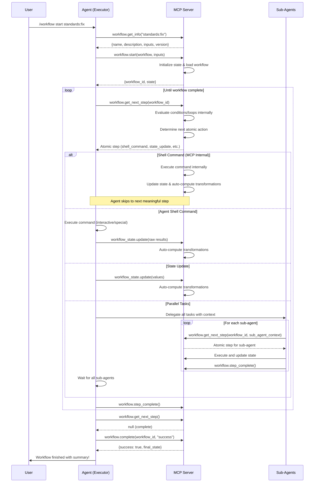
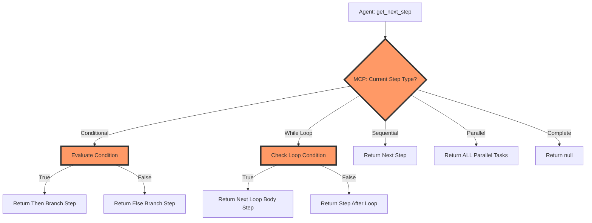

# MCP Workflow System - Complete Design

## Core Architecture

### MCP-Controlled Standard Prompts

The MCP server provides standard prompts for common workflow patterns. These prompts are not defined in workflows but are controlled by the MCP server to ensure consistency.

#### Standard parallel_foreach Sub-agent Prompt

```
You are a workflow sub-agent. Your role is to execute a specific task by following the workflow system.

Process:
1. Call workflow.get_next_step with your task_id to get the next atomic action
2. Execute the action exactly as instructed
3. Update state as directed in the step
4. Mark the step complete
5. Repeat until get_next_step returns null

The workflow will guide you through all necessary steps. Simply follow the instructions
provided by each step. Do not make assumptions about what needs to be done - the 
workflow will tell you everything.
```

This prompt is automatically used for all `parallel_foreach` steps unless explicitly overridden with `sub_agent_prompt_override`.

Benefits:
- **Consistency**: All workflows get the same sub-agent behavior
- **Centralized Updates**: Improve the prompt once, all workflows benefit
- **Simplified Workflows**: No need to repeat prompts in every workflow
- **Future Evolution**: Can add new prompt types as patterns emerge

### System Overview

The workflow system uses a **reactive state transformation model** with **MCP-controlled flow**:

1. **MCP manages all control flow** (conditions, loops, step sequencing)
2. **Agent executes only atomic operations** (commands, state updates, delegations)
3. **MCP automatically computes derived state** based on transformation rules
4. **Agent calls get_next_step** → receives atomic executable step → executes → repeat
5. **For parallel tasks**, MCP returns all tasks to execute simultaneously
6. **Agent never evaluates conditions** or determines flow

Key insights:
- Agents are simple executors - no workflow logic needed
- MCP handles all conditionals, loops, and step sequencing internally
- State transformations are still reactive and automatic
- Each step returned is immediately executable without decisions



### MCP Control Flow



## Workflow Definition Format

The workflow YAML defines the logical flow. The MCP server interprets this and returns atomic executable steps to agents.

### Basic YAML Structure

```yaml
# Workflow files are loaded by name from:
# 1. ./.aromcp/workflows/standards:fix.yaml (project-specific, checked first)
# 2. ~/.aromcp/workflows/standards:fix.yaml (user global, fallback)
name: "standards:fix"
description: "What this workflow accomplishes"
version: "1.0.0"

# Import shared components
imports:
  - "shared/common-tasks.yaml"

# Default state initialization (automatically set by MCP on workflow.start)
default_state:
  raw:
    start_time: "{{ now() }}"
    batch_status: {}
    file_results: {}
    errors: []

# Define state structure with reactive transformations
state_schema:
  # Raw state - set by agents
  raw:
    command_output: string
    file_list: array

  # Computed state - automatically derived by MCP
  computed:
    filtered_files:
      from: "raw.file_list"
      transform: |
        input
          .filter(f => !f.includes('node_modules'))
          .filter(f => !f.includes('.min.'))
          .filter(f => !f.endsWith('.d.ts'))

    file_batches:
      from: "computed.filtered_files"
      transform: |
        input.reduce((batches, file, index) => {
          const batchIndex = Math.floor(index / 3);
          if (!batches[batchIndex]) batches[batchIndex] = [];
          batches[batchIndex].push(file);
          return batches;
        }, []).map((files, idx) => ({
          id: `batch_${idx}`,
          files: files,
          status: 'pending'
        }))

    ready_batches:
      from: ["computed.file_batches", "raw.batch_status"]
      transform: |
        input[0].filter(batch =>
          (input[1][batch.id] || 'pending') === 'pending'
        )

# Workflow inputs
inputs:
  param_name:
    type: string
    default: "value"
    required: false
    description: "Parameter description"

# Workflow steps - MCP interprets these
steps:
  - id: "step_id"
    type: "shell_command"
    command: "git diff --name-only HEAD"
    output_format: "lines"
    state_update:
      path: "raw.file_list"

# Sub-agent task definitions
sub_agent_tasks:
  task_name:
    inputs:
      param: "value"
    steps:
      - id: "substep"
        type: "mcp_call"
        # Sub-agent step configuration
```

### State Schema Features

```yaml
# Default state values (applied automatically on workflow.start)
default_state:
  raw:
    counter: 0
    status: "initialized"
    items: []
    config:
      retries: 3
      timeout: 5000

state_schema:
  # Simple raw fields
  raw:
    git_output: string
    test_results: object

  # Computed fields with single dependency
  computed:
    parsed_files:
      from: "raw.git_output"
      transform: "input.split('\\n').filter(l => l.trim())"

    # Computed from another computed field (cascading)
    valid_files:
      from: "computed.parsed_files"
      transform: |
        input.filter(f =>
          f.endsWith('.ts') ||
          f.endsWith('.js')
        )

    # Multiple dependencies
    analysis_summary:
      from: ["computed.valid_files", "raw.test_results"]
      transform: |
        {
          total_files: input[0].length,
          failed_tests: input[1].failed || 0,
          ready_to_deploy: input[0].length > 0 && input[1].failed === 0
        }

    # Access full state in transform (MCP provides flattened view internally)
    complex_calculation:
      from: "computed.valid_files"
      transform: |
        input.map(file => ({
          path: file,
          has_test: test_results.files?.includes(file),  // MCP provides flattened access
          batch: file_batches?.findIndex(b => b.includes(file))
        }))
```

**Note**: While workflows define state structure with raw/computed sections, agents always receive and reference state values using flattened paths (e.g., `{{ file_count }}` instead of `{{ state.raw.file_count }}`).

### Step Types (Workflow Definition)

These define the workflow logic in YAML. MCP interprets these and returns atomic executable steps.

```yaml
# User input with validation
- type: "user_input"
  prompt: |
    What files do you want to process?
    Options: branch <name>, commit <guid>, file-path <path>, or HEAD
  validation:
    pattern: "^(branch .+|commit [a-f0-9]{7,40}|file-path .+|HEAD)$"
    error_message: "Please provide a valid option"
  state_update:
    path: "raw.user_choice"

# MCP tool call
- type: "mcp_call"
  mcp:
    method: "tool.method"
    params:
      param1: "value"
  state_update:
    path: "raw.tool_result"
    # Triggers automatic transformations

# Shell command execution (by MCP internally)
- type: "shell_command"
  command: "git diff --name-only HEAD"
  output_format: "lines"  # lines | json | text | key_value
  on_error: "fail"  # fail | continue | retry
  retry_count: 3
  state_update:
    path: "raw.git_files"
    # MCP executes internally and computes filtered_files, batches, etc.

# Shell command that agent must execute (rare cases)
- type: "agent_shell_command"
  command: "./interactive-script.sh"
  reason: "Requires interactive terminal or special permissions"
  output_format: "json"
  timeout: 300000  # 5 minutes
  state_update:
    path: "raw.script_result"

# Apply hints transformation (specialized step)
- type: "apply_hints"
  file: "{{ item }}"
  hints: "{{ file_results[item].hints }}"
  state_update:
    path: "raw.file_results.{{ item | path_to_key }}.hints_applied"
    value: "{{ applied_count }}"

# Conditional execution (MCP evaluates internally using flattened paths)
- type: "conditional"
  condition: "{{ ready_to_deploy }}"  # MCP knows this is computed.ready_to_deploy
  then:
    - type: "mcp_call"
      # Steps if true
  else:
    - type: "mcp_call"
      # Steps if false

# Parallel batch processing (uses MCP default prompt)
- type: "parallel_foreach"
  items: "{{ ready_batches }}"  # MCP knows this is computed.ready_batches
  max_parallel: 10
  wait_for_all: true
  sub_agent_task: "task_name"
  # Uses MCP server's default parallel_foreach prompt

# While loop pattern (MCP manages iterations)
- type: "while"
  condition: "{{ has_errors && retry_count < 5 }}"  # MCP resolves paths internally
  max_iterations: 10
  body:
    - type: "shell_command"
      # Retry logic
    - type: "state_update"
      path: "raw.retry_count"  # Must use full path for updates
      operation: "increment"
    - type: "conditional"
      condition: "{{ !has_errors }}"
      then:
        - type: "break"  # Exit the while loop early

# User messaging (using flattened paths)
- type: "user_message"
  message: "Status: {{ summary }}"  # MCP knows this is computed.summary
```

### Atomic Steps (What Agents Receive)

When agents call `workflow.get_next_step`, they receive atomic, immediately executable steps with all logic already evaluated:

```typescript
// Shell command with variables replaced
{
  id: "detect_files.shell_command",
  type: "shell_command",
  instructions: "Execute the git command and store output as lines array at path 'raw.git_files'",
  definition: {
    command: "git diff --name-only main",  // Variables already replaced
    output_format: "lines",
    state_update: {
      path: "raw.git_files",  // Full path required for updates
      value: "{{ result }}"   // Agent replaces with actual result
    }
  },
  variable_replacements: {
    "{{ inputs.branch }}": "main"  // For reference
  }
}

// State update with computed values
{
  id: "update_status",
  type: "state_update",
  instructions: "Update the state with provided values. Values are already computed.",
  definition: {
    updates: [
      { path: "raw.file_count", operation: "set", value: 7 },  // MCP computed this
      { path: "raw.status", operation: "set", value: "ready" }
    ]
  },
  original_expression: "valid_files.length"  // Shows the flattened expression used
}

// Parallel tasks fully expanded
{
  id: "process_batches",
  type: "parallel_tasks",
  instructions: "Create sub-agents for ALL tasks. Execute in parallel. Wait for ALL to complete.",
  definition: {
    // sub_agent_prompt provided by MCP server's default parallel_foreach prompt
    tasks: [
      {
        task_id: "batch_0",
        context: { batch_id: "batch_0", files: ["src/a.ts", "src/b.ts"], workflow_id: "wf_123" }
      },
      {
        task_id: "batch_1",
        context: { batch_id: "batch_1", files: ["src/c.ts"], workflow_id: "wf_123" }
      }
    ]
  }
}

// MCP call with all parameters resolved
{
  id: "check_typescript",
  type: "mcp_call",
  instructions: "Call TypeScript check and store result at specified path",
  definition: {
    method: "check_typescript",
    params: { files: ["src/index.ts", "src/utils.ts"] },  // Computed from state
    state_update: {
      path: "raw.typescript_results"  // Full path required
    }
  }
}

// User message with values interpolated
{
  id: "report_complete",
  type: "user_message",
  instructions: "Display this message to the user",
  definition: {
    message: "Processed 7 files with 23 fixes applied!"  // MCP interpolated from flattened state
  }
}
```

Key differences from workflow definitions:
- No conditionals or loops - MCP already evaluated them
- Variables replaced with actual values
- Expressions computed into concrete values
- Parallel items expanded into explicit task list
- Clear instructions for the agent to follow
- State updates always use full paths (raw.* or state.*)

### Workflow Composition

```yaml
# shared/check-standards.yaml
workflow:
  name: "shared:check-standards"

  state_schema:
    raw:
      files: array
      typescript_results: object
      lint_results: object

    computed:
      files_with_errors:
        from: ["raw.typescript_results", "raw.lint_results"]
        transform: |
          Object.keys(input[0])
            .filter(f => input[0][f].errors > 0 || input[1][f].errors > 0)

      total_issues:
        from: ["raw.typescript_results", "raw.lint_results"]
        transform: |
          Object.values(input[0]).reduce((sum, r) => sum + r.errors, 0) +
          Object.values(input[1]).reduce((sum, r) => sum + r.errors, 0)

  steps:
    - id: "check_typescript"
      type: "foreach"
      items: "{{ inputs.files }}"
      steps:
        - type: "mcp_call"
          mcp:
            method: "check_typescript"
            params:
              files: ["{{ item }}"]
          state_update:
            path: "raw.typescript_results.{{ item }}"
            value: "{{ result }}"

    - id: "check_lint"
      type: "foreach"
      items: "{{ inputs.files }}"
      steps:
        - type: "mcp_call"
          mcp:
            method: "lint_project"
            params:
              target_files: "{{ item }}"
          state_update:
            path: "raw.lint_results.{{ item }}"
            value: "{{ result }}"

# main-workflow.yaml
imports:
  - "shared/check-standards.yaml"

steps:
  - id: "run_checks"
    type: "include_workflow"
    workflow: "shared:check-standards"
    inputs:
      files: "{{ valid_files }}"
    # Computed state from included workflow is available
```

## State Management Design

The workflow system internally maintains state in three categories (raw, computed, state) but presents a **flattened view** to agents for reading:

```typescript
// Internal state structure (MCP manages this)
interface WorkflowState {
  raw: {
    [key: string]: any;  // Agent-writable values
  };
  computed: {
    [key: string]: any;  // MCP-computed values
  };
  state: {
    [key: string]: any;  // Legacy/manual values
  };
}

// What agents see when reading state
interface FlattenedState {
  [key: string]: any;  // All values merged into single namespace
}
```

**Reading State**: Agents receive a flattened view with all values
```javascript
// Agent calls:
workflow_state.read({ workflow_id: "wf_123" })

// Receives:
{
  attempts: 0,
  git_files: ["src/a.ts", "src/b.ts"],
  valid_files: ["src/a.ts"],  // computed value
  is_complete: false,         // computed value
  version: "1.0"              // from state.*
}
```

**Writing State**: Agents must use full paths to specify writable locations
```javascript
// Agent calls:
workflow_state.update({
  workflow_id: "wf_123",
  updates: [
    { path: "raw.attempts", value: 1 },          // Must use raw.*
    { path: "raw.git_files", value: [...] },     // Must use raw.*
    { path: "state.version", value: "1.1" }      // Or state.*
  ]
})
```

**Using State in Workflows**: Conditions and expressions use flattened paths
```yaml
# In workflow YAML:
- type: "conditional"
  condition: "{{ file_count > 0 && is_ready }}"  # Not state.raw.file_count

- type: "user_message"
  message: "Processing {{ valid_files.length }} files"  # Not state.computed.valid_files

# But updates always use full paths:
- type: "state_update"
  path: "raw.file_count"  # Must specify raw/state prefix
  value: 10
```

**Namespace Handling**: MCP flattens state intelligently
- Computed values take precedence over raw values with same name
- Use unique field names to avoid confusion
- MCP warns about namespace collisions during workflow validation

This design ensures:
- **Simple reading**: Agents don't need to navigate nested structures
- **Explicit writing**: Clear distinction of what's writable
- **Clean workflow syntax**: Conditions and templates use natural paths
- **No confusion**: Agents can't accidentally try to write computed values

### Default State Initialization

The workflow system supports automatic state initialization through the `default_state` section:

```yaml
default_state:
  raw:
    # Static values
    counter: 0
    enabled: true
    items: []

    # Dynamic values (evaluated by MCP on start)
    start_time: "{{ now() }}"
    workflow_run_id: "{{ uuid() }}"

    # Using inputs
    max_retries: "{{ inputs.retries || 3 }}"
    target_branch: "{{ inputs.branch || 'main' }}"

    # Complex structures
    config:
      timeout: 5000
      parallel_limit: "{{ inputs.parallel || 10 }}"
```

When `workflow.start` is called, MCP initializes the state with these defaults, evaluating any expressions. The agent receives the fully initialized state values.

### State Update Flow

From the agent's perspective:
1. Agent updates raw state via `workflow_state.update`
2. Agent receives computed field updates that resulted from the change
3. Agent continues with workflow execution using the new state values

The reactive transformations happen automatically - agents just see the results.

### Example State Updates

```yaml
# Agent sets raw state
- type: "shell_command"
  command: "find . -name '*.ts' -exec wc -l {} +"
  output_format: "lines"
  state_update:
    path: "raw.line_counts"  # Must use full path
    value: "{{ result }}"

# MCP automatically computes:
# - parsed_counts (parse the wc output)
# - large_files (files > 1000 lines)
# - summary_stats (total lines, avg, etc.)

# Agent can immediately use computed state in conditions
- type: "conditional"
  condition: "{{ large_files.length > 0 }}"  # Flattened path
  then:
    - type: "user_message"
      message: "Found {{ large_files.length }} large files"
```

## Workflow Loading Mechanism

### Workflow Name Resolution

The MCP server uses a name-based workflow loading system with the following priority:

1. **Project-specific workflows**: `./.aromcp/workflows/{name}.yaml`
2. **User global workflows**: `~/.aromcp/workflows/{name}.yaml`

When a workflow is requested by name (e.g., `"standards:fix"`), the MCP server:

```typescript
// Workflow loading logic used by workflow.get_info, workflow.start, and workflow.load_definition
function loadWorkflow(workflowName: string): WorkflowDefinition {
  // 1. Try project-specific location first
  const projectPath = `./.aromcp/workflows/${workflowName}.yaml`;
  if (exists(projectPath)) {
    return {
      ...parseYaml(projectPath),
      loaded_from: projectPath,
      source: "project"
    };
  }

  // 2. Fall back to user global location
  const globalPath = `~/.aromcp/workflows/${workflowName}.yaml`;
  if (exists(expandHome(globalPath))) {
    return {
      ...parseYaml(expandHome(globalPath)),
      loaded_from: expandHome(globalPath),
      source: "global"
    };
  }

  throw new Error(`Workflow '${workflowName}' not found in:
    - ${projectPath}
    - ${globalPath}`);
}

// Used internally by the MCP server for workflow execution
function loadDefinition(workflowName: string): FullWorkflowDefinition {
  const definition = loadWorkflow(workflowName);

  // Process imports recursively
  const resolvedDefinition = resolveImports(definition);

  // Validate workflow structure
  validateWorkflow(resolvedDefinition);

  // Return full definition with metadata
  return {
    ...resolvedDefinition,
    loaded_from: definition.loaded_from,
    source: definition.source,
    resolved_imports: getImportTree(definition)
  };
}
```

### Workflow Naming Convention

- **Use colons for namespacing**: `category:action` (e.g., `standards:fix`, `deps:update`)
- **No file extensions in names**: Just use `standards:fix`, not `standards:fix.yaml`
- **Case-sensitive names**: `Standards:Fix` is different from `standards:fix`
- **Valid characters**: Letters, numbers, hyphens, underscores, and colons

### Examples

```bash
# Directory structure
./.aromcp/workflows/
├── standards:fix.yaml      # Project-specific standards workflow
├── deps:analyze.yaml       # Project-specific dependency workflow
└── custom:build.yaml       # Project-specific build workflow

~/.aromcp/workflows/
├── standards:fix.yaml      # Global standards workflow (shadowed by project)
├── code:format.yaml        # Global code formatting workflow
└── git:hooks.yaml          # Global git hooks workflow
```

```typescript
// Usage examples
workflow.get_info({ workflow: "standards:fix" });     // Loads from ./.aromcp/workflows/
workflow.get_info({ workflow: "code:format" });       // Loads from ~/.aromcp/workflows/
workflow.start({ workflow: "deps:analyze" });         // Loads from ./.aromcp/workflows/
```

## MCP Server Tools

### Existing MCP Tools (Already Available)

The workflow system leverages these existing MCP tools:

```typescript
// File Operations (from FileSystem server)
- list_files(patterns: string | string[]) → string[]
  // Use for: Scanning project files, finding files to process

- read_files(files: string | string[], page?: number, max_tokens?: number) → dict
  // Use for: Reading file contents for analysis

- write_files(files: dict[str, str]) → None
  // Use for: Creating new workflow state files, outputs

// Build Tools (from Build server)
- check_typescript(files?: string | string[]) → dict
  // Use for: TypeScript compilation in standards:fix workflow

- lint_project(use_standards?: bool, target_files?: string | string[]) → dict
  // Use for: Linting files in standards:fix workflow

- run_test_suite(test_command?: string, ...) → dict
  // Use for: Running tests as part of workflows

// Analysis Tools (from Analysis server)
- find_dead_code(project_root?: string, ...) → dict
  // Use for: Code cleanup workflows

- find_import_cycles(project_root?: string, ...) → dict
  // Use for: Architecture improvement workflows

- extract_api_endpoints(project_root?: string, ...) → dict
  // Use for: API documentation workflows

// Standards Tools (from Standards server)
- hints_for_file(file_path: string, ...) → dict
  // Use for: Getting coding hints during workflows

- get_session_stats(session_id?: string) → dict
  // Use for: Tracking workflow progress across sessions
```

### New MCP Tools Needed for Workflows

```typescript
// Workflow Management Tools
interface WorkflowTools {
  // Get workflow definition info
  "workflow.get_info": (params: {
    workflow: string;  // e.g., "standards:fix"
  }) => {
    name: string;
    description: string;
    inputs: {
      [key: string]: {
        type: string;
        default?: any;
        required?: boolean;
        description?: string;
      };
    };
    version: string;
    found_at: string;  // Path where workflow was found (for debugging)
  };

  // Initialize a new workflow instance
  "workflow.start": (params: {
    workflow: string;  // e.g., "standards:fix" - MCP resolves to file
    inputs?: Record<string, any>;
  }) => {
    workflow_id: string;
    state: Record<string, any>;  // Flattened view of all state values
  };

  // Get next atomic step to execute
  "workflow.get_next_step": (params: {
    workflow_id: string;
    sub_agent_context?: {
      batch_id?: string;
      task_id?: string;
      [key: string]: any;
    };
  }) => {
    step: AtomicStep | null;  // null if workflow complete
  } | null;

  // Mark step as complete
  "workflow.step_complete": (params: {
    workflow_id: string;
    step_id: string;
    status?: "success" | "failed";
  }) => {
    success: boolean;
  };

  // Resume workflow from checkpoint
  "workflow.resume": (params: {
    workflow_id: string;
  }) => {
    workflow_id: string;
    state: Record<string, any>;  // Flattened view of all state values
    last_checkpoint: {
      step_id: string;
      timestamp: string;
    };
  };

  // Load workflow definition (used internally by MCP)
  "workflow.load_definition": (params: {
    workflow: string;  // e.g., "standards:fix"
  }) => {
    name: string;
    steps: any[];
    state_schema: {
      raw: any;
      computed: Record<string, ComputedFieldDefinition>;
    };
    sub_agent_tasks: any;
    loaded_from: string;  // Actual file path loaded
  };

  // Create checkpoint for recovery
  "workflow.checkpoint": (params: {
    workflow_id: string;
    step_id: string;
    reason: string;
  }) => {
    checkpoint_id: string;
    state_path: string;
  };

  // Mark workflow complete
  "workflow.complete": (params: {
    workflow_id: string;
    status: "success" | "failed" | "cancelled";
  }) => {
    success: boolean;
    final_state: Record<string, any>;  // Final flattened state
  };

  // List available workflows
  "workflow.list": (params: {
    include_global?: boolean;  // Include ~/.aromcp/workflows (default: true)
  }) => {
    workflows: Array<{
      name: string;  // e.g., "standards:fix"
      path: string;  // Full path to workflow file
      description: string;
      source: "project" | "global";  // Where workflow was found
    }>;
  };
}

// Atomic Step Types returned by get_next_step
interface AtomicStep {
  id: string;
  type: "shell_command" | "agent_shell_command" | "state_update" | "mcp_call" | "parallel_tasks" | "user_message" | "user_input";
  instructions: string;  // Human-readable instructions for the agent
  definition: {
    // For shell_command
    command?: string;
    output_format?: "lines" | "json" | "text";
    state_update?: {
      path: string;
      value?: string;  // "{{ result }}" for command output
    };

    // For state_update
    updates?: Array<{
      path: string;
      operation: "set" | "append" | "increment" | "merge";
      value: any;  // Already computed by MCP
    }>;

    // For mcp_call
    method?: string;
    params?: Record<string, any>;

    // For parallel_tasks
    tasks?: Array<{
      task_id: string;
      context: Record<string, any>;
    }>;

    // For user_message
    message?: string;

    // For user_input
    prompt?: string;
    validation?: {
      pattern: string;
      error_message: string;
    };
  };
  variable_replacements?: Record<string, any>;  // Variables to replace before execution
  original_expression?: string;  // For debugging what was evaluated
}

// State Management Tools with Reactive Transformations
interface StateTools {
  // Read workflow state (returns flattened view)
  "workflow_state.read": (params: {
    workflow_id: string;
    paths?: string[];  // Optional: specific paths to read
  }) => Record<string, any>;  // Flattened state object

  // Update raw state (triggers transformations)
  "workflow_state.update": (params: {
    workflow_id: string;
    updates: Array<{
      path: string;  // Must start with "raw." or "state."
      operation?: "set" | "append" | "increment" | "merge";
      value: any;
    }>;
  }) => {
    success: boolean;
  };

  // Get computed field dependencies
  "workflow_state.dependencies": (params: {
    workflow_id: string;
    field: string;
  }) => {
    direct_deps: string[];
    all_deps: string[];
    dependents: string[];
  };
}

// Debugging and Development Tools
interface DebugTools {
  // Trace transformation execution
  "workflow.trace_transformations": (params: {
    workflow_id: string;
    field?: string;  // Specific field or all
    include_timing?: boolean;
  }) => {
    traces: Array<{
      field: string;
      timestamp: string;
      trigger: string;  // What caused the transformation
      input: any;
      output: any;
      duration_ms: number;
      error?: string;
    }>;
  };

  // Debug workflow execution
  "workflow.debug_info": (params: {
    workflow_id: string;
  }) => {
    current_step: string;
    step_history: Array<{
      step_id: string;
      started_at: string;
      completed_at: string;
      status: "success" | "failed" | "skipped";
    }>;
    state_size: {
      raw_bytes: number;
      computed_bytes: number;
      total_transformations: number;
    };
    performance: {
      avg_transformation_time: number;
      slowest_transformations: Array<{
        field: string;
        avg_ms: number;
      }>;
    };
  };

  // Test transformations without side effects
  "workflow.test_transformation": (params: {
    transform: string;
    input: any;
    context?: any;  // Additional state context
  }) => {
    success: boolean;
    output?: any;
    error?: string;
    execution_time_ms: number;
  };

  // Get workflow execution plan
  "workflow.explain_plan": (params: {
    workflow: string;  // e.g., "standards:fix"
    inputs: Record<string, any>;
  }) => {
    steps: Array<{
      step_id: string;
      type: string;
      conditions?: string[];
      estimated_sub_agents?: number;
      dependencies?: string[];
    }>;
    estimated_duration: string;
    required_tools: string[];
  };
}
```

## Claude Code Commands

### /workflow Command

```
/workflow list
/workflow {workflow_name} info
/workflow {workflow_name} start [--input key=value ...]
/workflow resume {workflow_id}
/workflow status {workflow_id}
```

### Orchestrator Prompt Template

When `/workflow` is invoked, Claude Code should use this system prompt for the orchestrator agent:

```
You are a workflow executor. Your job is simple:

1. Call workflow.get_info to understand required inputs
2. Start the workflow with appropriate inputs
3. Call workflow.get_next_step to receive an atomic action
4. Execute the action exactly as instructed
5. Mark it complete with workflow.step_complete
6. Repeat steps 3-5 until get_next_step returns null
7. Call workflow.complete to finalize and get final state
8. Summarize the workflow results for the user

For each step type:
- shell_command: MCP already executed this internally, skip to next step
- agent_shell_command: Execute command, parse output, update state
- state_update: Update state with the provided values (already computed)
- mcp_call: Make the specified MCP tool call
- parallel_tasks: Create ALL sub-agents listed, wait for ALL to complete
- user_message: Display the message to the user
- user_input: Prompt user with validation, store response in state

IMPORTANT:
- Follow the instructions field in each step
- Use variable_replacements to replace {{variables}} before execution
- For shell commands, parse output according to output_format
- Always wait for ALL parallel tasks to complete before continuing
- If approaching context limits, create a checkpoint

You don't need to understand the workflow logic - just execute each atomic step.

Current workflow: {workflow_name}
```

### Sub-Agent Prompt Template

The MCP server provides the standard sub-agent prompt automatically for `parallel_foreach` steps. The prompt instructs agents to:

1. Call `workflow.get_next_step` with their task_id
2. Execute the returned atomic action
3. Update state as directed
4. Mark the step complete
5. Repeat until null is returned

The actual prompt used is defined in the MCP-Controlled Standard Prompts section above. Workflows should not define their own sub-agent prompts unless they have special requirements that can be handled with `sub_agent_prompt_override`.

## Context Management Strategy

The workflow system handles Claude's context limitations through orchestrator awareness:

```yaml
# Orchestrator monitors its own context usage
orchestrator_behavior:
  # After each batch of sub-agents complete
  - Check approximate token usage
  - If approaching limits (>80-85%), create checkpoint
  - Prompt user to clear and resume

# Example in orchestrator loop
on_high_context_usage:
  steps:
    - type: "mcp_call"
      mcp:
        method: "workflow.checkpoint"
        params:
          workflow_id: "{{ workflow_id }}"
          reason: "Context approaching limit"

    - type: "user_message"
      message: |
        Context usage is high. Progress saved.

        To continue:
        1. Clear this conversation
        2. Start new conversation
        3. Run: /workflow resume {{ workflow_id }}

    - type: "exit"

# Resume restores minimal context
on_resume:
  load_from_checkpoint:
    - workflow_metadata
    - computed_field_definitions
    - current raw state
    - pending tasks
  exclude:
    - historical data
    - completed task details
```

## Error Handling

### Step-Level Error Handling

```yaml
# Shell command errors
- type: "shell_command"
  command: "npm test"
  output_format: "json"
  on_error: "retry"  # fail | continue | retry
  retry_count: 3
  retry_delay: 1000  # ms
  fallback_value: {success: false, error: "Command failed"}
  state_update:
    path: "raw.test_result"

# MCP call errors
- type: "mcp_call"
  mcp:
    method: "lint_project"
    params: {...}
  on_error: "continue"
  error_state_update:
    path: "raw.errors.lint_failed"
    value: true

# Transformation errors (in state schema)
computed:
  parsed_data:
    from: "raw.json_output"
    transform: "JSON.parse(input)"
    on_error: "use_fallback"  # use_fallback | propagate | ignore
    fallback: {}
```

### Sub-Agent Failure Handling

```yaml
# In parallel_foreach
- type: "parallel_foreach"
  items: "{{ file_batches }}"
  max_parallel: 10
  wait_for_all: true
  sub_agent_task: "process_batch"
  on_sub_agent_error:
    strategy: "retry_failed"  # retry_failed | continue | fail_all
    max_retries: 2
    collect_errors: true
    error_state_path: "raw.sub_agent_errors"

# Sub-agent can return error status
sub_agent_tasks:
  process_batch:
    error_handling:
      return_on_error: true  # Return error to orchestrator
      cleanup_on_error:    # Cleanup steps before returning
        - type: "state_update"
          path: "raw.batch_status.{{ batch_id }}"
          value: "failed"
```

### Global Workflow Error Handling

```yaml
# In workflow definition
error_handling:
  # What to do on unhandled errors
  on_error: "checkpoint_and_fail"  # checkpoint_and_fail | continue | retry_workflow

  # Collect all errors in state
  error_collection:
    enabled: true
    state_path: "raw.workflow_errors"
    include_stack_traces: false

  # Notifications
  on_failure:
    - type: "user_message"
      message: "Workflow failed: {{ error.message }}"
    - type: "state_update"
      path: "raw.workflow_status"
      value: "failed"

# Error recovery on resume
on_resume:
  retry_failed_steps: true
  skip_completed_steps: true
  reset_error_counts: false
```

### Transformation Error Handling

```yaml
state_schema:
  raw:
    command_output: string

  computed:
    parsed_output:
      from: "raw.command_output"
      transform: |
        try {
          return JSON.parse(input);
        } catch (e) {
          return { error: 'Parse failed', raw: input };
        }

    safe_calculation:
      from: ["raw.value1", "raw.value2"]
      transform: "input[0] / input[1]"
      on_error: "use_fallback"
      fallback: 0
      validate: "typeof output === 'number' && !isNaN(output)"
```

### Error State Tracking

```yaml
# Automatic error tracking in state with defaults
default_state:
  raw:
    steps_completed: []
    steps_failed: []
    retry_counts: {}
    last_error: null
    workflow_errors: []

state_schema:
  raw:
    steps_completed: array
    steps_failed: array
    retry_counts: object
    last_error: object
    workflow_errors: array

  computed:
    can_retry:
      from: ["raw.steps_failed", "raw.retry_counts"]
      transform: |
        input[0].some(step =>
          (input[1][step] || 0) < 3
        )

    error_summary:
      from: ["raw.steps_failed", "raw.workflow_errors"]
      transform: |
        {
          failed_count: input[0].length,
          error_types: [...new Set(input[1].map(e => e.type))],
          first_error: input[1][0]
        }
```

When agents read state, they see:
```javascript
{
  steps_completed: ["init", "detect_files"],
  steps_failed: [],
  retry_counts: {},
  last_error: null,
  workflow_errors: [],
  can_retry: false,           // computed
  error_summary: {            // computed
    failed_count: 0,
    error_types: [],
    first_error: undefined
  }
}
```

## Complete Example: standards:fix Workflow

See the full workflow definition and console execution example in: [`state-examples/workflow-execution-example.yaml`](state-examples/workflow-execution-example.yaml)

This example demonstrates:
- Complete workflow definition with reactive state transformations
- Parallel batch processing with sub-agents
- Full console output from orchestrator and sub-agent perspectives
- State updates and computed field transformations in action

## Additional Workflow Examples

### Simple Command + Transform Example

See [`state-examples/simple-examples.md`](state-examples/simple-examples.md) for:
- Simple dependency analysis workflow
- State schema features with cascading transformations
- Example state updates and control flow patterns
- How MCP translates workflow definitions to atomic steps

### Shared Workflow with Reactive State

See [`state-examples/shared-workflow-example.md`](state-examples/shared-workflow-example.md) for:
- Reusable workflow components with imports
- Shared quality checking workflows
- Workflow composition patterns
- State isolation and computed field cascading

### Dependency Management Example

See [`state-examples/dependency-flow-example.md`](state-examples/dependency-flow-example.md) for:
- Complex task dependency graphs
- Dynamic task readiness evaluation
- Parallel execution of independent tasks
- Advanced patterns like conditional dependencies and priority-based execution

## System Benefits

### MCP Control Flow Examples

The control flow examples have been moved to [`state-examples/simple-examples.md`](state-examples/simple-examples.md) to show how MCP translates workflow definitions into atomic steps that agents can execute.

### Why This Reactive Design Works Well

1. **Clean Separation of Concerns**:
   - Agents: Execute commands, collect raw data
   - MCP: Transform data, manage state, compute derived values
   - Workflows: Declare transformations, not imperative steps

2. **No Bash Pipeline Temptation**:
   - Agents can't mess up filtering with complex pipes
   - All transformations are consistent and debuggable
   - Platform-independent data processing

3. **Automatic Cascading Updates**:
   - Change raw data → all dependent computed fields update
   - No manual orchestration of transformations
   - Dependency graph handled by MCP

4. **Developer Friendly**:
   - Declarative transformations in workflow YAML
   - Easy to test transformations in isolation
   - Clear data flow visualization
   - Built-in debugging tools for tracing transformations
   - **Flattened state for simplicity** - agents see all values in one namespace

5. **Performance Optimized**:
   - Only recompute what changed
   - Cache computed values
   - Batch updates for efficiency

6. **Production Ready**:
   - Atomic state updates with versioning
   - Resumable with full computed state
   - Audit trail of all transformations
   - Comprehensive error handling at all levels
   - **Clean API** - flattened reads, explicit writes

7. **Debugging and Observability**:
   - Trace transformation execution with timing
   - Test transformations without side effects
   - View workflow execution plans
   - Monitor performance metrics

The reactive state pattern eliminates entire categories of bugs while making workflows simpler to write and understand. Agents focus on I/O, MCP handles transformations, and the workflow just declares the relationships. The flattened state view keeps the agent interface clean and simple.

## Example Files

The workflow examples have been organized into separate files for easier reference and iteration:

- **[`state-examples/workflow-execution-example.yaml`](state-examples/workflow-execution-example.yaml)** - Complete standards:fix workflow with full console execution traces
- **[`state-examples/simple-examples.yaml`](state-examples/simple-examples.yaml)** - Simple workflows demonstrating state transformations and control flow
- **[`state-examples/shared-workflow-example.yaml`](state-examples/shared-workflow-example.yaml)** - Reusable workflow components and composition patterns
- **[`state-examples/dependency-flow-example.yaml`](state-examples/dependency-flow-example.yaml)** - Complex task dependency management and parallel execution

These examples can be modified and tested independently, then integrated back into this main document when finalized.