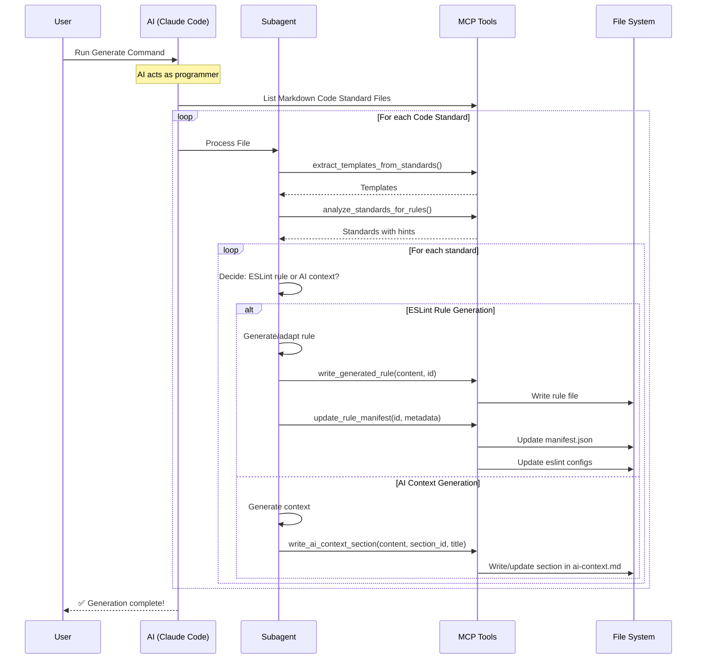

```mermaid
sequenceDiagram
    participant User
    participant AI as AI (Claude Code)
    participant Subagent
    participant MCP as MCP Tools
    participant FS as File System

    User->>AI: Run Generate Command

    Note over AI: AI acts as programmer

    AI->>MCP: List Markdown Code Standard Files
    loop For each Code Standard
        AI->>Subagent: Process File

        Subagent->>MCP: extract_templates_from_standards()
        MCP-->>Subagent: Templates
        Subagent->>MCP: analyze_standards_for_rules()
        MCP-->>Subagent: Standards with hints

        loop For each standard
            Subagent->>Subagent: Decide: ESLint rule or AI context?

            alt ESLint Rule Generation
                Subagent->>Subagent: Generate/adapt rule
                Subagent->>MCP: write_generated_rule(content, id)
                MCP->>FS: Write rule file
                Subagent->>MCP: update_rule_manifest(id, metadata)
                MCP->>FS: Update manifest.json
                MCP->>FS: Update eslint configs

            else AI Context Generation
                Subagent->>Subagent: Generate context
                Subagent->>MCP: write_ai_context_section(content, section_id, title)
                MCP->>FS: Write/update section in ai-context.md
            end
        end
    end

    AI-->>User: ✅ Generation complete!
```