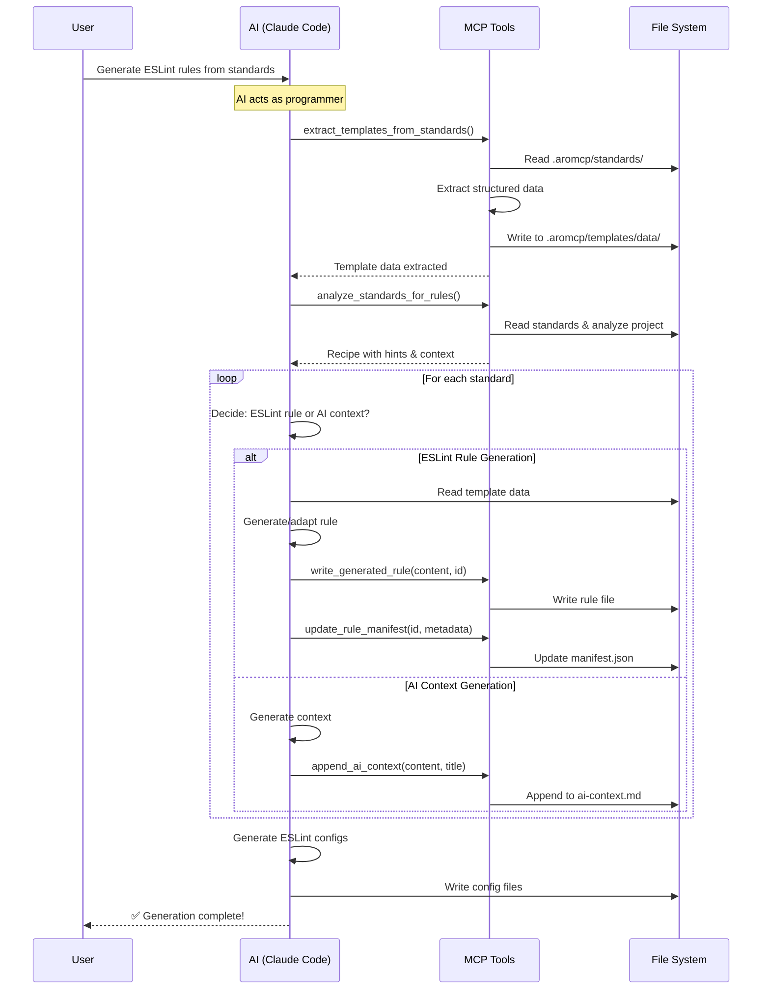

# Code Analysis Tool V2: Project-Agnostic ESLint Rule Generation

## Overview

This document outlines the implementation of enhanced code analysis tools for project-agnostic ESLint rule generation. The system analyzes any target project's structure and coding standards, then generates comprehensive ESLint rules that enforce both structural patterns and architectural principles.

**Key Design Principles:**
- **Simplicity First**: Use a simple "Analysis + Recipe" pattern
- **AI as Trusted Programmer**: Treat Claude Code as a programmer making decisions
- **Project-Local Configuration**: All templates stored in project's `.aromcp/` folder
- **Manifest-Based Metadata**: Single source of truth in `manifest.json`
- **Performance as Best-Effort**: Comprehensive analysis prioritized over speed

## Architecture: Analysis + Recipe Pattern



## Project Folder Structure

```
.aromcp/
├── standards/              # Markdown coding standards (source of truth)
│   ├── component-architecture.md
│   ├── api-design.md
│   └── security-practices.md
├── templates/              # Extracted template data
│   └── data/              # MCP-extracted structured data (JSON)
│       ├── component-architecture_template_data.json
│       └── api-design_template_data.json
├── generated-rules/        # Output directory
│   ├── manifest.json      # Single source of truth for metadata
│   ├── rules/             # Generated ESLint rules
│   │   ├── component-isolation.js
│   │   └── api-patterns.js
│   ├── configs/           # Generated ESLint configurations
│   │   ├── recommended.js
│   │   └── strict.js
│   └── ai-context.md      # Non-ESLint standards for AI reference
└── cache/                 # Optional analysis caching
```

## Standardized Coding Standard Template

All coding standards should follow this template format for reliable extraction:

```markdown
---
id: component-isolation
name: Component Isolation Standard
category: architecture
applies_to: ["**/*.tsx", "**/*.jsx"]
severity: error
---

# Component Isolation Standard

## Description
Brief description of what this standard enforces and why it's important.

## Good Examples
```typescript
// ✅ Good: dashboard/components/Chart.tsx used only in dashboard
// dashboard/page.tsx
import { Chart } from './components/Chart';
```

## Bad Examples
```typescript
// ❌ Bad: dashboard component used in profile page
// profile/page.tsx
import { Chart } from '../dashboard/components/Chart';
```

## Pattern Detection
```yaml
detect:
  - import_contains: "/components/"
  - not_from_parent: true
```

## Auto-Fix
```yaml
fixable: false
message: "Component {componentName} should only be imported within {parentModule}"
```

## Enforcement Type
- [ ] ESLint Rule (pattern-based detection)
- [ ] AI Context (requires human judgment)
- [x] Hybrid (both ESLint and AI guidance)

## Additional Context
Any additional context, edge cases, or explanations for AI understanding.
```

## Implementation: MCP Tools

### 1. Template Extraction Tool

```python
# src/aromcp/analysis_server/tools/extract_templates_from_standards.py

@mcp.tool
@json_convert
def extract_templates_from_standards(
    standards_dir: str = ".aromcp/standards",
    output_dir: str = ".aromcp/templates",
    project_root: str | None = None
) -> dict[str, Any]:
    """Extract template data from standardized coding standards files.
    
    This tool parses standardized markdown templates and extracts
    structured data that AI can use to generate ESLint rules.
    
    Returns:
        Dict with extracted template data paths and metadata
    """
    # Implementation extracts:
    # - Good/bad code examples
    # - Pattern detection hints
    # - Auto-fix information
    # - Enforcement type
    # Returns paths to JSON files with structured data
```

### 2. Standards Analysis Tool

```python
# src/aromcp/analysis_server/tools/analyze_standards_for_rules.py

@mcp.tool
@json_convert
def analyze_standards_for_rules(
    standards_dir: str = ".aromcp/standards",
    project_root: str | None = None
) -> dict[str, Any]:
    """Analyze standards and return a generation recipe.
    
    Performs single-pass analysis of standards and project,
    returning a simple recipe for AI to generate rules.
    
    Returns:
        Dict with standards, minimal project context, and generation hints
    """
    # Returns:
    # - All standards with metadata
    # - Minimal project context (framework, patterns, conventions)
    # - Generation hints (which standards can be ESLint rules)
```

### 3. Helper Tools

```python
# src/aromcp/analysis_server/tools/write_generated_rule.py

@mcp.tool
@json_convert
def write_generated_rule(
    rule_content: str,
    rule_id: str,
    output_dir: str = ".aromcp/generated-rules",
    project_root: str | None = None
) -> dict[str, Any]:
    """Write a generated ESLint rule to file."""

# src/aromcp/analysis_server/tools/update_rule_manifest.py

@mcp.tool
@json_convert
def update_rule_manifest(
    rule_id: str,
    metadata: dict[str, Any],
    manifest_path: str = ".aromcp/generated-rules/manifest.json",
    project_root: str | None = None
) -> dict[str, Any]:
    """Update the rule manifest with metadata."""

# src/aromcp/analysis_server/tools/write_ai_context.py

@mcp.tool  
@json_convert
def write_ai_context_section(
    context_content: str,
    section_id: str,
    section_title: str,
    context_file: str = ".aromcp/generated-rules/ai-context.md",
    project_root: str | None = None
) -> dict[str, Any]:
    """Write or update an AI context section in the context file.
    
    Uses section markers to enable updates on regeneration:
    <!-- aromcp:section:start:component-isolation -->
    ... content ...
    <!-- aromcp:section:end:component-isolation -->
    """
```

## AI Workflow (Claude Code)

```python
# Step 1: MCP extracts templates (deterministic parsing)
templates = mcp.extract_templates_from_standards()
print(f"Extracted {templates['data']['templates_extracted']} template data files")

# Step 2: MCP analyzes and creates recipe (deterministic analysis)  
recipe = mcp.analyze_standards_for_rules()
print(f"Found {len(recipe['data']['standards'])} standards to process")

# Step 3: AI processes each standard (AI decision-making)
for standard in recipe['data']['standards']:
    # AI DECIDES: Can this be an ESLint rule?
    if standard['id'] in recipe['data']['generation_hints']['eslint_capable']:
        # AI READS template data if available
        template_data = mcp.read_files_batch([f".aromcp/templates/data/{standard['id']}_template_data.json"])
        
        # AI GENERATES rule adapted to project
        rule_content = generate_eslint_rule_from_template_and_context(
            template_data, 
            recipe['data']['project_context']
        )
        
        # MCP WRITES file (deterministic)
        mcp.write_generated_rule(rule_content, standard['id'])
        
        # MCP UPDATES manifest (deterministic)
        mcp.update_rule_manifest(standard['id'], {
            "source_standard": standard['file_path'],
            "severity": standard.get('severity', 'error'),
            "patterns": standard.get('applies_to', ['**/*.js'])
        })
        
    else:
        # AI GENERATES context documentation
        context = generate_ai_context_for_standard(
            standard,
            recipe['data']['project_context']
        )
        
        # MCP WRITES/UPDATES section (deterministic)
        mcp.write_ai_context_section(
            context_content=context,
            section_id=standard['id'],
            section_title=standard['name']
        )

# Step 4: AI generates ESLint configurations
configs = generate_eslint_configs_from_manifest()
for config_name, content in configs.items():
    mcp.write_files_batch({f".aromcp/generated-rules/configs/{config_name}.js": content})
```

## Manifest Structure

```json
{
  "version": "1.0",
  "generated": "2024-01-15T10:00:00Z",
  "last_updated": "2024-01-15T10:30:00Z",
  "project": {
    "framework": "nextjs",
    "analyzed_at": "2024-01-15T10:00:00Z"
  },
  "rules": {
    "component-isolation": {
      "updated": "2024-01-15T10:15:00Z",
      "source_standard": ".aromcp/standards/component-architecture.md",
      "patterns": ["**/components/**/*.tsx"],
      "severity": "error",
      "type": "eslint_rule"
    },
    "api-design-patterns": {
      "updated": "2024-01-15T10:20:00Z",
      "source_standard": ".aromcp/standards/api-design.md",
      "type": "ai_context",
      "reason": "Requires architectural judgment"
    }
  },
  "statistics": {
    "total_standards": 15,
    "eslint_rules_generated": 8,
    "ai_context_sections": 5,
    "hybrid_implementations": 2
  }
}
```

## Implementation Timeline

### Week 1: Core MCP Tools
- [ ] Implement `extract_templates_from_standards` with structured data extraction
- [ ] Implement `analyze_standards_for_rules` with minimal project context
- [ ] Create supporting functions for template parsing and pattern detection

### Week 2: Helper Tools  
- [ ] Implement `write_generated_rule` tool
- [ ] Implement `update_rule_manifest` tool
- [ ] Implement `append_ai_context` tool
- [ ] Add manifest schema validation

### Week 3: Integration & Testing
- [ ] Update tools registration in `__init__.py`
- [ ] Create comprehensive test suite
- [ ] Update command documentation with clear AI workflow
- [ ] Test with various project types (Next.js, React, Express)

### Week 4: Documentation & Polish
- [ ] Create usage examples for different frameworks
- [ ] Document standardized template format with examples
- [ ] Create troubleshooting guide
- [ ] Performance optimization

## Key Responsibilities

### MCP Tools (Deterministic)
- Parse standardized templates to extract structured data
- Analyze project for minimal context (framework, patterns)
- Provide generation hints based on standard content
- Write files and update manifest
- No AI logic or complex decisions

### AI (Claude Code) 
- Read extracted template data
- Decide which standards can be ESLint rules
- Generate ESLint rules adapted to project
- Create AI context for complex patterns
- Generate appropriate ESLint configurations

## Updates Required for Existing Tools

### 1. `get_relevant_standards` - Major Update
- **Current**: Reads from `.aromcp/standards/` markdown files
- **New**: Reads from `manifest.json` to find applicable rules, then loads from:
  - `.aromcp/generated-rules/rules/` for ESLint rules
  - `.aromcp/generated-rules/ai-context.md` for AI context sections
- **Pattern Matching**: Uses patterns from manifest instead of frontmatter

### 2. `load_coding_standards` - Minor Update  
- **Enhancement**: Add generation status to each standard
- **New Fields**: Include whether rule was generated, type (eslint/ai), and last updated
- **Backward Compatible**: Still returns all standards, just with extra metadata

### 3. `parse_standard_to_rules` - Deprecate
- **Status**: Mark as deprecated with warning
- **Replacement**: Point users to `extract_templates_from_standards` for V2 workflow
- **Reason**: Template extraction provides better structure for AI generation

## Integration with Other Tools

### Build Tools
- Generated ESLint rules work seamlessly with `run_eslint` tool
- `run_typescript_compiler` benefits from type-aware ESLint rules
- No changes needed to existing build tools

### Workflow Integration
```python
# Before editing files (existing workflow)
relevant_rules = mcp.get_relevant_standards("src/components/Button.tsx")
# Now returns generated ESLint rules from manifest.json

# After making changes (existing workflow)
result = mcp.run_eslint(file_paths=["src/components/Button.tsx"])
# Validates against generated project-specific rules

# Regeneration workflow (new)
# Run weekly or when standards change
mcp.extract_templates_from_standards()
recipe = mcp.analyze_standards_for_rules()
# ... AI generates/updates rules ...
```

### File System Tools
- All new tools use existing `write_files_batch`, `read_files_batch`
- Leverage existing security validation and path handling
- No duplication of file operations

### Analysis Tools Enhancement
- Existing tools provide input to `analyze_standards_for_rules`:
  - `analyze_component_usage` → component boundaries
  - `find_import_cycles` → import patterns
  - `detect_security_patterns` → security conventions
  - `extract_api_endpoints` → API patterns

## Regeneration Strategy

When standards change or rules need updating:

1. **Full Regeneration**: 
   - Delete `.aromcp/generated-rules/` directory
   - Run complete generation process
   - All rules and context rebuilt from scratch

2. **Incremental Updates**:
   - Manifest tracks `last_updated` per rule
   - AI can compare standard modification times
   - Only regenerate changed standards
   - Section markers in AI context allow updates

3. **Version Control**:
   - `.aromcp/templates/data/` - Generated, can be gitignored
   - `.aromcp/generated-rules/` - Should be committed
   - Changes tracked through git history

## Success Metrics

1. **Rule Generation Coverage**: Generate ESLint rules for 80%+ of structural/syntactic standards
2. **Project Agnostic**: Successfully analyze and generate rules for different project types
3. **AI Context Quality**: Rich architectural context for complex patterns
4. **Simplicity**: Minimal MCP complexity, maximum AI flexibility
5. **Traceability**: Complete audit trail via manifest.json