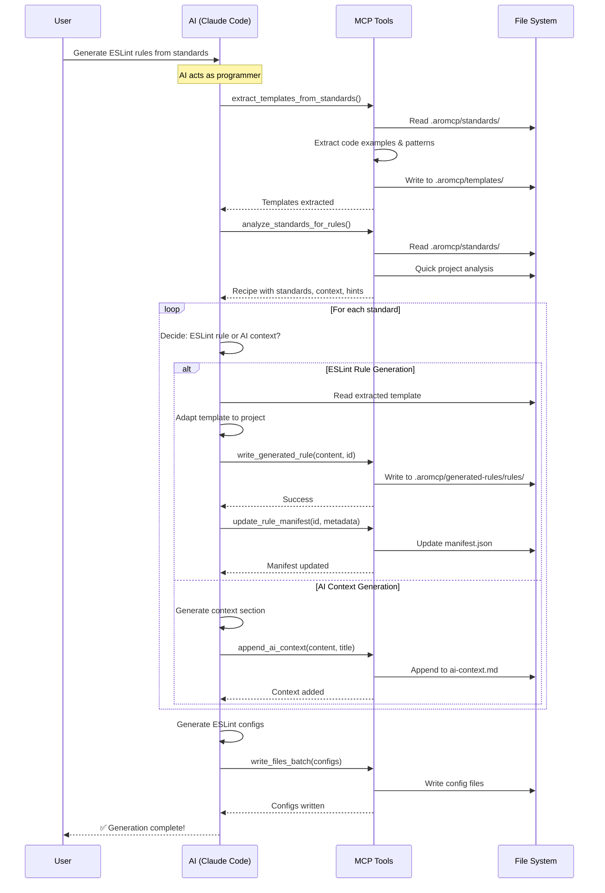

# Code Analysis Tool V2: Project-Agnostic ESLint Rule Generation

## Overview

This document outlines the implementation plan for enhancing AroMCP's code analysis tools to support project-agnostic ESLint rule generation. The goal is to analyze any target project's structure and coding standards, then generate comprehensive ESLint rules that enforce both structural patterns and architectural principles specific to that project.

**Key Design Principles:**
- **Simplicity First**: Use a simple "Analysis + Recipe" pattern instead of complex orchestration
- **AI as Trusted Programmer**: Treat Claude Code as a programmer making decisions, not a script executor
- **Project-Local Configuration**: All templates and configurations stored in project's `.aromcp/` folder
- **Manifest-Based Metadata**: Single source of truth for rule metadata in `manifest.json`
- **Performance as Best-Effort**: Comprehensive analysis prioritized over speed (runs weekly)

## Current State Analysis

### Existing Analysis Tools (Phase 4)

AroMCP currently has 8 production-ready analysis tools:

1. **Standards Management Tools**:
   - `load_coding_standards` - Load markdown standards with YAML frontmatter
   - `get_relevant_standards` - Get standards/rules relevant to specific files (migrated to read generated ESLint rules)
   - `parse_standard_to_rules` - Parse markdown standards to extract structured rules

2. **Code Quality Analysis Tools**:
   - `detect_security_patterns` - Find security vulnerabilities (SQL injection, hardcoded secrets)
   - `find_dead_code` - Identify unused exports, functions, orphaned files
   - `find_import_cycles` - Detect circular import dependencies
   - `analyze_component_usage` - Track component/function usage across codebase
   - `extract_api_endpoints` - Extract and document API endpoints from route files

### Current ESLint Integration

The system already has ESLint integration infrastructure:

- **ESLint Metadata Module** (`src/aromcp/analysis_server/eslint_metadata/`):
  - `rules_registry.py` - Registry for managing generated ESLint rules
  - `pattern_matcher.py` - Pattern matching for file categorization
  - `rule_parser.py` - Parser for reading generated ESLint rule metadata

- **ESLint Integration Module** (`src/aromcp/analysis_server/eslint_integration/`):
  - `rule_builder.py` - Build ESLint rules, plugin index, package.json
  - `rule_templates.py` - Templates for generating rule structure
  - `ast_patterns.py` - AST pattern detection from code examples

### Current Command: generate-eslint-rules.md

The existing command in `documentation/commands/generate-eslint-rules.md` provides a Claude Code command for ESLint rule generation, but has limitations:
- Generates too few rules (only simple patterns)
- Loses architectural context for non-ESLint patterns
- Not project-agnostic (assumes specific project structure)
- Doesn't leverage comprehensive project analysis

## V2 Implementation Plan

### Architecture: Analysis + Recipe Pattern

**Core Philosophy**:
1. **MCP Analysis**: AroMCP tools analyze project and standards, returning a simple "recipe" of what needs generation
2. **AI as Programmer**: Claude Code acts as a trusted programmer, deciding how to implement the recipe
3. **Helper Tools**: Small, focused MCP tools that AI can call as needed (write files, update manifest)
4. **Context-Aware**: Design acknowledges AI's context window limitations, providing focused analysis

**Key Insight**: Treat AI like a programmer who needs good analysis tools, not a robot following instructions. This creates a more flexible and maintainable system.

### Sequence Diagram



This diagram shows:
- **Template extraction**: First extract templates from standards (source of truth)
- **Simple flow**: No complex orchestration or action plans
- **AI autonomy**: AI makes decisions about each standard
- **Helper tools**: MCP provides simple, focused tools
- **Direct operations**: Each step is straightforward and independent

### Phase 1: Template Extraction and Analysis

**Standardized Coding Standard Template**

All coding standards should follow this template format for reliable extraction.

**Note**: Claude Code can help convert existing standards to this format. Simply ask:
> "Convert all coding standards to the standardized template format"

Template format:

```markdown
---
id: component-isolation
name: Component Isolation Standard
category: architecture
applies_to: ["**/*.tsx", "**/*.jsx"]
severity: error
---

# Component Isolation Standard

## Description
Brief description of what this standard enforces and why it's important.

## Good Examples
```typescript
// ✅ Good: dashboard/components/Chart.tsx used only in dashboard
// dashboard/page.tsx
import { Chart } from './components/Chart';
```

```typescript
// ✅ Good: shared components from common directory
// anywhere/page.tsx
import { Button } from '@/components/ui/Button';
```

## Bad Examples
```typescript
// ❌ Bad: dashboard component used in profile page
// profile/page.tsx
import { Chart } from '../dashboard/components/Chart';
```

## Pattern Detection
```yaml
detect:
  - import_contains: "/components/"
  - not_from_parent: true
```

## Auto-Fix
```yaml
fixable: false
message: "Component {componentName} should only be imported within {parentModule}"
```

## Enforcement Type
- [ ] ESLint Rule (pattern-based detection)
- [ ] AI Context (requires human judgment)
- [x] Hybrid (both ESLint and AI guidance)

## Additional Context
Any additional context, edge cases, or explanations that would help AI understand the intent.
```

**Key Sections Explained**:

1. **Frontmatter**: YAML metadata for categorization and applicability
2. **Description**: Clear explanation of the standard
3. **Good/Bad Examples**: Multiple code examples showing correct and incorrect usage
4. **Pattern Detection**: YAML/JSON describing patterns to detect (helps MCP extract patterns)
5. **Auto-Fix**: Information about whether violations can be auto-fixed
6. **Enforcement Type**: Explicit declaration of how this should be enforced
7. **Additional Context**: Free-form section for nuanced explanations

**Benefits**:
- **Predictable structure** for MCP parsing
- **Explicit enforcement type** removes guesswork
- **Pattern detection hints** guide template generation
- **Multiple examples** improve AI understanding

**Key Clarification**: With standardized templates:

1. **MCP Extracts Predictably**: Parses known sections reliably
2. **AI Has Clear Guidance**: Enforcement type and patterns are explicit
3. **Templates Are Consistent**: All standards follow same format

This separation ensures:
- MCP remains a "dumb" utility doing deterministic parsing
- AI handles the intelligent interpretation with clear guidance
- Templates are traceable back to their source standards

#### 1.1 Template Extraction Tool

**New Tool**: `extract_templates_from_standards`

```python
# src/aromcp/analysis_server/tools/extract_templates_from_standards.py

def extract_templates_from_standards_impl(
    standards_dir: str = ".aromcp/standards",
    output_dir: str = ".aromcp/templates",
    project_root: str | None = None
) -> dict[str, Any]:
    """Extract template data from standardized coding standards files.

    This tool extracts structured data from standards following the
    standardized template format. It parses known sections and metadata
    to create data that AI can use to generate ESLint templates.

    Args:
        standards_dir: Directory containing coding standards
        output_dir: Directory to write extracted template data
        project_root: Root directory of project

    Returns:
        Dict with extracted template data for AI to process
    """

    if project_root is None:
        project_root = get_project_root()

    try:
        # Load all standards (includes frontmatter parsing)
        standards = load_coding_standards_impl(project_root, standards_dir)
        if "error" in standards:
            return standards

        extracted_data = {}

        for standard in standards["data"]["standards"]:
            # Skip if not marked as ESLint enforceable
            enforcement_type = standard.get("metadata", {}).get("enforcement_type", "")
            if enforcement_type == "ai_context":
                continue  # Skip pure AI context standards

            # Parse standardized sections
            sections = parse_standardized_sections(standard["content"])

            # Extract structured data
            template_data = {
                "standard_id": standard["id"],
                "standard_name": standard["name"],
                "metadata": standard.get("metadata", {}),
                "good_examples": extract_code_blocks_from_section(
                    sections.get("good_examples", "")
                ),
                "bad_examples": extract_code_blocks_from_section(
                    sections.get("bad_examples", "")
                ),
                "pattern_detection": parse_yaml_section(
                    sections.get("pattern_detection", "")
                ),
                "auto_fix": parse_yaml_section(
                    sections.get("auto-fix", "")
                ),
                "enforcement_type": extract_enforcement_type(
                    sections.get("enforcement_type", "")
                ),
                "description": sections.get("description", "")
            }

            # Only save if there are examples to work with
            if template_data["good_examples"] or template_data["bad_examples"]:
                template_id = f"{standard['id']}_template_data"
                template_path = f"{output_dir}/data/{template_id}.json"

                extracted_data[template_id] = {
                    "path": template_path,
                    "source_standard": standard["file_path"],
                    "data": template_data
                }

        # Write template data files
        for template_id, template_info in extracted_data.items():
            write_files_batch_impl(
                {template_info["path"]: json.dumps(template_info["data"], indent=2)},
                project_root
            )

        return {
            "data": {
                "templates_extracted": len(extracted_data),
                "template_data": extracted_data,
                "note": "Extracted from standardized coding standards format"
            }
        }

    except Exception as e:
        return {
            "error": {
                "code": "EXTRACTION_FAILED",
                "message": f"Failed to extract template data: {str(e)}"
            }
        }

def parse_standardized_sections(content: str) -> dict[str, str]:
    """Parse standardized template sections.

    Returns dict mapping section names to their content.
    """
    import re

    sections = {}
    current_section = None
    current_content = []

    lines = content.split('\n')

    for line in lines:
        # Check for headers (## format for standardized sections)
        header_match = re.match(r'^##\s+(.+)$', line)

        if header_match:
            # Save previous section
            if current_section and current_content:
                sections[current_section] = '\n'.join(current_content).strip()

            # Start new section
            current_section = header_match.group(1).lower().replace(' ', '_')
            current_content = []
        elif current_section:
            current_content.append(line)

    # Save last section
    if current_section and current_content:
        sections[current_section] = '\n'.join(current_content).strip()

    return sections

def extract_code_blocks_from_section(content: str) -> list[dict]:
    """Extract code blocks from markdown section.

    Returns list of dicts with language and code content.
    """
    import re

    code_blocks = []

    # Find fenced code blocks
    pattern = r'```(\w+)?\n(.*?)```'
    matches = re.findall(pattern, content, re.DOTALL)

    for language, code in matches:
        code_blocks.append({
            "language": language or "unknown",
            "code": code.strip()
        })

    return code_blocks

def parse_yaml_section(content: str) -> dict:
    """Parse YAML content from a section."""
    import yaml

    # Extract YAML from code block if present
    yaml_match = re.search(r'```yaml\n(.*?)```', content, re.DOTALL)
    if yaml_match:
        try:
            return yaml.safe_load(yaml_match.group(1))
        except:
            return {}

    # Try parsing as direct YAML
    try:
        return yaml.safe_load(content)
    except:
        return {}

def extract_enforcement_type(content: str) -> str:
    """Extract the selected enforcement type from checkbox format."""

    if "[x] ESLint Rule" in content:
        return "eslint_rule"
    elif "[x] AI Context" in content:
        return "ai_context"
    elif "[x] Hybrid" in content:
        return "hybrid"

    return "unknown"
```

**Example Template Data Extraction**:

Given a standardized coding standard file:
```markdown
---
id: component-isolation
name: Component Isolation Standard
category: architecture
applies_to: ["**/*.tsx", "**/*.jsx"]
severity: error
---

# Component Isolation Standard

## Description
Components in page-specific folders should only be imported by that page to maintain clear module boundaries.

## Good Examples
```typescript
// ✅ Good: dashboard/components/Chart.tsx used only in dashboard
// dashboard/page.tsx
import { Chart } from './components/Chart';
```

## Bad Examples
```typescript
// ❌ Bad: dashboard component used in profile page
// profile/page.tsx
import { Chart } from '../dashboard/components/Chart';
```

## Pattern Detection
```yaml
detect:
  - import_contains: "/components/"
  - not_from_parent: true
```

## Auto-Fix
```yaml
fixable: false
message: "Component {componentName} should only be imported within {parentModule}"
```

## Enforcement Type
- [ ] ESLint Rule (pattern-based detection)
- [ ] AI Context (requires human judgment)
- [x] Hybrid (both ESLint and AI guidance)
```

The MCP tool extracts this structured data:
```json
// .aromcp/templates/data/component-isolation_template_data.json
{
  "standard_id": "component-isolation",
  "standard_name": "Component Isolation Standard",
  "metadata": {
    "id": "component-isolation",
    "name": "Component Isolation Standard",
    "category": "architecture",
    "applies_to": ["**/*.tsx", "**/*.jsx"],
    "severity": "error"
  },
  "description": "Components in page-specific folders should only be imported by that page to maintain clear module boundaries.",
  "good_examples": [
    {
      "language": "typescript",
      "code": "// ✅ Good: dashboard/components/Chart.tsx used only in dashboard\n// dashboard/page.tsx\nimport { Chart } from './components/Chart';"
    }
  ],
  "bad_examples": [
    {
      "language": "typescript",
      "code": "// ❌ Bad: dashboard component used in profile page\n// profile/page.tsx\nimport { Chart } from '../dashboard/components/Chart';"
    }
  ],
  "pattern_detection": {
    "detect": [
      {"import_contains": "/components/"},
      {"not_from_parent": true}
    ]
  },
  "auto_fix": {
    "fixable": false,
    "message": "Component {componentName} should only be imported within {parentModule}"
  },
  "enforcement_type": "hybrid"
}
```

**Then AI (Claude Code) generates the actual ESLint template** from this data:
```javascript
// AI reads the JSON data and understands the pattern from examples
// Then generates .aromcp/templates/component-isolation.js
module.exports = {
  meta: {
    type: 'problem',
    docs: {
      description: 'Components in page-specific folders should only be imported by that page'
    }
  },
  create(context) {
    // AI infers the pattern from good/bad examples
    return {
      ImportDeclaration(node) {
        const importPath = node.source.value;
        const currentFile = context.getFilename();

        if (importPath.includes('/components/')) {
          const componentDir = importPath.split('/components/')[0];
          const currentDir = currentFile.split('/').slice(0, -1).join('/');

          if (!currentDir.startsWith(componentDir)) {
            context.report({
              node,
              message: `Component from ${componentDir} should only be imported within that module`
            });
          }
        }
      }
    };
  }
};
```

#### 1.2 Main Analysis Tool

**Updated Tool**: `analyze_standards_for_rules`

```python
# src/aromcp/analysis_server/tools/analyze_standards_for_rules.py

def analyze_standards_for_rules_impl(
    standards_dir: str = ".aromcp/standards",
    project_root: str | None = None
) -> dict[str, Any]:
    """Analyze standards and return a generation recipe.

    This tool performs a single-pass analysis of standards and project,
    returning a simple recipe that Claude Code can use to generate rules.

    Args:
        standards_dir: Directory containing the project's coding standards
        project_root: Root directory of target project to analyze

    Returns:
        Dict with standards, project context, and generation hints
    """

    if project_root is None:
        project_root = get_project_root()

    try:
        # Load standards
        standards_result = load_coding_standards_impl(project_root, standards_dir)
        if "error" in standards_result:
            return standards_result

        # Get minimal project context (fast, focused analysis)
        project_context = get_minimal_project_context(project_root)

        # Categorize standards for generation
        generation_hints = {
            "eslint_capable": [],  # Standards that can be ESLint rules
            "ai_context_only": [], # Standards needing AI context
            "hybrid": []           # Standards needing both
        }

        for standard in standards_result["data"]["standards"]:
            category = categorize_standard_for_generation(standard, project_context)
            generation_hints[category].append(standard["id"])

        return {
            "data": {
                "standards": standards_result["data"]["standards"],
                "project_context": project_context,
                "generation_hints": generation_hints,
                "templates_dir": f"{project_root}/.aromcp/templates",
                "output_dir": f"{project_root}/.aromcp/generated-rules"
            }
        }

    except Exception as e:
        return {
            "error": {
                "code": "ANALYSIS_FAILED",
                "message": f"Failed to analyze standards: {str(e)}"
            }
        }
```

#### 1.2 Project Folder Structure

**Project-Local Configuration**:
All ESLint generation artifacts are stored in the project's `.aromcp/` folder:

```
.aromcp/
├── standards/           # Markdown files with coding standards (source of truth)
│   ├── component-architecture.md
│   ├── api-design.md
│   └── security-practices.md
├── templates/           # AI-generated ESLint templates from standards
│   ├── data/           # MCP-extracted structured data (JSON)
│   │   ├── component-architecture_template_data.json
│   │   └── api-design_template_data.json
│   ├── component-isolation.js    # AI-generated from data
│   ├── api-patterns.js          # AI-generated from data
│   └── naming-conventions.js    # AI-generated from data
├── generated-rules/     # Output directory for final rules
│   ├── manifest.json   # Single source of truth for metadata
│   ├── rules/          # Final ESLint rules (adapted templates)
│   │   ├── component-isolation.js
│   │   └── api-patterns.js
│   ├── configs/        # Generated ESLint configurations
│   │   ├── recommended.js
│   │   └── strict.js
│   └── ai-context.md   # Non-ESLint standards for AI reference
└── cache/              # Optional caching for analysis results
```

This structure ensures:
- Complete project independence
- Easy version control of templates
- Clear separation of inputs and outputs
- No cross-project contamination

#### 1.3 Minimal Project Context

```python
def get_minimal_project_context(project_root: str) -> dict:
    """Get focused project context for AI decision making.

    Unlike comprehensive analysis, this provides just enough context
    for AI to make informed decisions without overwhelming its context window.
    """

    try:
        # Quick framework detection
        framework = detect_project_framework(project_root)

        # Sample file patterns (not exhaustive scan)
        sample_patterns = get_sample_file_patterns(project_root, limit=50)

        # Key directories structure
        key_dirs = identify_key_directories(project_root)

        # Existing ESLint config (if any)
        existing_config = find_existing_eslint_config(project_root)

        return {
            "framework": framework,
            "sample_patterns": sample_patterns,
            "key_directories": key_dirs,
            "has_existing_eslint": existing_config is not None,
            "existing_eslint_extends": existing_config.get("extends", []) if existing_config else [],
            "detected_conventions": {
                "file_naming": detect_file_naming_convention(sample_patterns),
                "import_style": detect_import_style(sample_patterns)
            }
        }

    except Exception as e:
        # Return minimal context on error
        return {
            "framework": "unknown",
            "error": str(e)
        }
```

#### 1.3 Project Structure Analysis Tool

**Supporting Tool**: `analyze_project_structure` (used by orchestrator)

```python
# src/aromcp/analysis_server/tools/analyze_project_structure.py

def analyze_project_structure_impl(
    project_root: str,
    analysis_depth: str = "comprehensive"
) -> dict[str, Any]:
    """Analyze target project to provide comprehensive context.

    This tool provides CONTEXT for the orchestrator to create action plans.
    """

    try:
        # Use existing analysis tools for comprehensive discovery
        analysis = {}

        # File structure analysis
        analysis['files'] = get_target_files_impl(project_root, patterns=["**/*"])

        # Component relationships
        analysis['components'] = analyze_component_usage_impl(project_root)

        # Import dependencies
        analysis['imports'] = find_import_cycles_impl(project_root)

        # API patterns
        analysis['apis'] = extract_api_endpoints_impl(project_root)

        # Security patterns (to understand existing patterns)
        analysis['security'] = detect_security_patterns_impl(["**/*.ts", "**/*.tsx"], project_root)

        # Synthesize into project profile
        return {
            "data": {
                "profile": synthesize_project_profile(analysis),
                "discovered_patterns": extract_concrete_patterns(analysis),
                "architectural_insights": extract_architectural_patterns(analysis),
                "framework_analysis": detect_framework_and_patterns(analysis['files']),
                "component_boundaries": analyze_component_boundaries(analysis['components']),
                "api_patterns": analyze_api_patterns(analysis['apis']),
                "naming_conventions": extract_naming_patterns(analysis['files'])
            }
        }

    except Exception as e:
        return {
            "error": {
                "code": "ANALYSIS_FAILED",
                "message": f"Failed to analyze project structure: {str(e)}"
            }
        }
```

### Phase 2: Helper Tools for AI

#### 2.1 Manifest Management Tool

**Tool**: `update_rule_manifest`

```python
@mcp.tool
@json_convert
def update_rule_manifest(
    rule_id: str,
    metadata: dict[str, Any],
    manifest_path: str = ".aromcp/generated-rules/manifest.json",
    project_root: str | None = None
) -> dict[str, Any]:
    """Update the rule manifest with metadata.

    The manifest is the single source of truth for all generated rules.
    """

    if project_root is None:
        project_root = get_project_root()

    # Read existing manifest or create new
    manifest = {
        "version": "1.0",
        "generated": datetime.now().isoformat(),
        "rules": {}
    }

    manifest_full_path = f"{project_root}/{manifest_path}"
    try:
        existing = read_files_batch_impl([manifest_full_path], project_root)
        if "data" in existing and manifest_full_path in existing["data"]["files"]:
            manifest = json.loads(existing["data"]["files"][manifest_full_path])
    except:
        pass  # File doesn't exist yet

    # Update rule metadata
    manifest["rules"][rule_id] = {
        "updated": datetime.now().isoformat(),
        **metadata
    }
    manifest["last_updated"] = datetime.now().isoformat()

    # Write updated manifest
    write_result = write_files_batch_impl(
        {manifest_full_path: json.dumps(manifest, indent=2)},
        project_root
    )

    if "error" in write_result:
        return write_result

    return {
        "data": {
            "rule_id": rule_id,
            "manifest_path": manifest_path,
            "total_rules": len(manifest["rules"])
        }
    }
```

#### 2.2 Simple File Writers

**Tool**: `write_generated_rule`

```python
@mcp.tool
@json_convert
def write_generated_rule(
    rule_content: str,
    rule_id: str,
    output_dir: str = ".aromcp/generated-rules",
    project_root: str | None = None
) -> dict[str, Any]:
    """Write a generated ESLint rule to file."""

    if project_root is None:
        project_root = get_project_root()

    # Simple write with minimal validation
    rule_file_path = f"{output_dir}/rules/{rule_id}.js"
    write_result = write_files_batch_impl({rule_file_path: rule_content}, project_root)

    if "error" in write_result:
        return write_result

    return {
        "data": {
            "rule_file": rule_file_path,
            "rule_id": rule_id
        }
    }
```

**Tool**: `append_ai_context`

```python
@mcp.tool
@json_convert
def append_ai_context(
    context_content: str,
    section_title: str,
    context_file: str = ".aromcp/generated-rules/ai-context.md",
    project_root: str | None = None
) -> dict[str, Any]:
    """Append AI context section to the context file."""

    if project_root is None:
        project_root = get_project_root()

    # Read existing content or create new
    existing_content = ""
    try:
        existing_result = read_files_batch_impl([context_file], project_root)
        if "data" in existing_result and context_file in existing_result["data"]["files"]:
            existing_content = existing_result["data"]["files"][context_file]
    except:
        # Create header for new file
        existing_content = "# AI Context for Coding Standards\n\nThis file contains standards that require human judgment and cannot be enforced by ESLint alone.\n"

    # Append new section
    updated_content = existing_content + f"\n\n## {section_title}\n\n{context_content}"

    # Write updated file
    write_result = write_files_batch_impl({context_file: updated_content}, project_root)

    return {
        "data": {
            "context_file": context_file,
            "section_added": section_title
        }
    }
```

### Phase 3: Template Engine System

#### 3.1 Base Template System

```python
# src/aromcp/analysis_server/template_engine/base_template.py

class BaseTemplate(ABC):
    """Base class for all ESLint rule generation templates."""

    @abstractmethod
    def compatibility_score(self, standard: dict, rule: dict, project_profile: dict) -> float:
        """Calculate how well this template matches the standard and project."""
        pass

    @abstractmethod
    def generate_eslint_rule(self, standard: dict, rule: dict, project_profile: dict) -> str:
        """Generate ESLint rule using this template."""
        pass
```

#### 3.2 Framework-Specific Templates

```python
# src/aromcp/analysis_server/template_engine/nextjs_templates.py

class NextJSFileStructureTemplate(BaseTemplate):
    """Template for Next.js file structure enforcement."""

    def compatibility_score(self, standard: dict, rule: dict, project_profile: dict) -> float:
        score = 0.0

        # High score for Next.js projects with file structure standards
        if project_profile['framework'] == 'nextjs':
            score += 40.0

        # Score based on standard content
        nextjs_keywords = ['page.tsx', 'layout.tsx', 'app router', 'dashboard', 'components']
        for keyword in nextjs_keywords:
            if keyword.lower() in standard['content'].lower():
                score += 10.0

        # Score based on discovered patterns
        if 'page_component_structure' in project_profile['file_patterns']:
            score += 20.0

        return min(score, 100.0)

    def generate_eslint_rule(self, standard: dict, rule: dict, project_profile: dict) -> str:
        """Generate Next.js-specific file structure rule."""

        # Extract actual patterns from project
        actual_page_patterns = project_profile['file_patterns'].get('page_patterns', [])
        actual_component_patterns = project_profile['file_patterns'].get('component_patterns', [])

        return f'''
// @aromcp-rule-id: nextjs-structure-{rule["id"]}
// @aromcp-patterns: {json.dumps(rule.get("patterns", actual_page_patterns))}
// @aromcp-severity: {rule.get("severity", "error")}
// @aromcp-template: nextjs-file-structure
// @aromcp-project-specific: Generated for Next.js project structure

module.exports = {{
    meta: {{
        type: 'problem',
        docs: {{
            description: '{rule["description"]}',
            category: 'Best Practices'
        }},
        fixable: null,
        schema: []
    }},

    create(context) {{
        return {{
            Program(node) {{
                const filePath = context.getFilename();

                // Validate based on project's actual patterns
                if (isPageFile(filePath)) {{
                    validatePageStructure(filePath, node, {json.dumps(actual_page_patterns)});
                }}

                if (isComponentInPageFolder(filePath)) {{
                    validateComponentIsolation(filePath, node, {json.dumps(actual_component_patterns)});
                }}
            }},

            ImportDeclaration(node) {{
                const filePath = context.getFilename();
                const importPath = node.source.value;

                validateNextJSImportBoundaries(filePath, importPath, {{
                    projectPatterns: {json.dumps(project_profile['component_boundaries'])},
                    allowedImports: {json.dumps(rule.get('allowed_imports', []))}
                }});
            }}
        }};
    }}
}};
'''
```

### Phase 4: AI-as-Programmer Workflow

#### 4.1 Simplified Generation Process

The AI (Claude Code) acts as a programmer using the analysis recipe:

**Step 1: Extract Templates and Get Analysis Recipe**
```python
# First, extract templates from standards (source of truth)
extraction = aromcp.extract_templates_from_standards(
    standards_dir=".aromcp/standards",
    output_dir=".aromcp/templates"
)

print(f"Extracted {extraction['data']['templates_extracted']} templates")
print(f"Categories: {', '.join(extraction['data']['categories'])}")

# Then get the analysis recipe
recipe = aromcp.analyze_standards_for_rules(
    standards_dir=".aromcp/standards",
    project_root="/path/to/target/project"
)

print(f"Found {len(recipe['data']['standards'])} standards to process")
print(f"Project framework: {recipe['data']['project_context']['framework']}")
```

**Step 2: AI Processes Standards** (Like a programmer would)
```python
# Claude Code iterates through standards, making decisions
for standard in recipe['data']['standards']:
    standard_id = standard['id']

    # AI decides: Can this be an ESLint rule?
    if standard_id in recipe['data']['generation_hints']['eslint_capable']:
        # Check if template was extracted for this standard
        template_id = f"{standard_id}_template"
        if template_id in extraction['data']['templates']:
            # Use extracted template as base
            template = extraction['data']['templates'][template_id]
            template_content = aromcp.read_files_batch([template['path']])

            # Adapt template to specific project context
            rule_content = ai_adapt_template_to_project(
                template_content=template_content,
                project_context=recipe['data']['project_context'],
                standard=standard
            )
        else:
            # Generate from scratch if no template
            rule_content = ai_generate_eslint_rule(
                standard=standard,
                project_context=recipe['data']['project_context']
            )

        # Write the rule
        aromcp.write_generated_rule(
            rule_content=rule_content,
            rule_id=standard_id
        )

        # Update manifest
        aromcp.update_rule_manifest(
            rule_id=standard_id,
            metadata={
                "source_standard": standard['file_path'],
                "template_used": "nextjs/file-structure.js",  # AI chose this
                "patterns": ["**/pages/**/*.tsx"],
                "severity": "error"
            }
        )

    elif standard_id in recipe['data']['generation_hints']['ai_context_only']:
        # Generate AI context for complex patterns
        context = ai_generate_context_section(
            standard=standard,
            project_context=recipe['data']['project_context']
        )

        # Append to AI context file
        aromcp.append_ai_context(
            context_content=context,
            section_title=standard['name']
        )

    # AI can also decide on hybrid approach
    elif standard_id in recipe['data']['generation_hints']['hybrid']:
        # Generate both ESLint rule AND AI context
        # ... (similar to above)

# Generate configurations based on what was created
configs = ai_generate_configs_based_on_manifest()
for config_name, config_content in configs.items():
    aromcp.write_files_batch({
        f".aromcp/generated-rules/configs/{config_name}.js": config_content
    })

print("✅ Generation complete!")
```

#### 4.2 Manifest Structure

**Example `manifest.json`**:
```json
{
  "version": "1.0",
  "generated": "2024-01-15T10:00:00Z",
  "last_updated": "2024-01-15T10:30:00Z",
  "project": {
    "framework": "nextjs",
    "analyzed_at": "2024-01-15T10:00:00Z"
  },
  "rules": {
    "component-isolation": {
      "updated": "2024-01-15T10:15:00Z",
      "source_standard": ".aromcp/standards/component-architecture.md",
      "template_used": ".aromcp/templates/nextjs/import-boundaries.js",
      "patterns": ["**/components/**/*.tsx"],
      "severity": "error",
      "type": "eslint_rule"
    },
    "api-design-patterns": {
      "updated": "2024-01-15T10:20:00Z",
      "source_standard": ".aromcp/standards/api-design.md",
      "type": "ai_context",
      "reason": "Requires architectural judgment"
    },
    "naming-conventions": {
      "updated": "2024-01-15T10:25:00Z",
      "source_standard": ".aromcp/standards/naming-conventions.md",
      "template_used": ".aromcp/templates/common/naming.js",
      "patterns": ["**/*.ts", "**/*.tsx"],
      "severity": "warning",
      "type": "eslint_rule"
    }
  },
  "statistics": {
    "total_standards": 15,
    "eslint_rules_generated": 8,
    "ai_context_sections": 5,
    "hybrid_implementations": 2
  }
}
```

This manifest provides:
- Complete traceability from standards to generated rules
- Clear indication of which standards became ESLint rules vs AI context
- Template usage tracking for maintenance
- Statistics for reporting

### Phase 5: Enhanced AI Context Generation

#### 5.1 Rich AI Context Builder

```python
# src/aromcp/analysis_server/ai_context/context_builder.py

class AIContextBuilder:
    """Build comprehensive AI context file with project-specific guidance."""

    def __init__(self, project_profile: dict):
        self.project_profile = project_profile
        self.architectural_patterns = []
        self.process_standards = []
        self.business_logic_standards = []
        self.complex_patterns = []

    def add_rule_context(self, context: dict):
        """Add a rule context and categorize it appropriately."""

        if 'architectural' in context.get('complexity_level', ''):
            self.architectural_patterns.append(context)
        elif 'process' in context.get('complexity_level', ''):
            self.process_standards.append(context)
        elif 'business_logic' in context.get('complexity_level', ''):
            self.business_logic_standards.append(context)
        else:
            self.complex_patterns.append(context)

    def build(self) -> str:
        """Build comprehensive AI context file."""

        return f"""# {self.project_profile['framework'].title()} Project Coding Standards (AI Context)

Generated: {datetime.now().isoformat()}
Project Framework: {self.project_profile['framework']}
Total Non-ESLint Standards: {len(self.architectural_patterns + self.process_standards + self.business_logic_standards + self.complex_patterns)}

## Quick Reference for AI Assistants

### Project-Specific Context
- **Framework**: {self.project_profile['framework']}
- **File Structure**: {self.project_profile['file_patterns']['primary_organization']}
- **Component Architecture**: {self.project_profile.get('architectural_patterns', {}).get('component_organization', 'Standard')}
- **API Patterns**: {', '.join(self.project_profile.get('api_patterns', {}).keys())}

### When to Apply Standards
{self._generate_application_guidance()}

## Architectural Standards

{self._generate_architectural_section()}

## Process Standards

{self._generate_process_section()}

## Business Logic Standards

{self._generate_business_logic_section()}

## Complex Patterns (Requiring Human Judgment)

{self._generate_complex_patterns_section()}

## Project-Specific Examples

{self._generate_project_examples()}

## Integration with ESLint Rules

{self._generate_eslint_integration_notes()}
"""
```

### Phase 6: Configuration Generation

#### 6.1 Enhanced ESLint Configuration Generator

```python
# src/aromcp/analysis_server/config_generation/eslint_config_generator.py

class ESLintConfigGenerator:
    """Generate ESLint configurations optimized for specific project structures."""

    def __init__(self, project_profile: dict):
        self.project_profile = project_profile

    def generate_configurations(self, generated_rules: list) -> dict:
        """Generate multiple ESLint configuration presets."""

        # Parse rule metadata for pattern-based organization
        rules_by_pattern = self.organize_rules_by_patterns(generated_rules)

        # Generate different configuration levels
        configs = {
            'recommended': self.generate_recommended_config(rules_by_pattern),
            'strict': self.generate_strict_config(rules_by_pattern),
            'development': self.generate_development_config(rules_by_pattern)
        }

        # Add project-specific configurations
        if self.project_profile['framework'] == 'nextjs':
            configs['nextjs-optimized'] = self.generate_nextjs_config(rules_by_pattern)

        return configs

    def generate_recommended_config(self, rules_by_pattern: dict) -> dict:
        """Generate recommended configuration with intelligent overrides."""

        overrides = []

        # Group rules by discovered project patterns
        for pattern_group, rules in rules_by_pattern.items():

            # Create file pattern matches based on project structure
            file_patterns = self.resolve_file_patterns(pattern_group)

            override = {
                'files': file_patterns,
                'rules': {}
            }

            # Add rules with appropriate severity
            for rule in rules:
                rule_name = f"@aromcp/{rule['id']}"
                override['rules'][rule_name] = rule['severity']

            overrides.append(override)

        # Add automatic test file handling
        test_overrides = self.generate_test_overrides(rules_by_pattern)
        overrides.extend(test_overrides)

        return {
            'plugins': ['@aromcp'],
            'overrides': overrides
        }
```

### Phase 7: Tool Registration and Integration

#### 7.1 Update Analysis Tools Registration

**Update**: `src/aromcp/analysis_server/tools/__init__.py`

```python
# Add new orchestrator and action execution tools
from .generate_eslint_rules import generate_eslint_rules_impl
from .analyze_project_structure import analyze_project_structure_impl
from .write_eslint_rule_file import write_eslint_rule_file_impl
from .append_ai_context_file import append_ai_context_file_impl
from .write_eslint_config_files import write_eslint_config_files_impl

def register_analysis_tools(mcp):
    """Register analysis tools with the MCP server."""

    # ... existing tools ...

    # NEW: Orchestrator Tool
    @mcp.tool
    @json_convert
    def generate_eslint_rules(
        target_project_root: str,
        standards_dir: str = ".aromcp/standards",
        output_dir: str = ".aromcp/generated-rules"
    ) -> dict[str, Any]:
        """Orchestrate the entire ESLint rule generation process.

        Args:
            target_project_root: Root directory of target project to analyze
            standards_dir: Directory containing the project's coding standards
            output_dir: Directory to write generated ESLint rules
        """
        return generate_eslint_rules_impl(target_project_root, standards_dir, output_dir)

    # NEW: Project Analysis Tool
    @mcp.tool
    @json_convert
    def analyze_project_structure(
        project_root: str,
        analysis_depth: str = "comprehensive"
    ) -> dict[str, Any]:
        """Analyze target project's structure, patterns, and architecture.

        Args:
            project_root: Root directory of project to analyze
            analysis_depth: Level of analysis (basic|standard|comprehensive)
        """
        return analyze_project_structure_impl(project_root, analysis_depth)

    # NEW: Action Execution Tools
    @mcp.tool
    @json_convert
    def write_eslint_rule_file(
        rule_content: str,
        rule_id: str,
        output_dir: str,
        project_root: str | None = None
    ) -> dict[str, Any]:
        """Write a generated ESLint rule to file."""
        return write_eslint_rule_file_impl(rule_content, rule_id, output_dir, project_root)

    @mcp.tool
    @json_convert
    def append_ai_context_file(
        context_content: str,
        section_title: str,
        output_dir: str = ".aromcp/generated-rules",
        project_root: str | None = None
    ) -> dict[str, Any]:
        """Append AI context section to the main context file."""
        return append_ai_context_file_impl(context_content, section_title, output_dir, project_root)

    @mcp.tool
    @json_convert
    def write_eslint_config_files(
        config_files: dict[str, str],
        output_dir: str,
        project_root: str | None = None
    ) -> dict[str, Any]:
        """Write ESLint configuration files."""
        return write_eslint_config_files_impl(config_files, output_dir, project_root)
```

#### 7.2 Update Command Documentation

**Update**: `documentation/commands/generate-eslint-rules.md`

Add orchestrated workflow section:

```markdown
## Orchestrated ESLint Rule Generation (V2)

### Step 1: Initialize Orchestrated Process
```python
# Start the orchestrated process - MCP creates action plan
action_plan = aromcp.generate_eslint_rules(
    target_project_root="/path/to/target/project",
    standards_dir=".aromcp/standards",
    output_dir=".aromcp/generated-rules"
)

print(f"✅ Action plan created with {action_plan['data']['total_actions']} actions")
print(f"📋 Project framework: {action_plan['data']['project_analysis']['profile']['framework']}")
```

### Step 2: Execute Action Plan (Claude Code follows structured plan)
```python
# Process each action in the orchestrated plan
execution_context = action_plan["data"]["execution_context"]

for action in action_plan["data"]["action_plan"]["actions"]:
    print(f"🔄 Executing: {action['description']}")

    if action["type"] == "generate_eslint_rule":
        # AI generates ESLint rule based on action context
        eslint_rule = ai_generate_eslint_rule(
            standard=action["inputs"]["standard"],
            project_context=action["inputs"]["project_context"],
            hints=action["inputs"]["generation_hints"]
        )

        # Call MCP tool to write rule
        result = aromcp.write_eslint_rule_file(
            rule_content=eslint_rule,
            rule_id=action["action_id"],
            output_dir=execution_context["output_dir"]
        )
        print(f"✅ Rule generated: {result['data']['rule_id']}")

    elif action["type"] == "generate_ai_context":
        # AI generates rich context for complex patterns
        ai_context = ai_generate_context(
            standard=action["inputs"]["standard"],
            project_context=action["inputs"]["project_context"],
            hints=action["inputs"]["context_hints"]
        )

        # Call MCP tool to append context
        result = aromcp.append_ai_context_file(
            context_content=ai_context,
            section_title=action["inputs"]["standard"]["name"]
        )
        print(f"✅ Context added: {result['data']['section_added']}")

    elif action["type"] == "generate_eslint_config":
        # AI generates ESLint configurations
        configs = ai_generate_eslint_configs(
            framework=action["inputs"]["project_framework"],
            patterns=action["inputs"]["project_patterns"]
        )

        # Call MCP tool to write configs
        result = aromcp.write_eslint_config_files(
            config_files=configs,
            output_dir=execution_context["output_dir"]
        )
        print(f"✅ Configs generated: {', '.join(result['data']['configs_generated'])}")

print("🎉 Orchestrated ESLint rule generation complete!")
```

### Benefits of Orchestrated Approach
1. **Structured Process**: Clear action plan with defined inputs and outputs
2. **Error Recovery**: Each action is atomic and can be retried independently
3. **Progress Tracking**: Clear visibility into what's being generated and why
4. **Coordination**: MCP handles analysis and coordination, AI handles intelligent generation
5. **Reliability**: Predictable workflow with proper error handling
```

### Phase 8: Testing and Validation

#### 8.1 Test Suite Expansion

**New Test Files**:
- `tests/analysis_server/test_analyze_project_structure.py`
- `tests/analysis_server/test_generate_eslint_rules.py`
- `tests/analysis_server/test_action_execution_tools.py`
- `tests/analysis_server/test_template_engine.py`
- `tests/analysis_server/test_project_profiling.py`

#### 8.2 Integration Tests

**New Integration Tests**:
- Test with various project types (Next.js, React, Vue, Express)
- Test with different standards complexity levels
- Test rule generation accuracy and completeness
- Test AI context quality and usefulness
- Test orchestrated workflow end-to-end

## Implementation Timeline

### Phase 1: MCP Orchestrator and Analysis Tools (Week 1-2)
- [ ] Implement `generate_eslint_rules` orchestrator tool
- [ ] Implement `analyze_project_structure` supporting tool
- [ ] Create project profiling and pattern discovery infrastructure
- [ ] Add pattern synthesis functions (framework detection, architectural patterns)
- [ ] Update tools registration

### Phase 2: Action Execution Tools (Week 2-3)
- [ ] Implement `write_eslint_rule_file` tool
- [ ] Implement `append_ai_context_file` tool
- [ ] Implement `write_eslint_config_files` tool
- [ ] Add rule validation and metadata extraction functions
- [ ] Test individual action execution tools

### Phase 3: Template Engine System (Week 3)
- [ ] Implement base template system
- [ ] Create framework-specific templates (Next.js, React, Vue)
- [ ] Create architectural pattern templates
- [ ] Integrate template selection with action plan generation
- [ ] Test template generation quality

### Phase 4: Enhanced Claude Code Command (Week 3-4)
- [ ] Update `generate-eslint-rules.md` command documentation
- [ ] Test orchestrated workflow with real project
- [ ] Refine AI prompting for different action types
- [ ] Create example workflows and troubleshooting guides

### Phase 5: Integration & Testing (Week 4)
- [ ] Test complete orchestrated workflow with different project types
- [ ] Validate action plan accuracy and AI-generated content quality
- [ ] Test error recovery and retry mechanisms
- [ ] Performance optimization and final refinement

## Success Metrics

1. **Rule Generation Coverage**: Generate ESLint rules for 80%+ of structural/syntactic standards
2. **Project Agnostic**: Successfully analyze and generate rules for different project types
3. **AI Context Quality**: Maintain rich architectural context for complex patterns
4. **Configuration Intelligence**: Generate appropriate ESLint configs based on project structure
5. **Performance**: Best-effort basis - comprehensive analysis prioritized over speed (typical weekly usage)

**Performance Note**: Since ESLint rule generation is an infrequent process (typically run when standards are updated, approximately weekly), performance optimization is not a primary concern. The system prioritizes comprehensive analysis and accurate rule generation over execution speed.

## Breaking Changes & Migration

### For Existing Users
- `get_relevant_standards` already migrated to read generated rules (no breaking change)
- New tools are additive (no breaking changes to existing API)
- Command documentation updated with new project-agnostic usage patterns

### New Capabilities
- Project structure analysis and profiling (static analysis context)
- AI-driven rule generation that understands project context
- Enhanced AI context generation with project-specific examples
- Intelligent ESLint configuration generation
- Support for complex architectural pattern enforcement via AI

## Key Architectural Insight: AI as Trusted Programmer

This implementation treats AI (Claude Code) as a trusted programmer rather than a script executor:

### **MCP Analysis Role**
- **Analysis**: Provides focused project context and standards
- **Recipe Creation**: Generates simple hints about what can be ESLint rules
- **Helper Tools**: Offers simple file writing and manifest management
- **Project Independence**: All configuration stored locally in `.aromcp/`

### **AI Programmer Role**
- **Decision Making**: Decides which standards can be ESLint rules
- **Template Selection**: Chooses appropriate templates from project's collection
- **Rule Generation**: Creates ESLint rules adapted to project patterns
- **Context Writing**: Documents complex patterns requiring human judgment

### **Benefits of AI-as-Programmer Approach**
1. **Simplicity**: No complex orchestration or action plans needed
2. **Flexibility**: AI can adapt approach based on each standard
3. **Natural Workflow**: Mirrors how a human developer would work
4. **Context Aware**: Designed for AI's context window limitations
5. **Project-Local**: All templates and configs in project's `.aromcp/`
6. **Manifest-Based**: Single source of truth for all metadata

### **Workflow Summary**
1. **MCP analyzes** standards and project → returns simple recipe
2. **AI iterates** through standards → makes generation decisions
3. **AI uses** helper tools → writes rules and updates manifest
4. **Result**: ESLint rules + AI context + complete traceability

This approach provides a simple, maintainable solution that leverages AI's strengths while acknowledging its limitations.