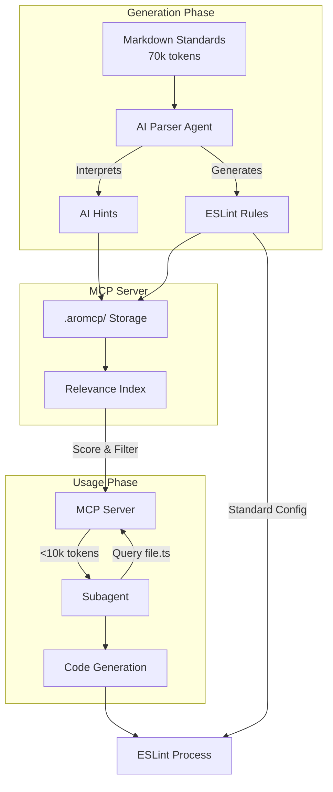

# MCP Code Standards System - Complete Design

## System Overview

A Model Context Protocol (MCP) server that efficiently manages coding standards for AI subagents. It stores AI-interpreted rules and ESLint configurations, serving only relevant hints to keep subagent context under 10k tokens.



## Storage Structure

```
project-root/
├── .aromcp/                          # All MCP data
│   ├── manifest.json                 # Standards registry
│   ├── hints/
│   │   ├── {standard-id}/           # One folder per standard
│   │   │   ├── hint-001.json        # Individual hints
│   │   │   ├── hint-002.json
│   │   │   └── metadata.json        # Standard metadata
│   │   └── index.json               # Fast lookup indices
│   └── eslint/
│       └── {standard-id}.json       # ESLint rules per standard
├── standards/                        # Source markdown files
│   ├── api/
│   │   └── error-handling.md
│   └── components/
│       └── structure.md
└── .eslintrc.json                   # Standard ESLint config
```

## MCP API Specification

### Module: `standards`

#### Tool: `check-updates`
Scans for new or modified standard files.

```json
{
  "inputSchema": {
    "type": "object",
    "properties": {
      "standardsPath": {
        "type": "string",
        "description": "Root folder containing .md files"
      }
    },
    "required": ["standardsPath"]
  },
  "outputSchema": {
    "type": "object",
    "properties": {
      "needsUpdate": {
        "type": "array",
        "items": {
          "type": "object",
          "properties": {
            "standardId": { "type": "string" },
            "sourcePath": { "type": "string" },
            "reason": { "enum": ["new", "modified", "deleted"] },
            "lastModified": { "type": "string", "format": "date-time" }
          }
        }
      },
      "upToDate": { "type": "number" }
    }
  }
}
```

#### Tool: `register`
Registers a standard after AI parsing.

```json
{
  "inputSchema": {
    "type": "object",
    "properties": {
      "sourcePath": { "type": "string" },
      "metadata": {
        "type": "object",
        "properties": {
          "id": { "type": "string" },
          "name": { "type": "string" },
          "category": { "type": "string" },
          "tags": { "type": "array", "items": { "type": "string" } },
          "appliesTo": { "type": "array", "items": { "type": "string" } },
          "severity": { "enum": ["error", "warning", "info"] },
          "priority": { "enum": ["required", "important", "recommended"] }
        },
        "required": ["id", "name", "category", "tags", "appliesTo", "severity", "priority"]
      }
    }
  },
  "outputSchema": {
    "type": "object",
    "properties": {
      "standardId": { "type": "string" },
      "isNew": { "type": "boolean" }
    }
  }
}
```

#### Tool: `delete`
Removes all rules and hints for a standard.

```json
{
  "inputSchema": {
    "type": "object",
    "properties": {
      "standardId": { "type": "string" }
    },
    "required": ["standardId"]
  },
  "outputSchema": {
    "type": "object",
    "properties": {
      "deleted": {
        "type": "object",
        "properties": {
          "aiHints": { "type": "number" },
          "eslintRules": { "type": "boolean" }
        }
      }
    }
  }
}
```

#### Tool: `update-rules`
Stores AI hints and ESLint rules.

```json
{
  "inputSchema": {
    "type": "object",
    "properties": {
      "standardId": { "type": "string" },
      "clearExisting": { "type": "boolean" },
      "aiHints": {
        "type": "array",
        "items": {
          "type": "object",
          "properties": {
            "rule": { "type": "string" },
            "context": { "type": "string" },
            "correctExample": { "type": "string" },
            "incorrectExample": { "type": "string" },
            "hasEslintRule": { "type": "boolean" }
          }
        }
      },
      "eslintRules": {
        "type": "object",
        "properties": {
          "rules": { "type": "object" }
        }
      }
    }
  }
}
```

#### Tool: `hints-for-file`
Gets relevant hints for a specific file.

```json
{
  "inputSchema": {
    "type": "object",
    "properties": {
      "filePath": { "type": "string" },
      "maxTokens": { "type": "number", "default": 10000 }
    }
  },
  "outputSchema": {
    "type": "object",
    "properties": {
      "hints": {
        "type": "array",
        "items": {
          "type": "object",
          "properties": {
            "rule": { "type": "string" },
            "context": { "type": "string" },
            "correctExample": { "type": "string" },
            "incorrectExample": { "type": "string" },
            "relevanceScore": { "type": "number" }
          }
        }
      },
      "totalTokens": { "type": "number" }
    }
  }
}
```

## Relevance Scoring Algorithm

```typescript
function scoreRelevance(standard: Metadata, filePath: string): number {
  const parts = filePath.split('/');
  const folders = parts.slice(0, -1);
  let score = 0;

  // Exact folder match: 1.0
  if (folders.includes(standard.category) ||
      folders.some(f => standard.tags.includes(f))) {
    score = 1.0;
  }
  // Glob pattern match: 0.8
  else if (standard.appliesTo.some(pattern => minimatch(filePath, pattern))) {
    score = 0.8;
  }
  // Category in path: 0.6
  else if (folders.some(f => f.includes(standard.category))) {
    score = 0.6;
  }
  // Tag in path: 0.4
  else if (standard.tags.some(tag =>
    filePath.toLowerCase().includes(tag.toLowerCase()))) {
    score = 0.4;
  }

  // Priority boost
  const boost = {
    'required': 1.2,
    'important': 1.1,
    'recommended': 1.0
  };

  return score * boost[standard.priority];
}
```

## Workflow Examples

### Generation Workflow

```typescript
// 1. Check for updates
const updates = await mcp.call('check-updates', {
  standardsPath: './standards'
});

// 2. For each outdated standard
for (const update of updates.needsUpdate) {
  // AI Agent reads and parses markdown
  const content = await fs.readFile(update.sourcePath);
  const parsed = await aiAgent.parseStandard(content);

  // Register the standard
  await mcp.call('register', {
    sourcePath: update.sourcePath,
    metadata: parsed.metadata
  });

  // Generate and store rules
  const hints = await aiAgent.generateHints(parsed);
  const eslint = await aiAgent.generateEslint(parsed);

  await mcp.call('update-rules', {
    standardId: parsed.metadata.id,
    clearExisting: true,
    aiHints: hints,
    eslintRules: eslint
  });
}
```

### Usage Workflow

```typescript
// Subagent processing a file
async function processFile(filePath: string) {
  // Get relevant hints
  const response = await mcp.call('hints-for-file', {
    filePath: filePath,
    maxTokens: 8000  // Leave room for code generation
  });

  // Use hints to generate code
  const code = await generateCode(filePath, response.hints);

  return code;
}
```

## Token Optimization Strategy

1. **Pre-calculate token counts** for each hint during storage
2. **Score-based selection** prioritizes most relevant standards
3. **Deprioritize ESLint-covered rules** (multiply score by 0.7)
4. **Required rules first**, then by relevance score
5. **Minimal response format** - only essential fields returned

## Example Data

### Stored AI Hint
```json
{
  "id": "error-handling-001",
  "standardId": "error-handling",
  "rule": "Always use Error objects for throwing errors",
  "context": "This preserves stack traces and enables better debugging",
  "correctExample": "throw new Error('User not found');",
  "incorrectExample": "throw 'User not found';",
  "hasEslintRule": true,
  "eslintRuleRef": "no-throw-literal",
  "tokens": 127
}
```

### Response to Subagent
```json
{
  "hints": [
    {
      "rule": "Always use Error objects for throwing errors",
      "context": "This preserves stack traces and enables better debugging",
      "correctExample": "throw new Error('User not found');",
      "incorrectExample": "throw 'User not found';",
      "relevanceScore": 0.96
    }
  ],
  "totalTokens": 89
}
```

## Key Design Principles

1. **Separation of Concerns**
   - MCP: Storage and retrieval only
   - AI Agent: All parsing and generation
   - ESLint: Runs independently with standard config

2. **Token Efficiency**
   - Minimal response format
   - Pre-calculated token counts
   - Smart selection within budget

3. **Deterministic Behavior**
   - File-based pattern matching
   - No AI logic in MCP server
   - Predictable scoring algorithm

4. **Scalability**
   - Indexed for fast lookups
   - Handles hundreds of standards
   - Efficient folder structure

## Implementation Checklist

- [ ] MCP server with three modules (standards, rules, hints)
- [ ] File system operations for `.aromcp/` directory
- [ ] Relevance scoring with folder/pattern matching
- [ ] Token counting and budget management
- [ ] ESLint validation on rule storage
- [ ] Recursive markdown file discovery
- [ ] Manifest tracking for update detection
- [ ] Minimal response formatting

## Benefits

- **Context Efficiency**: Subagents stay under 10k tokens
- **Quality Assurance**: Both AI guidance and ESLint automation
- **Maintainability**: Clear file structure and update tracking
- **Performance**: Fast lookups with pre-built indices
- **Flexibility**: Works with existing ESLint setup