# Temporal.io Workflow Engine - Simplified Design Specification

## 1. Executive Summary

This specification describes a streamlined workflow orchestration system built on Temporal.io that runs entirely within a single MCP server process. The system leverages Temporal's built-in persistence and state management, eliminating the need for external storage systems like Redis. All workflow execution, state management, and MCP protocol handling occur within one Python process that Claude starts.

## 2. Glossary of Terms

### Core Terminology

| Term | Definition |
|------|------------|
| **Sub-agent** | A new Claude conversation context created with specialized system prompts and custom instructions for handling delegated tasks. Each sub-agent operates independently with its own context. |
| **Local Activity** | A Temporal activity that executes synchronously within the workflow worker process without network calls or queuing. Used for server-side operations like conditions and state updates. |
| **Standard Activity** | A Temporal activity that executes on a task queue and can be asynchronous. Returns pending actions that require Claude to execute before the workflow can continue. |
| **MCP Tool** | A tool exposed through the Model Context Protocol that Claude can invoke. Examples include file operations, API calls, and integration with external services. |
| **System Prompt** | The base instructional prompt that defines an agent's role and capabilities. Combined with custom instructions to create the complete prompt for sub-agents. |
| **Pending Action** | A workflow action that requires Claude's execution (shell command, tool call, etc.) before the workflow can proceed. Stored in memory while workflow is suspended. |
| **needs_state** | A declaration on each workflow step specifying which state fields it can access. Enforces state isolation and explicit data dependencies. |
| **output_to** | The state field where a step's result will be written upon successful completion. |
| **Workflow Definition** | A YAML file describing the workflow steps, inputs, state, and sub-tasks. |
| **Child Workflow** | A Temporal workflow spawned by a parent workflow, typically for parallel processing. Has isolated state and no direct access to parent state. |
| **Workflow Server** | The MCP server component that manages workflow execution and provides step-by-step instructions to sub-agents. |

## 2.1. Implementation Terms and Definitions

### Agent Identifiers

| Term | Definition | Examples |
|------|------------|----------|
| **Agent Identifier** | A string prefixed with `@` that routes delegation to a specific Claude sub-agent configuration | `@codebase-researcher`, `@security-analyzer`, `@code-generator` |
| **@task** | Special agent identifier for generic task execution where sub-agent follows workflow steps | `agent: "@task"` |
| **Agent Format** | Must match pattern: `@[a-z0-9-]+` (lowercase letters, numbers, hyphens only) | Valid: `@data-analyst-v2`<br>Invalid: `@Data_Analyst`, `@agent.name` |
| **Default Agent** | When no agent specified, uses standard Claude with base system prompt | Omit `agent` field or use `null` |

### Jinja2 Functions Reference

#### Date/Time Functions

| Function | Description | Return Type | Example |
|----------|-------------|-------------|---------|
| `now()` | Returns current datetime | Python datetime object | `{{ now() }}` → `2025-08-19 14:30:00` |
| `now().isoformat()` | ISO 8601 formatted string | String | `{{ now().isoformat() }}` → `2025-08-19T14:30:00` |
| `now().strftime(format)` | Custom formatted datetime | String | `{{ now().strftime('%Y%m%d-%H%M%S') }}` → `20250819-143000` |
| `now().timestamp()` | Unix timestamp | Float | `{{ now().timestamp() }}` → `1754923800.0` |
| `now().date()` | Date portion only | Date object | `{{ now().date() }}` → `2025-08-19` |

#### String Manipulation Functions

| Function | Description | Example |
|----------|-------------|---------|
| `regex_search(pattern, string)` | Find first regex match | `{{ state.output \| regex_search('([0-9]+)% reduction') }}` → `['45% reduction']` |
| `regex_findall(pattern, string)` | Find all regex matches | `{{ state.text \| regex_findall(r'\d+') }}` → `['10', '20', '30']` |
| `regex_replace(pattern, replacement, string)` | Replace using regex | `{{ state.path \| regex_replace(r'\.txt

### In-Memory Storage Implementations

| Component | Data Structure | Scope | Lifetime |
|-----------|---------------|-------|----------|
| **Pending Actions Map** | Python `dict` with workflow_id keys | Process-wide | Until workflow completes or MCP server restarts |
| **YAML Cache** | LRU cache with TTL (using `cachetools`) | Process-wide | TTL-based eviction (default: 300s) |
| **State Filter** | Temporary dict created per step | Step execution | Garbage collected after step |
| **Expression Context** | Dict with state + inputs | Expression evaluation | Garbage collected after evaluation |

### FastMCP Configuration

| Parameter | Description | Default | Required |
|-----------|-------------|---------|----------|
| **server_name** | MCP server identifier | `"temporal-workflow"` | Yes |
| **transport** | Communication protocol | `"stdio"` | Yes |
| **tools** | List of exposed MCP tools | `["start_workflow", "submit_result", "get_workflow_status"]` | Yes |
| **max_message_size** | Maximum MCP message size | `10MB` | No |
| **timeout** | MCP operation timeout | `30s` | No |

### Workflow Server Interaction Protocol

| MCP Tool | Purpose | Used By |
|----------|---------|---------|
| **get_next_step(workflow_id)** | Get the next step to execute in a child workflow | Sub-agents executing tasks |
| **submit_step_result(workflow_id, step_id, result)** | Submit the result of a workflow step | Sub-agents executing tasks |
| **get_workflow_state(workflow_id)** | Query current workflow state (debugging) | Sub-agents (optional) |

## 3. Architecture Overview

**Note:** The MCP protocol layer is implemented using FastMCP, which handles all Claude communication, tool registration, and message routing.

### 3.1 Simplified Two-Component Architecture

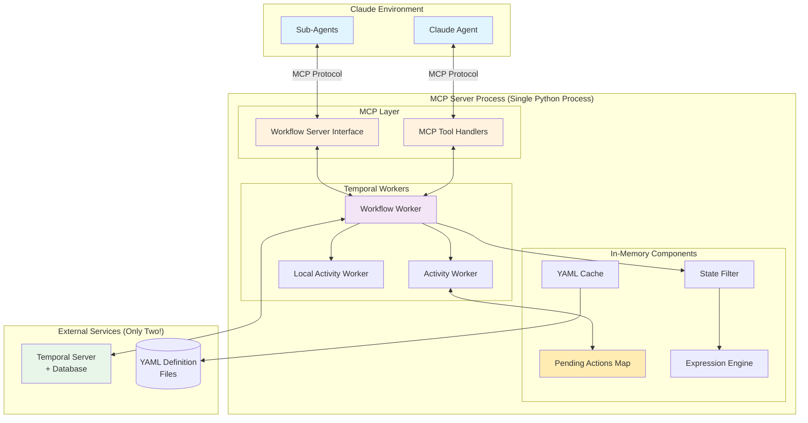

### 3.2 Component Responsibilities

| Component | Purpose | Storage |
|-----------|---------|---------|
| **MCP Tool Handlers** | Process Claude's MCP tool calls | In-memory |
| **Workflow Server Interface** | Provides step-by-step execution for sub-agents | In-memory |
| **Temporal Workers** | Execute workflows and activities | State in Temporal |
| **Pending Actions Map** | Track actions awaiting Claude execution | In-memory HashMap |
| **YAML Cache** | Cache parsed workflow definitions | In-memory with TTL |
| **State Filter** | Apply needs_state access control | In-memory processing |
| **Expression Engine** | Evaluate Jinja2 templates | In-memory processing |

## 4. Core Workflow Execution

### 4.1 Execution Flow

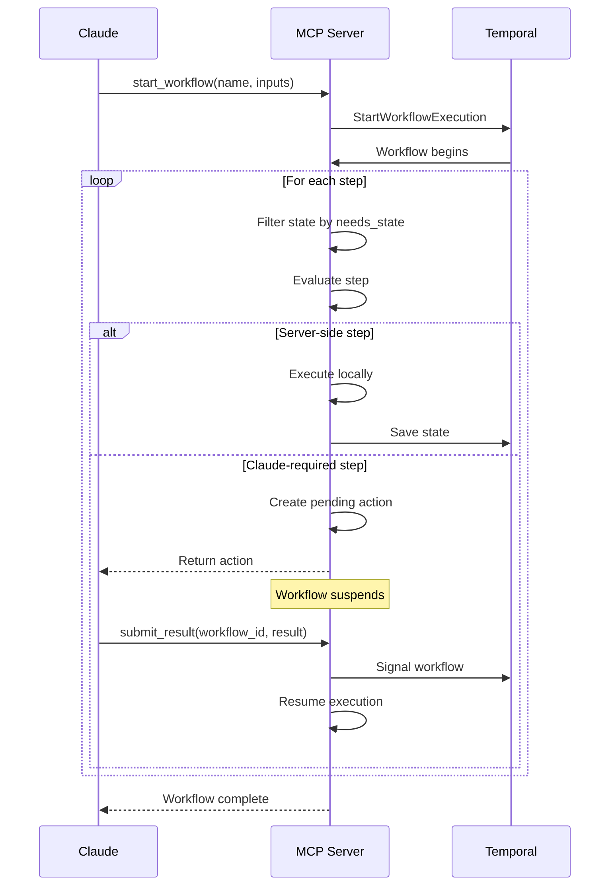

### 4.2 State Management (Fully Temporal-Based)

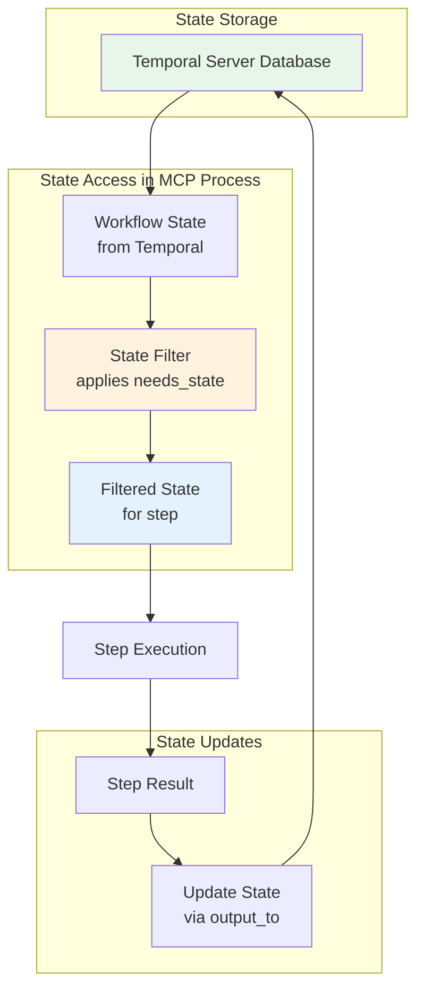

**Key Points:**
- All workflow state persisted in Temporal's database
- No Redis needed - Temporal handles all persistence
- State filtering happens in-memory during execution
- Temporal provides automatic recovery and history

## 5. Workflow Step Types - Complete Functional Reference

### 5.1 Overview of Step Types

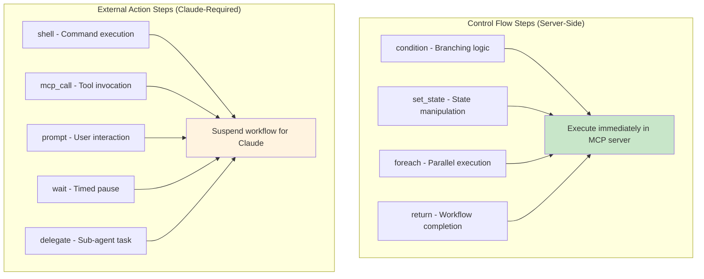

### 5.2 Control Flow Steps (Server-Side Execution)

#### **condition** - Conditional Branching
**Purpose:** Execute different steps based on runtime conditions
**Execution:** Synchronous, in-process (Local Activity)
**Use Cases:**
- Route workflow based on previous results
- Implement if/then/else logic
- Handle error conditions with fallback paths

**Functional Behavior:**
1. Evaluates Jinja2 expression in `if` field using filtered state
2. If true, executes all steps in `then` branch sequentially
3. If false, executes all steps in `else` branch (if present)
4. Branches can contain any step types, including nested conditions
5. All branch steps inherit parent's state and can modify it

**Example:**
```yaml
- id: "check-approval"
  type: condition
  needs_state: ["approval_status", "approver_count"]
  if: "{{ state.approval_status == 'approved' and state.approver_count >= 2 }}"
  then:
    - id: "proceed-with-deployment"
      type: shell
      needs_state: []
      command: "kubectl apply -f deployment.yaml"
      output_to: "deployment_result"
  else:
    - id: "request-more-approvals"
      type: mcp_call
      needs_state: ["approver_count"]
      tool: "slack.notify"
      parameters:
        message: "Need {{ 2 - state.approver_count }} more approvals"
```

#### **set_state** - State Manipulation
**Purpose:** Update workflow state with computed values
**Execution:** Synchronous, in-process (Local Activity)
**Use Cases:**
- Calculate derived values from existing state
- Initialize state fields
- Transform data between steps
- Aggregate or summarize results

**Functional Behavior:**
1. Evaluates each Jinja2 expression in `updates` dictionary
2. Writes all results to workflow state atomically
3. Can create new state fields or overwrite existing ones
4. Expressions can reference current state and inputs
5. All updates happen in a single transaction

**Example:**
```yaml
- id: "calculate-metrics"
  type: set_state
  needs_state: ["test_results", "build_time"]
  updates:
    total_tests: "{{ state.test_results | length }}"
    passed_tests: "{{ state.test_results | selectattr('status', 'equalto', 'pass') | list | length }}"
    success_rate: "{{ (passed_tests / total_tests * 100) | round(2) }}"
    performance_score: "{{ 100 - (state.build_time / 60) | int }}"
```

#### **foreach** - Parallel Iteration with Optional Delegation
**Purpose:** Process collections in parallel using sub-workflows
**Execution:** Spawns Temporal child workflows
**Use Cases:**
- Batch processing of files, records, or resources
- Parallel API calls or deployments
- Map-reduce style operations
- Concurrent testing or validation
- Delegating tasks to sub-agents for clean context isolation

**Functional Behavior:**
1. Evaluates `items` expression to get array
2. If `sequential: true`, processes items one at a time in order
3. If `sequential: false` (default), spawns all child workflows in parallel
4. Each child receives only its item as input (no parent state access)
5. If `agent` specified, entire child task is delegated to sub-agent
6. Parent workflow suspends until ALL children complete
7. Results collected in order and written to `output_to` field
8. If any child fails, parent continues but marks failure

**Execution Modes:**

| Mode | Configuration | Behavior | Use Case |
|------|--------------|----------|----------|
| **Parallel** | `sequential: false` (default) | All items processed simultaneously | Batch processing, independent tasks |
| **Sequential** | `sequential: true` | Items processed one at a time | Order-dependent tasks, rate-limited APIs |

**Delegation Modes:**

| Mode | Agent Field | Execution | Use Case |
|------|------------|-----------|----------|
| **Standard** | Not specified | Child workflow executes normally | Simple parallel processing |
| **Task Delegation** | `@task` | Sub-agent executes workflow steps | Complex multi-step tasks |
| **Specialized Agent** | `@agent-name` | Specialized agent processes directly | Domain-specific analysis |

> ⚠️ **RUNTIME PROMPT GENERATION**
>
> When `agent` is specified, the MCP server automatically generates:
> 1. **Instructions for main Claude** about how to delegate
> 2. **Sub-agent prompt** with workflow-server-rules and context
>
> The workflow definition only declares the intent; the MCP server handles the execution details at runtime.

**Example:**
```yaml
# Parallel foreach with task delegation (default)
- id: "analyze-all-files"
  type: foreach
  needs_state: ["file_list", "analysis_context"]
  items: "{{ state.file_list }}"
  agent: "@task"  # Delegates entire task to sub-agent
  task: "analyze_file"  # Task definition contains the steps
  output_to: "analysis_results"

# Sequential foreach for order-dependent processing
- id: "progressive-research"
  type: foreach
  needs_state: ["research_topics"]
  items: "{{ state.research_topics }}"
  agent: "@task"
  task: "research_topic"
  sequential: true  # Process one at a time, each building on previous
  output_to: "research_findings"

# Specialized agent delegation
- id: "security-scan"
  type: foreach
  needs_state: ["source_files"]
  items: "{{ state.source_files }}"
  agent: "@security-analyzer"  # Uses specialized agent
  task: "scan_file"
  output_to: "security_findings"

# Standard execution (no delegation)
- id: "copy-files"
  type: foreach
  needs_state: ["files_to_copy"]
  items: "{{ state.files_to_copy }}"
  task: "copy_file"  # No agent - executes normally
  output_to: "copy_results"
```

#### **delegate** - Single Task Delegation
**Purpose:** Delegate a single task to a Claude sub-agent with context
**Execution:** Creates sub-agent, returns action to Claude
**Use Cases:**
- Complex analysis requiring specialized agent
- Research tasks needing specific expertise
- Code generation with custom instructions
- Document processing with domain context

**Functional Behavior:**
1. Renders instructions template with filtered state
2. Creates delegation action with system + custom prompt
3. If agent specified, routes to that specific agent
4. Returns delegation action to Claude
5. Workflow suspends until sub-agent completes
6. Sub-agent result written to `output_to` field

**Delegation Structure:**
- System prompt (standard) + custom instructions
- Can pass context from parent workflow
- Agent identifier for specialized routing
- Result includes both answer and metadata

**Example:**
```yaml
- id: "research-architecture"
  type: delegate
  needs_state: ["codebase_summary", "requirements"]
  instructions: |
    Analyze this codebase and suggest architectural improvements.

    Current architecture summary:
    {{ state.codebase_summary }}

    Requirements to consider:
    {{ state.requirements | join('\n') }}

    Provide specific, actionable recommendations with code examples.
  agent: "@codebase-researcher"
  output_to: "architecture_analysis"
```

#### **return** - Workflow Completion
**Purpose:** Complete workflow or sub-task with final value
**Execution:** Synchronous, in-process (Local Activity)
**Use Cases:**
- Early exit from workflow
- Return result from sub-task to parent
- Provide final workflow output
- Exit from conditional branches

**Functional Behavior:**
1. Evaluates `value` expression to compute return value
2. Immediately terminates workflow execution
3. For main workflows: sets final output
4. For sub-tasks: returns value to parent foreach
5. No subsequent steps execute after return

**Example:**
```yaml
- id: "early-exit"
  type: return
  needs_state: ["error_count", "processed_items"]
  value:
    success: false
    reason: "Too many errors"
    processed: "{{ state.processed_items }}"
    errors: "{{ state.error_count }}"
```

#### **goto** - Jump to Step (Future Enhancement)
**Purpose:** Jump to a previous or later step in the workflow
**Status:** Planned for future implementation
**Use Cases:**
- Retry logic with different parameters
- Iterative refinement based on review feedback
- Complex state machines

**Planned Behavior:**
1. Jump to specified step by ID
2. Maintain current state
3. Optional: Set loop counter to prevent infinite loops

**Example (Future):**
```yaml
- id: "check-quality"
  type: condition
  needs_state: ["quality_score"]
  if: "{{ state.quality_score < 90 }}"
  then:
    - id: "retry"
      type: goto
      target: "improve-quality"  # Jump back to earlier step
      max_iterations: 3  # Prevent infinite loops
```

> **Note:** Currently, iterative workflows can be approximated using nested conditions or by breaking the workflow into multiple workflows that chain together.

### 5.3 External Action Steps (Claude-Required Execution)

#### **shell** - Command Line Execution
**Purpose:** Execute shell commands in Claude's environment
**Execution:** Returns action to Claude, workflow suspends
**Use Cases:**
- Run build scripts or tests
- Execute system commands
- Interact with CLI tools
- File system operations

**Functional Behavior:**
1. Renders command template with filtered state
2. Returns shell action to Claude with timeout
3. Workflow suspends until result submitted
4. Claude executes command and returns stdout/stderr/exit_code
5. Result written to `output_to` field if specified

**Result Structure:**
```yaml
{
  stdout: "command output",
  stderr: "error output if any",
  exit_code: 0,
  duration: 1.23  # execution time in seconds
}
```

**Example:**
```yaml
- id: "run-tests"
  type: shell
  needs_state: ["test_directory"]
  command: "cd {{ state.test_directory }} && npm test --coverage"
  timeout: 120  # 2 minutes
  output_to: "test_output"
  when: "{{ state.test_directory is defined }}"
```

#### **mcp_call** - MCP Tool Invocation
**Purpose:** Call MCP tools available in Claude's environment
**Execution:** Returns action to Claude, workflow suspends
**Use Cases:**
- Interact with external APIs
- Access Claude's integrated tools
- Perform operations requiring MCP tools
- Integration with third-party services

**Functional Behavior:**
1. Renders tool parameters with filtered state
2. Returns MCP call action to Claude
3. Workflow suspends until result submitted
4. Claude executes tool and returns tool-specific response
5. Result structure depends on specific tool

**Example:**
```yaml
- id: "create-github-issue"
  type: mcp_call
  needs_state: ["error_details", "repository"]
  tool: "github.create_issue"
  parameters:
    repo: "{{ state.repository }}"
    title: "Build failed: {{ state.error_details.message }}"
    body: |
      Error occurred at: {{ state.error_details.timestamp }}
      Exit code: {{ state.error_details.exit_code }}
      See workflow run for details.
    labels: ["bug", "ci-failure"]
  output_to: "issue"
```

#### **prompt** - User Interaction
**Purpose:** Display information or collect user input
**Execution:** Returns action to Claude, workflow suspends
**Use Cases:**
- Get user confirmation before proceeding
- Display status messages
- Collect user input or choices
- Manual approval gates

**Functional Behavior:**
1. Renders message with filtered state
2. Returns prompt action to Claude based on type
3. Workflow suspends until user responds
4. Response format varies by prompt type
5. User response written to `output_to` if specified

**Prompt Types and Responses:**

| Type | Purpose | Response Format |
|------|---------|----------------|
| `info` | Display message only | `{acknowledged: true}` |
| `confirm` | Yes/No question | `{confirmed: true/false}` |
| `text` | Text input | `{input: "user text"}` |
| `choice` | Select from options | `{selected: "option"}` |

**Example:**
```yaml
- id: "confirm-production-deploy"
  type: prompt
  needs_state: ["environment", "version"]
  message: |
    Deploy version {{ state.version }} to {{ state.environment }}?
    This action cannot be undone.
  type: "confirm"
  output_to: "user_confirmation"
```

#### **wait** - Timed Pause
**Purpose:** Pause workflow execution for specified duration
**Execution:** Returns action to Claude, workflow suspends
**Use Cases:**
- Wait for external systems to stabilize
- Rate limiting between operations
- Polling delays
- Give time for manual intervention

**Functional Behavior:**
1. Returns wait action with duration to Claude
2. Workflow suspends for specified time
3. Optional message displayed during wait
4. After duration, workflow automatically resumes
5. No user interaction required

**Example:**
```yaml
- id: "wait-for-dns"
  type: wait
  needs_state: []
  duration_seconds: 30
  message: "Waiting for DNS propagation..."
  output_to: "wait_complete"
```

### 5.4 Step Execution Matrix

| Step Type | Execution Model | Suspends Workflow | Modifies State | Can Fail |
|-----------|----------------|-------------------|----------------|----------|
| `condition` | Local/Sync | No | Yes (via branches) | Yes |
| `set_state` | Local/Sync | No | Yes | Yes |
| `foreach` | Child Workflows | Yes (for children) | Yes | Yes |
| `return` | Local/Sync | No | No (terminates) | Yes |
| `shell` | Claude Action | Yes | Via output_to | Yes |
| `mcp_call` | Claude Action | Yes | Via output_to | Yes |
| `prompt` | Claude Action | Yes | Via output_to | No |
| `wait` | Claude Action | Yes | Via output_to | No |
| `delegate` | Claude Sub-Agent | Yes | Via output_to | Yes |

### 5.5 Common Step Modifiers

All step types support these optional modifiers:

| Modifier | Applies To | Purpose | Example |
|----------|------------|---------|---------|
| `needs_state` | All | Declare state field access | `needs_state: ["field1", "field2"]` |
| `output_to` | All except return | Specify result storage field | `output_to: "result_field"` |
| `when` | All except return | Conditional execution | `when: "{{ state.enabled }}"` |
| `timeout` | shell, mcp_call | Override default timeout | `timeout: 60` |

## 6. Sub-Agent Workflow Execution

### 6.1 Sub-Agent Interaction Protocol

When a foreach step delegates to a sub-agent (via `agent` field), the sub-agent is created with minimal context to preserve the main Claude's context window:

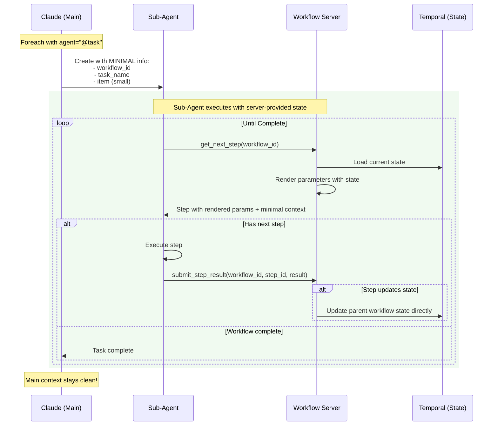

**Key Architecture Principles:**
- **Minimal Context**: Sub-agents created with only workflow_id, task, and item
- **Server-Provided State**: Each step receives state from server, not passed through Claude
- **Direct Parent Updates**: Child workflows can update parent state directly
- **No State in Context**: State never duplicated in Claude's context window

### 6.2 Workflow Server Rules (Runtime Generated)

When a sub-agent is created for task delegation, it receives:

```markdown
<workflow-server-rules>
You are executing a workflow task through the Temporal workflow server.
You must call the workflow server to get each next step to execute.

## How to interact with the workflow server:
1. Call `get_next_step(workflow_id)` to receive the next workflow step
2. Execute the step based on its type:
   - shell: Execute the command and return stdout/stderr/exit_code
   - mcp_call: Call the specified MCP tool with parameters
   - set_state: Acknowledge state updates (server handles internally)
   - return: Acknowledge completion
3. Call `submit_step_result(workflow_id, step_id, result)` to send the result back
4. Repeat until you receive {status: "complete"}

## Workflow Context:
- Workflow ID: [generated_id]
- Task: [task_name]
- Input: [item_from_foreach]
</workflow-server-rules>

Begin by calling get_next_step with your workflow ID.
```

### 6.3 Example Sub-Agent Execution

```python
# Sub-agent starts by getting first step
get_next_step(workflow_id="child_1_analyze_file")

# Server returns step to execute
{
  "step_id": "read-file",
  "type": "shell",
  "command": "cat /src/main.py",
  "timeout": 30
}

# Sub-agent executes and submits result
submit_step_result(
  workflow_id="child_1_analyze_file",
  step_id="read-file",
  result={
    "stdout": "print('hello')",
    "stderr": "",
    "exit_code": 0
  }
)

# Sub-agent gets next step
get_next_step(workflow_id="child_1_analyze_file")

# Continue until server returns completion
{
  "status": "complete",
  "final_result": {...}
}
```

### 6.4 Design Principle: User Input in Main Workflow

**Important:** User input (via `prompt` steps) should occur in the main workflow, not in delegated tasks.

**Rationale:**
- Sub-agents are execution engines, not interaction managers
- Keeps delegation boundaries clean
- Avoids complex input bubbling through multiple layers
- User always interacts with the main Claude context

**Pattern:**
```yaml
# GOOD: Get user input before delegation
steps:
  - id: "get-approval"
    type: prompt
    message: "Proceed with deployment?"
    type: "confirm"
    output_to: "approved"

  - id: "deploy-if-approved"
    type: condition
    if: "{{ state.approved.confirmed }}"
    then:
      - id: "deploy"
        type: foreach
        agent: "@task"
        task: "deploy_service"  # No prompts in this task

# BAD: Prompt inside delegated task
tasks:
  deploy_service:
    steps:
      - id: "confirm"  # ❌ Don't put prompts in delegated tasks
        type: prompt
        message: "Deploy?"
```

### 6.5 State Management in Sub-Agent Tasks

When a sub-agent encounters a `set_state` step, the workflow server handles all state updates internally:

```python
# Sub-agent receives set_state step
get_next_step(workflow_id="child_1")
# Returns:
{
  "step_id": "calculate-metrics",
  "type": "set_state",
  "message": "State updated internally",
  "requires_action": false
}

# Sub-agent just acknowledges - no state manipulation
submit_step_result(
  workflow_id="child_1",
  step_id="calculate-metrics",
  result={"acknowledged": true}
)
```

**Key Principles:**
1. **Server owns state**: All state updates happen in the workflow server
2. **Sub-agents are stateless**: They don't track or modify state directly
3. **Expressions evaluated server-side**: Jinja2 templates processed by server
4. **Persistence automatic**: Server saves all state changes to Temporal

This design keeps sub-agents simple and focused purely on execution.

## 7. MCP Tool Interface

### 7.1 Core MCP Tools

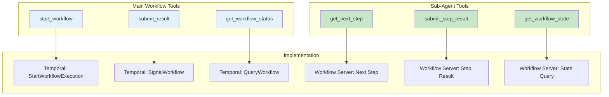

### 7.2 Tool Specifications

#### Main Workflow Tools

**start_workflow**
- Starts new Temporal workflow
- Validates inputs against YAML schema
- Executes until first Claude-required action
- Returns workflow_id and pending action (or completion)

**submit_result**
- Signals suspended workflow with result
- Workflow resumes execution
- Continues until next Claude action or completion
- Returns next action or final state

**get_workflow_status**
- Queries workflow state from Temporal
- Returns current status and any pending action
- Useful for recovery after connection issues

#### Sub-Agent Workflow Tools

**get_next_step**
- Gets the next step to execute in a child workflow
- Returns step details or completion status
- Used by sub-agents executing delegated tasks

**submit_step_result**
- Submits the result of executing a workflow step
- Result format depends on step type
- Advances workflow to next step

**get_workflow_state**
- Optional debugging tool
- Returns current workflow state
- Helps sub-agents understand context

### 7.3 MCP Tools Available in Tasks

When executing tasks (whether in main workflow or delegated to sub-agents), these MCP tools are typically available:

#### Data Management Tools

| Tool | Purpose | Example Parameters |
|------|---------|-------------------|
| **save_to_memory** | Persist data for later retrieval | `{key: "research_1", value: {...}}` |
| **load_from_memory** | Retrieve previously saved data | `{key: "research_1"}` |
| **list_memory_keys** | List all saved keys | `{prefix: "research_"}` |

#### External Integration Tools

| Tool | Purpose | Example Parameters |
|------|---------|-------------------|
| **web_search** | Search the web | `{query: "Next.js auth", max_results: 5}` |
| **analyze_text** | Analyze/summarize text | `{text: "...", task: "extract key points"}` |
| **github.get_pr** | Fetch PR details | `{pr: 123}` |
| **github.create_issue** | Create GitHub issue | `{title: "...", body: "..."}` |
| **slack.notify** | Send Slack message | `{channel: "#dev", message: "..."}` |
| **kubernetes.apply** | Apply K8s manifest | `{manifest: "deploy.yaml"}` |

#### File System Tools

| Tool | Purpose | Example Parameters |
|------|---------|-------------------|
| **read_file** | Read file contents | `{path: "/src/main.py"}` |
| **write_file** | Write to file | `{path: "/output.txt", content: "..."}` |
| **list_files** | List directory contents | `{path: "/src", pattern: "*.py"}` |

> **Note:** The actual tools available depend on what MCP servers are connected to Claude. Sub-agents executing delegated tasks have access to the same MCP tools as the main Claude agent.

## 8. Expression Language (Jinja2)

### 8.1 Expression Evaluation Pipeline

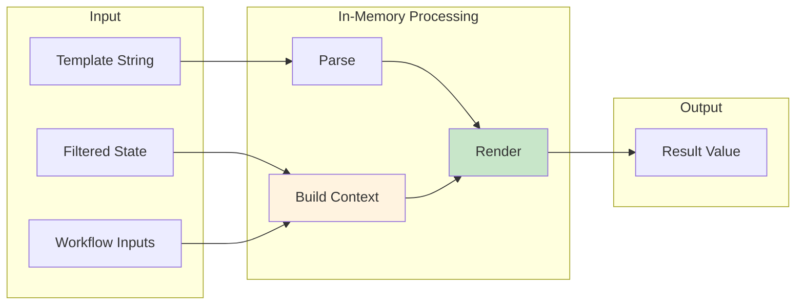

### 8.2 Available Context and Filters

**Template Context:**
- `state` - Filtered state (only needs_state fields)
- `inputs` - Read-only workflow inputs
- `item` - Current item (in foreach child tasks only)

**Built-in Filters:**
- String: `split`, `strip`, `upper`, `lower`, `replace`
- List: `select`, `selectattr`, `list`, `length`, `first`, `last`, `join`, `map`
- Value: `default`, `int`, `float`, `string`, `bool`, `round`
- Comparison: `equalto`, `greaterthan`, `lessthan`
- Custom: `regex_search`, `regex_findall`, `regex_replace`
- All standard Jinja2 filters and tests

## 9. YAML-to-Temporal Workflow Translation

### 9.1 Translation Architecture

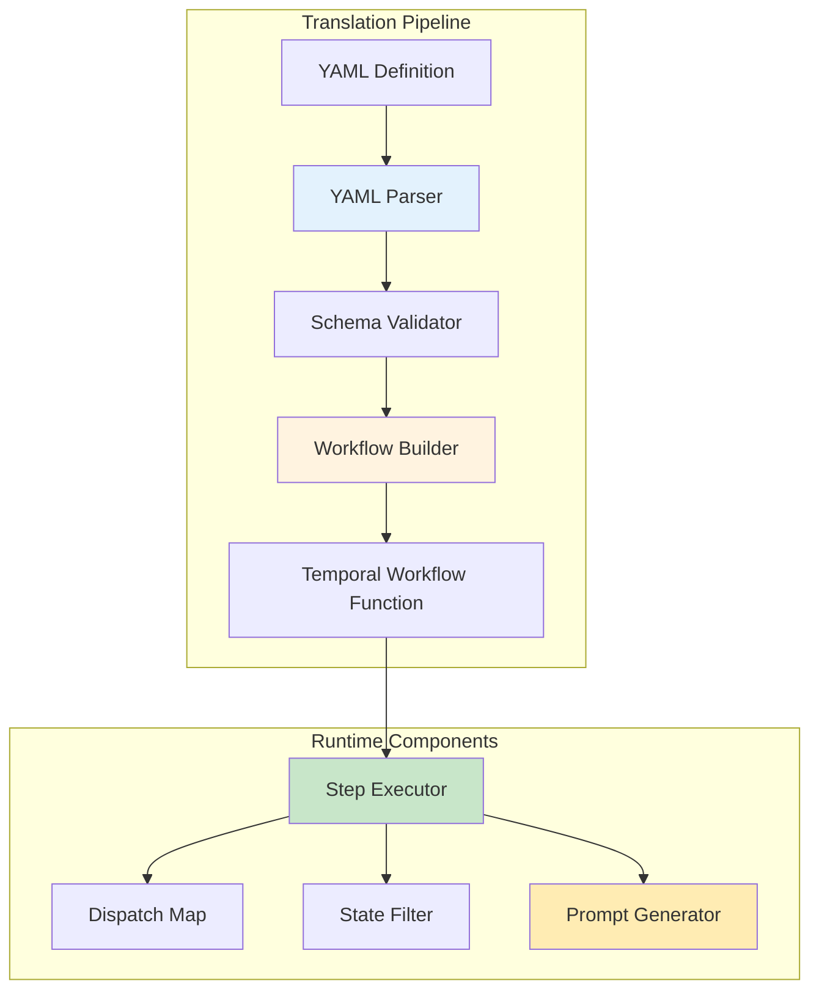

### 9.2 Dynamic Workflow Generation

The system generates Temporal workflow functions from YAML definitions at runtime:

**Workflow Factory Pattern:**
- Each YAML workflow definition is parsed and validated on first use
- A generic Temporal workflow function is parameterized with the YAML structure
- The workflow function interprets the YAML steps sequentially

**Step Execution Engine:**
```
For each step in YAML:
  1. Load step definition from YAML structure
  2. Apply state filter based on needs_state
  3. Evaluate 'when' condition (skip if false)
  4. Render parameters using Jinja2 with filtered state
  5. Dispatch to activity based on step type
  6. Handle activity result according to type
  7. Write output to state if output_to specified
  8. Continue to next step
```

### 9.3 Activity Dispatch Map

| Step Type | Temporal Execution | Returns To Workflow |
|-----------|-------------------|-------------------|
| `condition` | Local Activity (sync) | Branch result |
| `set_state` | Local Activity (sync) | Updated fields |
| `foreach` | Child Workflows | Aggregated array |
| `return` | Local Activity (sync) | Final value |
| `shell` | Standard Activity | PendingAction |
| `mcp_call` | Standard Activity | PendingAction |
| `prompt` | Standard Activity | PendingAction |
| `wait` | Standard Activity | PendingAction |
| `delegate` | Standard Activity | PendingAction |

### 9.4 Runtime Prompt Generation

When a foreach step includes an `agent` field, the MCP server generates prompts at runtime:

**For Main Claude:**
```
You need to process N items in parallel using [agent_type].
For each item, delegate to the appropriate agent to execute the task.
The workflow server will coordinate the execution.
```

**For Sub-Agents:**
```
<workflow-server-rules>
[Standard workflow server interaction protocol]
</workflow-server-rules>

Task: [task_name]
Input: [item]

Call get_next_step() to begin execution.
```

## 10. Activity Result Protocol

### 10.1 Activity Result Structure

All activities return a standardized result structure:

```yaml
# Server-Side Activity Result
LocalActivityResult:
  success: boolean          # Did the activity succeed?
  value: any               # The actual result value
  error: string            # Error message if failed (optional)

# Claude-Required Activity Result
AsyncActivityResult:
  type: "pending_action"   # Indicates Claude action needed
  action:                  # Action for Claude to execute
    type: string           # shell|mcp_call|prompt|wait|delegate
    parameters: object     # Type-specific parameters
    step_id: string        # For correlation
  workflow_id: string      # For submit_result correlation
```

### 10.2 Activity Type Result Specifications

**Server-Side Activities (Immediate Results):**

| Activity | Success Result | Failure Result |
|----------|---------------|----------------|
| `condition` | `{success: true, value: <branch_results>}` | `{success: false, error: "Expression error: ..."}` |
| `set_state` | `{success: true, value: {field: value, ...}}` | `{success: false, error: "Invalid expression: ..."}` |
| `foreach` | `{success: true, value: [<child_results>]}` | `{success: false, error: "Child workflow failed: ..."}` |
| `return` | `{success: true, value: <return_value>}` | `{success: false, error: "Return expression failed"}` |

**Claude-Required Activities (Pending Actions):**

| Activity | Pending Action Format | Result After Claude Execution |
|----------|----------------------|------------------------------|
| `shell` | `{type: "shell", parameters: {command: "...", timeout: 30}}` | `{stdout: "...", stderr: "...", exit_code: 0}` |
| `mcp_call` | `{type: "mcp_call", parameters: {tool: "...", args: {...}}}` | Tool-specific response object |
| `prompt` | `{type: "prompt", parameters: {message: "...", type: "info"}}` | `{acknowledged: true}` or `{input: "..."}` or `{confirmed: bool}` |
| `wait` | `{type: "wait", parameters: {duration: 10, message: "..."}}` | `{resumed: true, duration: 10}` |
| `delegate` | `{type: "delegate", parameters: {instructions: "...", agent: "..."}}` | `{response: "...", agent_used: "...", tokens_used: N}` |

## 11. Parallel Execution (Child Workflows)

### 11.1 Foreach Implementation

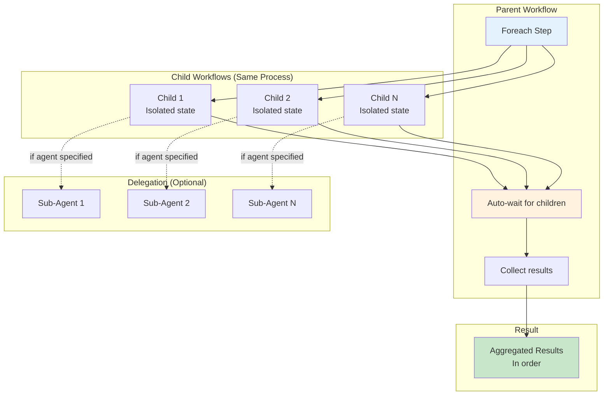

### 11.2 Child Workflow Properties

**Execution:**
- Run as Temporal child workflows
- Automatic parent-child tracking by Temporal
- Execute in parallel (up to worker limits)
- Each has completely isolated state

**Delegation Options:**
- No agent: Child executes normally
- With agent: Entire task delegated to sub-agent
- Sub-agent manages execution via workflow server

**Result Handling:**
- Parent automatically waits (Temporal feature)
- Results maintain item order
- Aggregated array written to output_to field
- All handled by Temporal's child workflow feature

## 12. State Access Control

### 12.1 needs_state Enforcement

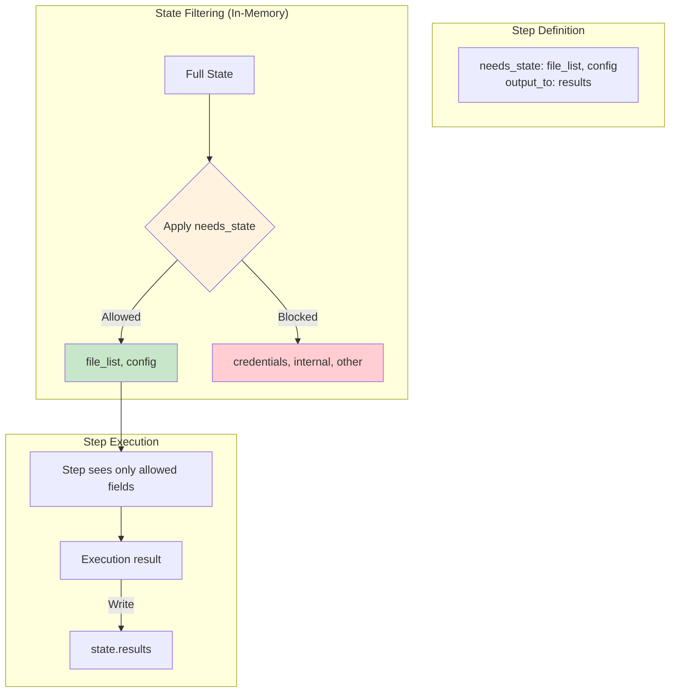

### 12.2 Access Control Rules

**Enforcement Points:**
1. State filtered before each step execution
2. Templates can only reference declared fields
3. Steps write to single field via output_to
4. Violations cause immediate workflow failure

**Security Benefits:**
- No global state access
- Explicit data dependencies
- Predictable state flow
- Easy to audit and debug

## 13. Error Handling

### 13.1 Fail-Fast Strategy

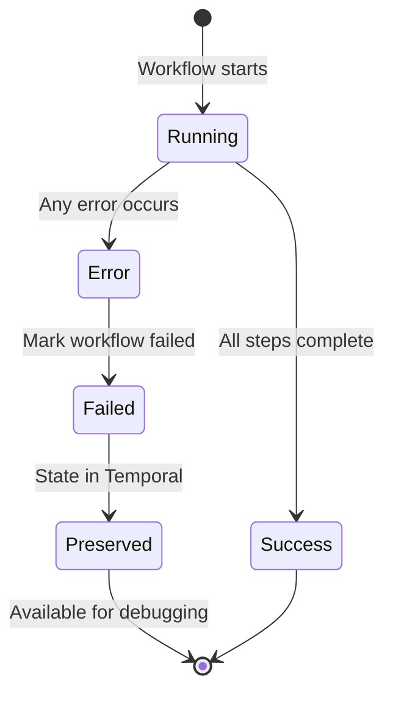

### 13.2 Error Types

| Error | Source | Handling |
|-------|--------|----------|
| **Expression Error** | Invalid Jinja2 | Workflow fails, error returned |
| **State Access Violation** | Undeclared field access | Workflow fails immediately |
| **Activity Timeout** | Step exceeds limit | Temporal timeout, workflow fails |
| **Child Failure** | Sub-task error | Parent fails after collecting |
| **Validation Error** | Invalid inputs | Workflow rejected at start |

**Note:** Temporal preserves complete history for debugging all failures.

## 14. Deployment

### 14.1 Required Infrastructure

```mermaid
graph TB
    subgraph "Required Infrastructure"
        subgraph "Temporal Deployment"
            TS[Temporal Server]
            DB[(PostgreSQL/MySQL/<br/>Cassandra)]
        end

        subgraph "File System"
            YAML[YAML Workflow<br/>Definitions]
        end
    end

    subgraph "Per Claude Session"
        MCP[MCP Server Process<br/>(Python)]
    end

    MCP --> TS
    TS --> DB
    MCP --> YAML

    style TS fill:#e8f5e9
    style MCP fill:#fff3e0
    style YAML fill:#e3f2fd
```

### 14.2 Configuration Requirements

**Temporal Connection:**
```yaml
temporal:
  host: localhost:7233
  namespace: default
  task_queue: mcp-workflows
```

**MCP Server Settings:**
```yaml
mcp_server:
  workflow_definitions: ./workflows/
  max_pending_actions: 50
  yaml_cache_ttl: 300  # seconds
  worker_threads: 10
```

## 15. System Limits

### 15.1 Operational Limits

| Limit | Value | Reason |
|-------|-------|--------|
| Max workflow depth | 5 levels | Prevent stack overflow |
| Max parallel children | 100 | Memory constraint |
| Max state size | 1MB | Temporal best practice |
| Expression timeout | 5 seconds | Prevent hanging |
| Max steps per workflow | 1000 | Practical limit |
| Max pending actions | 50 | Memory constraint |
| YAML cache entries | 100 | Memory constraint |

### 15.2 Resource Usage

**Memory Footprint:**
- Base MCP server: ~50MB
- Per workflow: ~1-2MB
- Pending actions: ~10KB each
- YAML cache: ~100KB per definition
- **Total typical**: 100-200MB

**CPU Usage:**
- Mostly idle waiting for Claude
- Spikes during expression evaluation
- Local activities are CPU-efficient
- Python GIL limits parallelism

## 16. Security Model

### 16.1 Security Boundaries

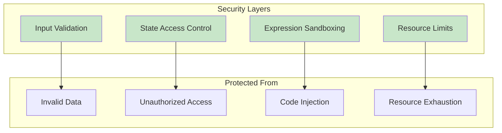

### 16.2 Security Guarantees

- **No code execution** - Only Jinja2 templates
- **Explicit state access** - needs_state enforcement
- **Resource bounded** - Timeouts and size limits
- **Process isolation** - Single trusted process
- **Audit trail** - Complete Temporal history

## 17. Complete YAML Specification

### 17.1 Workflow Definition Schema

```yaml
# Required fields
name: string                    # Unique workflow identifier
version: string                  # Semantic version (e.g., "1.0.0")

# Optional: Input parameter definitions
inputs:
  parameter_name:
    type: string|number|boolean|array|object  # Required
    required: boolean            # Default: false
    default: any                 # Default value if not provided
    validation:                  # Optional validation rules
      # For strings
      pattern: string           # Regex pattern
      min_length: number
      max_length: number
      enum: [string, ...]       # Allowed values

      # For numbers
      min: number
      max: number

      # For arrays
      min_items: number
      max_items: number
      item_type: string         # Type of array elements

      # For objects
      required_keys: [string, ...]
      properties:               # Nested object validation
        key_name:
          type: string
          # ... nested validation

# Optional: Initial workflow state
initial_state:
  field_name: any               # Any JSON-serializable value
  another_field: any

# Required: Workflow steps (at least one)
steps:
  - id: string                  # Required: Unique step identifier
    type: string                # Required: Activity type (see 17.2)
    needs_state: [string, ...]  # Required: State fields this step can access
    output_to: string           # Optional: State field to write result
    when: string                # Optional: Jinja2 condition to execute step

    # Type-specific fields (see 17.2 for details)
    # ...

# Optional: Sub-task definitions (for foreach)
tasks:
  task_name:
    inputs:                     # Same as workflow inputs
      parameter_name:
        type: string
        required: boolean
        # ...

    initial_state:              # Same as workflow initial_state
      field: value

    steps:                      # Same as workflow steps
      - id: string
        type: string
        # ...
```

### 17.2 Activity Type Specifications

#### Server-Side Activities (Local)

```yaml
# CONDITION - Branching logic
- id: string
  type: condition
  needs_state: [string, ...]
  if: string                    # Jinja2 expression that evaluates to boolean
  then:                         # Steps to execute if true
    - id: string
      type: string
      # ... nested step definition
  else:                         # Optional: Steps to execute if false
    - id: string
      type: string
      # ... nested step definition

# SET_STATE - Update workflow state
- id: string
  type: set_state
  needs_state: [string, ...]
  updates:                      # Key-value pairs of state updates
    field_name: string          # Jinja2 expression for new value
    another_field: string       # Can reference state and inputs

# FOREACH - Parallel iteration with optional delegation
- id: string
  type: foreach
  needs_state: [string, ...]
  items: string                 # Jinja2 expression returning array
  task: string                  # Name of task definition in 'tasks' section
  agent: string                 # Optional: "@task" or "@agent-name" for delegation
  sequential: boolean           # Optional: Execute items one at a time (default: false)
  output_to: string             # Required: Where to store aggregated results

# RETURN - Complete workflow/task
- id: string
  type: return
  needs_state: [string, ...]
  value: any                    # Jinja2 expression or literal value
```

#### Claude-Required Activities (Async)

```yaml
# SHELL - Execute shell command
- id: string
  type: shell
  needs_state: [string, ...]
  command: string               # Jinja2 template for command
  timeout: number               # Optional: Seconds (default: 30)
  output_to: string             # Optional: Store result
  when: string                  # Optional: Conditional execution

# MCP_CALL - Call MCP tool
- id: string
  type: mcp_call
  needs_state: [string, ...]
  tool: string                  # MCP tool name
  parameters:                   # Tool-specific parameters
    param_name: any             # Can use Jinja2 templates
    another_param: any
  timeout: number               # Optional: Seconds (default: 30)
  output_to: string             # Optional: Store result
  when: string                  # Optional: Conditional execution

# PROMPT - User interaction
- id: string
  type: prompt
  needs_state: [string, ...]
  message: string               # Jinja2 template for message
  type: info|confirm|text|choice  # Prompt type

  # For 'choice' type only:
  options: [string, ...]        # Array of choices

  # For 'text' type only:
  validation:                   # Optional input validation
    pattern: string
    min_length: number
    max_length: number

  output_to: string             # Optional: Store response
  when: string                  # Optional: Conditional execution

# WAIT - Pause execution
- id: string
  type: wait
  needs_state: []               # Usually needs no state
  duration_seconds: number      # Required: How long to wait
  message: string               # Optional: Message to display
  output_to: string             # Optional: Store completion
  when: string                  # Optional: Conditional execution

# DELEGATE - Delegate task to Claude sub-agent
- id: string
  type: delegate
  needs_state: [string, ...]
  instructions: string          # Required: Custom prompt with context
  agent: string                 # Optional: Specific agent (e.g., "@security-analyzer")
  timeout: number               # Optional: Seconds (default: 300)
  output_to: string             # Optional: Store agent response
  when: string                  # Optional: Conditional execution
```

## 18. Workflow Examples

### 18.1 Simple Linear Workflow

```yaml
name: "deploy-service"
version: "1.0.0"

inputs:
  service_name:
    type: string
    required: true
  environment:
    type: string
    default: "staging"

initial_state:
  deployed: false

steps:
  - id: "build"
    type: shell
    needs_state: []
    command: "docker build -t {{ inputs.service_name }}:latest ."
    output_to: "build_output"

  - id: "test"
    type: shell
    needs_state: ["build_output"]
    command: "docker run {{ inputs.service_name }}:latest npm test"
    output_to: "test_results"
    when: "{{ state.build_output.exit_code == 0 }}"

  - id: "push"
    type: shell
    needs_state: []
    command: "docker push {{ inputs.service_name }}:latest"
    output_to: "push_result"

  - id: "deploy"
    type: mcp_call
    needs_state: ["push_result"]
    tool: "kubernetes.apply"
    parameters:
      manifest: "k8s/{{ inputs.environment }}/{{ inputs.service_name }}.yaml"
    output_to: "deploy_status"

  - id: "notify"
    type: prompt
    needs_state: ["deploy_status"]
    message: "Deployment complete for {{ inputs.service_name }}"
    type: "info"
```

### 18.2 Parallel Processing with Delegation

```yaml
name: "analyze-codebase"
version: "1.0.0"

inputs:
  repository:
    type: string
    required: true
  file_patterns:
    type: array
    default: ["*.py", "*.js", "*.ts"]

initial_state:
  files: []
  analysis_results: []

steps:
  - id: "find-files"
    type: shell
    needs_state: []
    command: |
      find {{ inputs.repository }} \
         \
        -name "{{ pattern }}"  -o  \
         \
        | head -50
    output_to: "file_list_raw"

  - id: "parse-files"
    type: set_state
    needs_state: ["file_list_raw"]
    updates:
      files: "{{ state.file_list_raw.stdout.strip().split('\\n') }}"

  # Delegate analysis to sub-agents for clean context
  - id: "analyze-files"
    type: foreach
    needs_state: ["files"]
    items: "{{ state.files }}"
    agent: "@task"  # Use task tool for structured execution
    task: "analyze_file"
    output_to: "analysis_results"

  - id: "summarize"
    type: delegate
    needs_state: ["analysis_results"]
    instructions: |
      Create an executive summary of the code analysis.

      Analysis results: {{ state.analysis_results | tojson }}

      Provide:
      1. Overall code quality score
      2. Top 5 critical issues
      3. Recommended next steps
    agent: "@report-writer"
    output_to: "summary"

tasks:
  analyze_file:
    inputs:
      file_path:
        type: string
        required: true

    initial_state: {}

    steps:
      - id: "read-file"
        type: shell
        needs_state: []
        command: "cat {{ inputs.file_path }}"
        output_to: "content"

      - id: "analyze"
        type: mcp_call
        needs_state: ["content"]
        tool: "code_analyzer"
        parameters:
          code: "{{ state.content.stdout }}"
          checks: ["security", "performance", "style"]
        output_to: "analysis"

      - id: "return-result"
        type: return
        needs_state: ["analysis"]
        value:
          file: "{{ inputs.file_path }}"
          issues: "{{ state.analysis.issues }}"
          score: "{{ state.analysis.score }}"
```

### 18.4 MVP Example: Interactive Planning Workflow

> **🎯 PRIMARY IMPLEMENTATION TARGET**
>
> This workflow serves as the MVP test case for system implementation. It demonstrates all core features needed for AI-assisted project planning with research delegation, review cycles, and user approval.

This workflow demonstrates the primary use case for the system - an interactive planning session with research delegation, review cycles, and user approval:

```yaml
name: "interactive-planning"
version: "1.0.0"
description: "MVP workflow for AI-assisted project planning with research and review"

inputs:
  max_research_tasks:
    type: number
    default: 5
    validation:
      min: 1
      max: 10

initial_state:
  user_request: null
  research_tasks: []
  research_results: []
  initial_plan: null
  review: null
  final_plan: null
  approved: false

steps:
  # Step 1: Get user's planning request
  - id: "get-user-request"
    type: prompt
    needs_state: []
    message: "What would you like to plan today?"
    type: "text"
    output_to: "user_request"

  # Step 2-3: Claude generates research tasks based on user input
  - id: "generate-research-tasks"
    type: delegate
    needs_state: ["user_request"]
    instructions: |
      The user wants to: {{ state.user_request.input }}

      Break this down into specific research tasks that need to be investigated.
      Generate up to {{ inputs.max_research_tasks }} focused research questions.

      IMPORTANT: Return your response as a valid JSON array of strings.
      Example format: ["Research task 1", "Research task 2", ...]

      For the user's request about implementing auth in Next.js, you might generate:
      ["Research Next.js authentication best practices",
       "Compare JWT vs session-based authentication",
       "Investigate OAuth providers for Next.js",
       "Research middleware patterns for route protection",
       "Find examples of production Next.js auth implementations"]
    agent: null  # Main Claude does this
    output_to: "research_task_list"

  - id: "parse-tasks"
    type: set_state
    needs_state: ["research_task_list"]
    updates:
      research_tasks: "{{ state.research_task_list.response | parse_json }}"
      task_count: "{{ state.research_task_list.response | parse_json | length }}"

  # Step 4-7: Execute research tasks (sequentially for better context)
  - id: "execute-research"
    type: foreach
    needs_state: ["research_tasks", "user_request"]
    items: "{{ state.research_tasks }}"
    agent: "@task"  # Delegate to task tool for clean execution
    task: "research_topic"
    sequential: true  # Research tasks build on each other
    output_to: "research_results"

  # Step 8-9: Claude reviews results and generates initial plan
  - id: "generate-initial-plan"
    type: delegate
    needs_state: ["user_request", "research_results"]
    instructions: |
      Based on the research results, create a detailed implementation plan.

      User request: {{ state.user_request.input }}

      Research findings:
      
      Task: {{ result.task }}
      Key findings: {{ result.findings }}
      ---
      

      Generate a comprehensive, step-by-step implementation plan that includes:
      1. Overview and approach
      2. Technical architecture decisions
      3. File structure and components needed
      4. Implementation steps with code examples
      5. Testing strategy
      6. Security considerations
      7. Performance optimizations
      8. Deployment considerations

      Format as markdown for easy reading.
    agent: null  # Main Claude synthesizes
    output_to: "initial_plan"

  # Step 10-11: Delegate plan review to standards expert
  - id: "review-plan"
    type: delegate
    needs_state: ["initial_plan", "user_request"]
    instructions: |
      You are a senior architect reviewing an implementation plan.
      Review this plan for quality, completeness, and best practices.

      Original request: {{ state.user_request.input }}

      Proposed plan:
      {{ state.initial_plan.response }}

      Provide a thorough review covering:
      - Security vulnerabilities or concerns
      - Performance bottlenecks
      - Scalability issues
      - Code quality and maintainability
      - Missing considerations
      - Compliance with industry standards
      - Specific improvements needed

      Be constructive but thorough in your critique.
    agent: "@code-standards-reviewer"
    output_to: "review"

  # Step 12-13: Incorporate feedback and create final plan
  - id: "finalize-plan"
    type: delegate
    needs_state: ["initial_plan", "review", "user_request"]
    instructions: |
      Update the implementation plan based on the review feedback.

      Original plan:
      {{ state.initial_plan.response }}

      Review feedback:
      {{ state.review.response }}

      Create the final, improved plan that:
      1. Addresses all concerns raised in the review
      2. Incorporates suggested improvements
      3. Maintains clarity and actionability
      4. Highlights what changed from the initial plan

      Format as markdown with a "Changes from Initial Plan" section at the top.
    agent: null  # Main Claude synthesizes
    output_to: "final_plan"

  # Step 14: Get user approval
  - id: "approve-plan"
    type: prompt
    needs_state: ["final_plan"]
    message: |
      Here's your implementation plan for: {{ state.user_request.input }}

      {{ state.final_plan.response }}

      Would you like to proceed with this plan?
    type: "confirm"
    output_to: "user_approval"

  # Save the approved plan
  - id: "save-if-approved"
    type: condition
    needs_state: ["user_approval"]
    if: "{{ state.user_approval.confirmed }}"
    then:
      - id: "save-plan"
        type: mcp_call
        needs_state: ["final_plan", "user_request"]
        tool: "save_to_memory"
        parameters:
          key: "plan_{{ state.user_request.input | hash }}"
          value:
            request: "{{ state.user_request.input }}"
            plan: "{{ state.final_plan.response }}"
            approved_at: "{{ now().isoformat() }}"
        output_to: "saved_plan"

      - id: "confirm-save"
        type: set_state
        needs_state: []
        updates:
          approved: true
          status: "Plan approved and saved"
    else:
      - id: "mark-rejected"
        type: set_state
        needs_state: []
        updates:
          approved: false
          status: "Plan rejected by user"

# Sub-task for research execution
tasks:
  research_topic:
    inputs:
      research_task:
        type: string
        required: true

    initial_state:
      search_results: null
      analysis: null

    steps:
      # Execute web search
      - id: "search-web"
        type: mcp_call
        needs_state: []
        tool: "web_search"
        parameters:
          query: "{{ inputs.research_task }}"
          max_results: 5
        output_to: "search_results"

      # Analyze and synthesize results
      - id: "analyze-results"
        type: mcp_call
        needs_state: ["search_results"]
        tool: "analyze_text"
        parameters:
          text: "{{ state.search_results | tojson }}"
          task: |
            Analyze these search results for: {{ inputs.research_task }}
            Extract key insights, best practices, and actionable recommendations.
            Focus on practical, implementation-ready information.
        output_to: "analysis"

      # Save research to memory
      - id: "save-research"
        type: mcp_call
        needs_state: ["analysis", "search_results"]
        tool: "save_to_memory"
        parameters:
          key: "research_{{ inputs.research_task | hash }}"
          value:
            task: "{{ inputs.research_task }}"
            sources: "{{ state.search_results.urls | default([]) }}"
            analysis: "{{ state.analysis.result }}"
            timestamp: "{{ now().isoformat() }}"
        output_to: "saved"

      # Return findings
      - id: "return-findings"
        type: return
        needs_state: ["analysis"]
        value:
          task: "{{ inputs.research_task }}"
          findings: "{{ state.analysis.result }}"
          sources_count: "{{ state.search_results.urls | length | default(0) }}"
```

#### Execution Flow for MVP

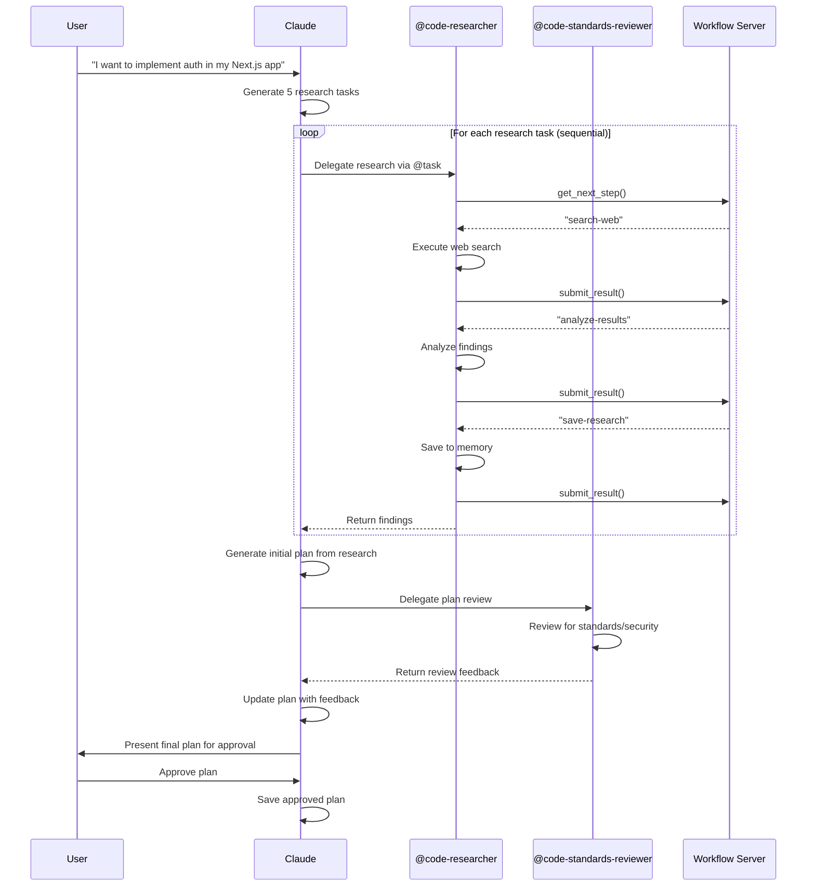

#### Key MVP Features Demonstrated

1. **Interactive User Input**: Prompt steps for requirements gathering and approval
2. **Dynamic Task Generation**: Claude breaks down requests into research tasks
3. **Sequential Processing**: Research tasks execute one at a time for better context
4. **Delegation for Clean Context**: Research delegated to sub-agents keeps main context clean
5. **Multiple Agent Types**: Uses both `@task` for structured execution and specialized reviewers
6. **Review Cycles**: Plan goes through generation, review, and refinement
7. **State Accumulation**: Builds up context through research → plan → review → final
8. **Persistent Memory**: Saves research and plans for future reference
9. **Conditional Logic**: Different paths based on user approval

This workflow serves as the initial test case for the system implementation.

```yaml
name: "pr-automation"
version: "1.0.0"

inputs:
  pr_number:
    type: number
    required: true
  auto_merge_threshold:
    type: number
    default: 95

initial_state:
  pr_data: null
  test_passed: false
  quality_score: 0

steps:
  - id: "fetch-pr"
    type: mcp_call
    needs_state: []
    tool: "github.get_pr"
    parameters:
      pr: "{{ inputs.pr_number }}"
    output_to: "pr_data"

  - id: "check-size"
    type: condition
    needs_state: ["pr_data"]
    if: "{{ state.pr_data.files_changed > 50 }}"
    then:
      # Large PR - needs human review
      - id: "request-review"
        type: mcp_call
        needs_state: ["pr_data"]
        tool: "slack.notify"
        parameters:
          channel: "#code-review"
          message: "Large PR #{{ inputs.pr_number }} needs review ({{ state.pr_data.files_changed }} files)"
        output_to: "review_requested"
    else:
      # Small PR - can auto-test
      - id: "run-tests"
        type: shell
        needs_state: []
        command: "cd /tmp/repo && npm test"
        output_to: "test_results"

      - id: "run-quality-check"
        type: shell
        needs_state: []
        command: "cd /tmp/repo && npm run lint:score"
        output_to: "quality_results"

      - id: "evaluate"
        type: set_state
        needs_state: ["test_results", "quality_results"]
        updates:
          test_passed: "{{ state.test_results.exit_code == 0 }}"
          quality_score: "{{ state.quality_results.stdout | regex_search('Score: (\\d+)') | first | int }}"

      - id: "auto-merge-check"
        type: condition
        needs_state: ["test_passed", "quality_score"]
        if: "{{ state.test_passed and state.quality_score >= inputs.auto_merge_threshold }}"
        then:
          - id: "approve-and-merge"
            type: mcp_call
            needs_state: []
            tool: "github.merge_pr"
            parameters:
              pr: "{{ inputs.pr_number }}"
              method: "squash"
            output_to: "merge_result"
        else:
          - id: "comment-issues"
            type: mcp_call
            needs_state: ["test_passed", "quality_score"]
            tool: "github.comment_pr"
            parameters:
              pr: "{{ inputs.pr_number }}"
              comment: |
                Automated check results:
                - Tests: {{ 'Passed ✅' if state.test_passed else 'Failed ❌' }}
                - Quality Score: {{ state.quality_score }}/100

                Manual review required.
            output_to: "comment_result"
```

## 19. Summary

This simplified design leverages Temporal's robust features to eliminate unnecessary complexity:

**Core Architecture:**
- Single MCP server process
- Temporal for all persistence
- In-memory for transient data
- YAML files for definitions

**Key Features:**
- Explicit state access control via needs_state
- Jinja2 expression language with JSON parsing support
- Parallel or sequential sub-task execution with optional delegation
- Clean separation between orchestration and execution
- Full workflow history in Temporal
- Runtime prompt generation for flexibility
- User interaction through prompt steps

**Delegation Benefits:**
- Clean context isolation for sub-agents
- Parallel or sequential execution without main context pollution
- Structured task execution via workflow server
- Consistent interaction protocol
- Sub-agents remain stateless execution engines

**MVP Target:**
The Interactive Planning Workflow (Section 18.4) demonstrates the system's primary use case:
- User-driven planning sessions
- Dynamic research task generation
- Delegated research with clean context isolation
- Multi-stage review and refinement
- Persistent memory for knowledge accumulation

**Planned Enhancements:**
- `goto` step type for iterative refinement loops
- Additional MCP tool integrations
- Enhanced error handling and retry logic
- Workflow composition and chaining

**Minimal Dependencies:**
- Temporal Server + Database
- YAML definition files
- Python process with Temporal SDK
- FastMCP for protocol handling

The system is essentially a Temporal client that implements workflow semantics with in-memory support structures and intelligent delegation to sub-agents, making it straightforward to build, deploy, and maintain., '.bak') }}` |

#### Data Parsing Functions

| Function | Description | Example |
|----------|-------------|---------|
| `parse_json(string)` | Parse JSON string to object | `{{ state.response \| parse_json }}` → `{"key": "value"}` |
| `tojson(object, indent)` | Convert object to JSON string | `{{ state.data \| tojson(indent=2) }}` → formatted JSON |
| `hash(string)` | Generate hash of string | `{{ state.key \| hash }}` → `"a1b2c3d4..."` |

### In-Memory Storage Implementations

| Component | Data Structure | Scope | Lifetime |
|-----------|---------------|-------|----------|
| **Pending Actions Map** | Python `dict` with workflow_id keys | Process-wide | Until workflow completes or MCP server restarts |
| **YAML Cache** | LRU cache with TTL (using `cachetools`) | Process-wide | TTL-based eviction (default: 300s) |
| **State Filter** | Temporary dict created per step | Step execution | Garbage collected after step |
| **Expression Context** | Dict with state + inputs | Expression evaluation | Garbage collected after evaluation |

### FastMCP Configuration

| Parameter | Description | Default | Required |
|-----------|-------------|---------|----------|
| **server_name** | MCP server identifier | `"temporal-workflow"` | Yes |
| **transport** | Communication protocol | `"stdio"` | Yes |
| **tools** | List of exposed MCP tools | `["start_workflow", "submit_result", "get_workflow_status"]` | Yes |
| **max_message_size** | Maximum MCP message size | `10MB` | No |
| **timeout** | MCP operation timeout | `30s` | No |

### Workflow Server Interaction Protocol

| MCP Tool | Purpose | Used By |
|----------|---------|---------|
| **get_next_step(workflow_id)** | Get the next step to execute in a child workflow | Sub-agents executing tasks |
| **submit_step_result(workflow_id, step_id, result)** | Submit the result of a workflow step | Sub-agents executing tasks |
| **get_workflow_state(workflow_id)** | Query current workflow state (debugging) | Sub-agents (optional) |

## 3. Architecture Overview

**Note:** The MCP protocol layer is implemented using FastMCP, which handles all Claude communication, tool registration, and message routing.

### 3.1 Simplified Two-Component Architecture


### 3.2 Component Responsibilities

| Component | Purpose | Storage |
|-----------|---------|---------|
| **MCP Tool Handlers** | Process Claude's MCP tool calls | In-memory |
| **Workflow Server Interface** | Provides step-by-step execution for sub-agents | In-memory |
| **Temporal Workers** | Execute workflows and activities | State in Temporal |
| **Pending Actions Map** | Track actions awaiting Claude execution | In-memory HashMap |
| **YAML Cache** | Cache parsed workflow definitions | In-memory with TTL |
| **State Filter** | Apply needs_state access control | In-memory processing |
| **Expression Engine** | Evaluate Jinja2 templates | In-memory processing |

## 4. Core Workflow Execution

### 4.1 Execution Flow


### 4.2 State Management (Fully Temporal-Based)


**Key Points:**
- All workflow state persisted in Temporal's database
- No Redis needed - Temporal handles all persistence
- State filtering happens in-memory during execution
- Temporal provides automatic recovery and history

## 5. Workflow Step Types - Complete Functional Reference

### 5.1 Overview of Step Types


### 5.2 Control Flow Steps (Server-Side Execution)

#### **condition** - Conditional Branching
**Purpose:** Execute different steps based on runtime conditions
**Execution:** Synchronous, in-process (Local Activity)
**Use Cases:**
- Route workflow based on previous results
- Implement if/then/else logic
- Handle error conditions with fallback paths

**Functional Behavior:**
1. Evaluates Jinja2 expression in `if` field using filtered state
2. If true, executes all steps in `then` branch sequentially
3. If false, executes all steps in `else` branch (if present)
4. Branches can contain any step types, including nested conditions
5. All branch steps inherit parent's state and can modify it

**Example:**
```yaml
- id: "check-approval"
  type: condition
  needs_state: ["approval_status", "approver_count"]
  if: "{{ state.approval_status == 'approved' and state.approver_count >= 2 }}"
  then:
    - id: "proceed-with-deployment"
      type: shell
      needs_state: []
      command: "kubectl apply -f deployment.yaml"
      output_to: "deployment_result"
  else:
    - id: "request-more-approvals"
      type: mcp_call
      needs_state: ["approver_count"]
      tool: "slack.notify"
      parameters:
        message: "Need {{ 2 - state.approver_count }} more approvals"
```

#### **set_state** - State Manipulation
**Purpose:** Update workflow state with computed values
**Execution:** Synchronous, in-process (Local Activity)
**Use Cases:**
- Calculate derived values from existing state
- Initialize state fields
- Transform data between steps
- Aggregate or summarize results

**Functional Behavior:**
1. Evaluates each Jinja2 expression in `updates` dictionary
2. Writes all results to workflow state atomically
3. Can create new state fields or overwrite existing ones
4. Expressions can reference current state and inputs
5. All updates happen in a single transaction

**Example:**
```yaml
- id: "calculate-metrics"
  type: set_state
  needs_state: ["test_results", "build_time"]
  updates:
    total_tests: "{{ state.test_results | length }}"
    passed_tests: "{{ state.test_results | selectattr('status', 'equalto', 'pass') | list | length }}"
    success_rate: "{{ (passed_tests / total_tests * 100) | round(2) }}"
    performance_score: "{{ 100 - (state.build_time / 60) | int }}"
```

#### **foreach** - Parallel Iteration with Optional Delegation
**Purpose:** Process collections in parallel using sub-workflows
**Execution:** Spawns Temporal child workflows
**Use Cases:**
- Batch processing of files, records, or resources
- Parallel API calls or deployments
- Map-reduce style operations
- Concurrent testing or validation
- Delegating tasks to sub-agents for clean context isolation

**Functional Behavior:**
1. Evaluates `items` expression to get array
2. Spawns one child workflow per item
3. Each child receives only its item as input (no parent state access)
4. If `agent` specified, entire child task is delegated to sub-agent
5. Parent workflow suspends until ALL children complete
6. Results collected in order and written to `output_to` field
7. If any child fails, parent continues but marks failure

**Delegation Modes:**

| Mode | Agent Field | Execution | Use Case |
|------|------------|-----------|----------|
| **Standard** | Not specified | Child workflow executes normally | Simple parallel processing |
| **Task Delegation** | `@task` | Sub-agent executes workflow steps | Complex multi-step tasks |
| **Specialized Agent** | `@agent-name` | Specialized agent processes directly | Domain-specific analysis |

> ⚠️ **RUNTIME PROMPT GENERATION**
>
> When `agent` is specified, the MCP server automatically generates:
> 1. **Instructions for main Claude** about how to delegate
> 2. **Sub-agent prompt** with workflow-server-rules and context
>
> The workflow definition only declares the intent; the MCP server handles the execution details at runtime.

**Example:**
```yaml
# Simple foreach with task delegation
- id: "analyze-all-files"
  type: foreach
  needs_state: ["file_list", "analysis_context"]
  items: "{{ state.file_list }}"
  agent: "@task"  # Delegates entire task to sub-agent
  task: "analyze_file"  # Task definition contains the steps
  output_to: "analysis_results"

# Specialized agent delegation
- id: "security-scan"
  type: foreach
  needs_state: ["source_files"]
  items: "{{ state.source_files }}"
  agent: "@security-analyzer"  # Uses specialized agent
  task: "scan_file"
  output_to: "security_findings"

# Standard execution (no delegation)
- id: "copy-files"
  type: foreach
  needs_state: ["files_to_copy"]
  items: "{{ state.files_to_copy }}"
  task: "copy_file"  # No agent - executes normally
  output_to: "copy_results"
```

#### **delegate** - Single Task Delegation
**Purpose:** Delegate a single task to a Claude sub-agent with context
**Execution:** Creates sub-agent, returns action to Claude
**Use Cases:**
- Complex analysis requiring specialized agent
- Research tasks needing specific expertise
- Code generation with custom instructions
- Document processing with domain context

**Functional Behavior:**
1. Renders instructions template with filtered state
2. Creates delegation action with system + custom prompt
3. If agent specified, routes to that specific agent
4. Returns delegation action to Claude
5. Workflow suspends until sub-agent completes
6. Sub-agent result written to `output_to` field

**Delegation Structure:**
- System prompt (standard) + custom instructions
- Can pass context from parent workflow
- Agent identifier for specialized routing
- Result includes both answer and metadata

**Example:**
```yaml
- id: "research-architecture"
  type: delegate
  needs_state: ["codebase_summary", "requirements"]
  instructions: |
    Analyze this codebase and suggest architectural improvements.

    Current architecture summary:
    {{ state.codebase_summary }}

    Requirements to consider:
    {{ state.requirements | join('\n') }}

    Provide specific, actionable recommendations with code examples.
  agent: "@codebase-researcher"
  output_to: "architecture_analysis"
```

#### **return** - Workflow Completion
**Purpose:** Complete workflow or sub-task with final value
**Execution:** Synchronous, in-process (Local Activity)
**Use Cases:**
- Early exit from workflow
- Return result from sub-task to parent
- Provide final workflow output
- Exit from conditional branches

**Functional Behavior:**
1. Evaluates `value` expression to compute return value
2. Immediately terminates workflow execution
3. For main workflows: sets final output
4. For sub-tasks: returns value to parent foreach
5. No subsequent steps execute after return

**Example:**
```yaml
- id: "early-exit"
  type: return
  needs_state: ["error_count", "processed_items"]
  value:
    success: false
    reason: "Too many errors"
    processed: "{{ state.processed_items }}"
    errors: "{{ state.error_count }}"
```

### 5.3 External Action Steps (Claude-Required Execution)

#### **shell** - Command Line Execution
**Purpose:** Execute shell commands in Claude's environment
**Execution:** Returns action to Claude, workflow suspends
**Use Cases:**
- Run build scripts or tests
- Execute system commands
- Interact with CLI tools
- File system operations

**Functional Behavior:**
1. Renders command template with filtered state
2. Returns shell action to Claude with timeout
3. Workflow suspends until result submitted
4. Claude executes command and returns stdout/stderr/exit_code
5. Result written to `output_to` field if specified

**Result Structure:**
```yaml
{
  stdout: "command output",
  stderr: "error output if any",
  exit_code: 0,
  duration: 1.23  # execution time in seconds
}
```

**Example:**
```yaml
- id: "run-tests"
  type: shell
  needs_state: ["test_directory"]
  command: "cd {{ state.test_directory }} && npm test --coverage"
  timeout: 120  # 2 minutes
  output_to: "test_output"
  when: "{{ state.test_directory is defined }}"
```

#### **mcp_call** - MCP Tool Invocation
**Purpose:** Call MCP tools available in Claude's environment
**Execution:** Returns action to Claude, workflow suspends
**Use Cases:**
- Interact with external APIs
- Access Claude's integrated tools
- Perform operations requiring MCP tools
- Integration with third-party services

**Functional Behavior:**
1. Renders tool parameters with filtered state
2. Returns MCP call action to Claude
3. Workflow suspends until result submitted
4. Claude executes tool and returns tool-specific response
5. Result structure depends on specific tool

**Example:**
```yaml
- id: "create-github-issue"
  type: mcp_call
  needs_state: ["error_details", "repository"]
  tool: "github.create_issue"
  parameters:
    repo: "{{ state.repository }}"
    title: "Build failed: {{ state.error_details.message }}"
    body: |
      Error occurred at: {{ state.error_details.timestamp }}
      Exit code: {{ state.error_details.exit_code }}
      See workflow run for details.
    labels: ["bug", "ci-failure"]
  output_to: "issue"
```

#### **prompt** - User Interaction
**Purpose:** Display information or collect user input
**Execution:** Returns action to Claude, workflow suspends
**Use Cases:**
- Get user confirmation before proceeding
- Display status messages
- Collect user input or choices
- Manual approval gates

**Functional Behavior:**
1. Renders message with filtered state
2. Returns prompt action to Claude based on type
3. Workflow suspends until user responds
4. Response format varies by prompt type
5. User response written to `output_to` if specified

**Prompt Types and Responses:**

| Type | Purpose | Response Format |
|------|---------|----------------|
| `info` | Display message only | `{acknowledged: true}` |
| `confirm` | Yes/No question | `{confirmed: true/false}` |
| `text` | Text input | `{input: "user text"}` |
| `choice` | Select from options | `{selected: "option"}` |

**Example:**
```yaml
- id: "confirm-production-deploy"
  type: prompt
  needs_state: ["environment", "version"]
  message: |
    Deploy version {{ state.version }} to {{ state.environment }}?
    This action cannot be undone.
  type: "confirm"
  output_to: "user_confirmation"
```

#### **wait** - Timed Pause
**Purpose:** Pause workflow execution for specified duration
**Execution:** Returns action to Claude, workflow suspends
**Use Cases:**
- Wait for external systems to stabilize
- Rate limiting between operations
- Polling delays
- Give time for manual intervention

**Functional Behavior:**
1. Returns wait action with duration to Claude
2. Workflow suspends for specified time
3. Optional message displayed during wait
4. After duration, workflow automatically resumes
5. No user interaction required

**Example:**
```yaml
- id: "wait-for-dns"
  type: wait
  needs_state: []
  duration_seconds: 30
  message: "Waiting for DNS propagation..."
  output_to: "wait_complete"
```

### 5.4 Step Execution Matrix

| Step Type | Execution Model | Suspends Workflow | Modifies State | Can Fail |
|-----------|----------------|-------------------|----------------|----------|
| `condition` | Local/Sync | No | Yes (via branches) | Yes |
| `set_state` | Local/Sync | No | Yes | Yes |
| `foreach` | Child Workflows | Yes (for children) | Yes | Yes |
| `return` | Local/Sync | No | No (terminates) | Yes |
| `shell` | Claude Action | Yes | Via output_to | Yes |
| `mcp_call` | Claude Action | Yes | Via output_to | Yes |
| `prompt` | Claude Action | Yes | Via output_to | No |
| `wait` | Claude Action | Yes | Via output_to | No |
| `delegate` | Claude Sub-Agent | Yes | Via output_to | Yes |

### 5.5 Common Step Modifiers

All step types support these optional modifiers:

| Modifier | Applies To | Purpose | Example |
|----------|------------|---------|---------|
| `needs_state` | All | Declare state field access | `needs_state: ["field1", "field2"]` |
| `output_to` | All except return | Specify result storage field | `output_to: "result_field"` |
| `when` | All except return | Conditional execution | `when: "{{ state.enabled }}"` |
| `timeout` | shell, mcp_call | Override default timeout | `timeout: 60` |

## 6. Sub-Agent Workflow Execution

### 6.1 Sub-Agent Interaction Protocol

When a foreach step delegates to a sub-agent (via `agent` field), the sub-agent interacts with the workflow server to execute the task step-by-step:

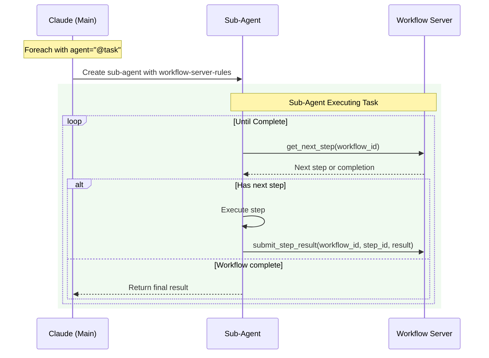

### 6.2 Workflow Server Rules (Runtime Generated)

When a sub-agent is created for task delegation, it receives:

```markdown
<workflow-server-rules>
You are executing a workflow task through the Temporal workflow server.
You must call the workflow server to get each next step to execute.

## How to interact with the workflow server:
1. Call `get_next_step(workflow_id)` to receive the next workflow step
2. Execute the step based on its type:
   - shell: Execute the command and return stdout/stderr/exit_code
   - mcp_call: Call the specified MCP tool with parameters
   - set_state: Acknowledge state updates (server handles internally)
   - return: Acknowledge completion
3. Call `submit_step_result(workflow_id, step_id, result)` to send the result back
4. Repeat until you receive {status: "complete"}

## Workflow Context:
- Workflow ID: [generated_id]
- Task: [task_name]
- Input: [item_from_foreach]
</workflow-server-rules>

Begin by calling get_next_step with your workflow ID.
```

### 6.3 Example Sub-Agent Execution

```python
# Sub-agent starts by getting first step
get_next_step(workflow_id="child_1_analyze_file")

# Server returns step to execute
{
  "step_id": "read-file",
  "type": "shell",
  "command": "cat /src/main.py",
  "timeout": 30
}

# Sub-agent executes and submits result
submit_step_result(
  workflow_id="child_1_analyze_file",
  step_id="read-file",
  result={
    "stdout": "print('hello')",
    "stderr": "",
    "exit_code": 0
  }
)

# Sub-agent gets next step
get_next_step(workflow_id="child_1_analyze_file")

# Continue until server returns completion
{
  "status": "complete",
  "final_result": {...}
}
```

## 7. MCP Tool Interface

### 7.1 Core MCP Tools


### 7.2 Tool Specifications

#### Main Workflow Tools

**start_workflow**
- Starts new Temporal workflow
- Validates inputs against YAML schema
- Executes until first Claude-required action
- Returns workflow_id and pending action (or completion)

**submit_result**
- Signals suspended workflow with result
- Workflow resumes execution
- Continues until next Claude action or completion
- Returns next action or final state

**get_workflow_status**
- Queries workflow state from Temporal
- Returns current status and any pending action
- Useful for recovery after connection issues

#### Sub-Agent Workflow Tools

**get_next_step**
- Gets the next step to execute in a child workflow
- Returns step details or completion status
- Used by sub-agents executing delegated tasks

**submit_step_result**
- Submits the result of executing a workflow step
- Result format depends on step type
- Advances workflow to next step

**get_workflow_state**
- Optional debugging tool
- Returns current workflow state
- Helps sub-agents understand context

## 8. Expression Language (Jinja2)

### 8.1 Expression Evaluation Pipeline

```mermaid
graph LR
    subgraph "Input"
        T[Template String]
        S[Filtered State]
        I[Workflow Inputs]
    end

    subgraph "In-Memory Processing"
        P[Parse]
        C[Build Context]
        R[Render]
    end

    subgraph "Output"
        O[Result Value]
    end

    T --> P
    S --> C
    I --> C
    P --> R
    C --> R
    R --> O

    style C fill:#fff3e0
    style R fill:#c8e6c9
```

### 8.2 Available Context and Filters

**Template Context:**
- `state` - Filtered state (only needs_state fields)
- `inputs` - Read-only workflow inputs
- `item` - Current item (in foreach child tasks only)

**Built-in Filters:**
- String: `split`, `strip`, `upper`, `lower`, `replace`
- List: `select`, `selectattr`, `list`, `length`, `first`, `last`, `join`, `map`
- Value: `default`, `int`, `float`, `string`, `bool`, `round`
- Comparison: `equalto`, `greaterthan`, `lessthan`
- Custom: `regex_search`, `regex_findall`, `regex_replace`
- All standard Jinja2 filters and tests

## 9. YAML-to-Temporal Workflow Translation

### 9.1 Translation Architecture

```mermaid
graph TD
    subgraph "Translation Pipeline"
        YAML[YAML Definition]
        Parser[YAML Parser]
        Validator[Schema Validator]
        Builder[Workflow Builder]
        TWF[Temporal Workflow Function]
    end

    subgraph "Runtime Components"
        SE[Step Executor]
        DM[Dispatch Map]
        SF[State Filter]
        PG[Prompt Generator]
    end

    YAML --> Parser
    Parser --> Validator
    Validator --> Builder
    Builder --> TWF
    TWF --> SE
    SE --> DM
    SE --> SF
    SE --> PG

    style Parser fill:#e3f2fd
    style Builder fill:#fff3e0
    style SE fill:#c8e6c9
    style PG fill:#ffecb3
```

### 9.2 Dynamic Workflow Generation

The system generates Temporal workflow functions from YAML definitions at runtime:

**Workflow Factory Pattern:**
- Each YAML workflow definition is parsed and validated on first use
- A generic Temporal workflow function is parameterized with the YAML structure
- The workflow function interprets the YAML steps sequentially

**Step Execution Engine:**
```
For each step in YAML:
  1. Load step definition from YAML structure
  2. Apply state filter based on needs_state
  3. Evaluate 'when' condition (skip if false)
  4. Render parameters using Jinja2 with filtered state
  5. Dispatch to activity based on step type
  6. Handle activity result according to type
  7. Write output to state if output_to specified
  8. Continue to next step
```

### 9.3 Activity Dispatch Map

| Step Type | Temporal Execution | Returns To Workflow |
|-----------|-------------------|-------------------|
| `condition` | Local Activity (sync) | Branch result |
| `set_state` | Local Activity (sync) | Updated fields |
| `foreach` | Child Workflows | Aggregated array |
| `return` | Local Activity (sync) | Final value |
| `shell` | Standard Activity | PendingAction |
| `mcp_call` | Standard Activity | PendingAction |
| `prompt` | Standard Activity | PendingAction |
| `wait` | Standard Activity | PendingAction |
| `delegate` | Standard Activity | PendingAction |

### 9.4 Runtime Prompt Generation

When a foreach step includes an `agent` field, the MCP server generates prompts at runtime:

**For Main Claude:**
```
You need to process N items in parallel using [agent_type].
For each item, delegate to the appropriate agent to execute the task.
The workflow server will coordinate the execution.
```

**For Sub-Agents:**
```
<workflow-server-rules>
[Standard workflow server interaction protocol]
</workflow-server-rules>

Task: [task_name]
Input: [item]

Call get_next_step() to begin execution.
```

## 10. Activity Result Protocol

### 10.1 Activity Result Structure

All activities return a standardized result structure:

```yaml
# Server-Side Activity Result
LocalActivityResult:
  success: boolean          # Did the activity succeed?
  value: any               # The actual result value
  error: string            # Error message if failed (optional)

# Claude-Required Activity Result
AsyncActivityResult:
  type: "pending_action"   # Indicates Claude action needed
  action:                  # Action for Claude to execute
    type: string           # shell|mcp_call|prompt|wait|delegate
    parameters: object     # Type-specific parameters
    step_id: string        # For correlation
  workflow_id: string      # For submit_result correlation
```

### 10.2 Activity Type Result Specifications

**Server-Side Activities (Immediate Results):**

| Activity | Success Result | Failure Result |
|----------|---------------|----------------|
| `condition` | `{success: true, value: <branch_results>}` | `{success: false, error: "Expression error: ..."}` |
| `set_state` | `{success: true, value: {field: value, ...}}` | `{success: false, error: "Invalid expression: ..."}` |
| `foreach` | `{success: true, value: [<child_results>]}` | `{success: false, error: "Child workflow failed: ..."}` |
| `return` | `{success: true, value: <return_value>}` | `{success: false, error: "Return expression failed"}` |

**Claude-Required Activities (Pending Actions):**

| Activity | Pending Action Format | Result After Claude Execution |
|----------|----------------------|------------------------------|
| `shell` | `{type: "shell", parameters: {command: "...", timeout: 30}}` | `{stdout: "...", stderr: "...", exit_code: 0}` |
| `mcp_call` | `{type: "mcp_call", parameters: {tool: "...", args: {...}}}` | Tool-specific response object |
| `prompt` | `{type: "prompt", parameters: {message: "...", type: "info"}}` | `{acknowledged: true}` or `{input: "..."}` or `{confirmed: bool}` |
| `wait` | `{type: "wait", parameters: {duration: 10, message: "..."}}` | `{resumed: true, duration: 10}` |
| `delegate` | `{type: "delegate", parameters: {instructions: "...", agent: "..."}}` | `{response: "...", agent_used: "...", tokens_used: N}` |

## 11. Parallel Execution (Child Workflows)

### 11.1 Foreach Implementation

```mermaid
graph TB
    subgraph "Parent Workflow"
        FE[Foreach Step]
        Wait[Auto-wait for children]
        Collect[Collect results]
    end

    subgraph "Child Workflows (Same Process)"
        C1[Child 1<br/>Isolated state]
        C2[Child 2<br/>Isolated state]
        C3[Child N<br/>Isolated state]
    end

    subgraph "Delegation (Optional)"
        SA1[Sub-Agent 1]
        SA2[Sub-Agent 2]
        SA3[Sub-Agent N]
    end

    subgraph "Result"
        AR[Aggregated Results<br/>In order]
    end

    FE --> C1
    FE --> C2
    FE --> C3

    C1 -.->|if agent specified| SA1
    C2 -.->|if agent specified| SA2
    C3 -.->|if agent specified| SA3

    C1 --> Wait
    C2 --> Wait
    C3 --> Wait

    Wait --> Collect
    Collect --> AR

    style FE fill:#e3f2fd
    style Wait fill:#fff3e0
    style AR fill:#c8e6c9
```

### 11.2 Child Workflow Properties

**Execution:**
- Run as Temporal child workflows
- Automatic parent-child tracking by Temporal
- Execute in parallel (up to worker limits)
- Each has completely isolated state

**Delegation Options:**
- No agent: Child executes normally
- With agent: Entire task delegated to sub-agent
- Sub-agent manages execution via workflow server

**Result Handling:**
- Parent automatically waits (Temporal feature)
- Results maintain item order
- Aggregated array written to output_to field
- All handled by Temporal's child workflow feature

## 12. State Access Control

### 12.1 needs_state Enforcement

```mermaid
graph TD
    subgraph "Step Definition"
        SD[needs_state: file_list, config<br/>output_to: results]
    end

    subgraph "State Filtering (In-Memory)"
        FS[Full State] --> Filter{Apply needs_state}
        Filter --> |Allowed| AF[file_list, config]
        Filter --> |Blocked| BF[credentials, internal, other]
    end

    subgraph "Step Execution"
        AF --> SE[Step sees only allowed fields]
        SE --> Result[Execution result]
        Result --> |Write| OUT[state.results]
    end

    style BF fill:#ffcdd2
    style AF fill:#c8e6c9
    style Filter fill:#fff3e0
```

### 12.2 Access Control Rules

**Enforcement Points:**
1. State filtered before each step execution
2. Templates can only reference declared fields
3. Steps write to single field via output_to
4. Violations cause immediate workflow failure

**Security Benefits:**
- No global state access
- Explicit data dependencies
- Predictable state flow
- Easy to audit and debug

## 13. Error Handling

### 13.1 Fail-Fast Strategy

```mermaid
stateDiagram-v2
    [*] --> Running: Workflow starts
    Running --> Error: Any error occurs
    Error --> Failed: Mark workflow failed
    Failed --> Preserved: State in Temporal
    Preserved --> [*]: Available for debugging

    Running --> Success: All steps complete
    Success --> [*]
```

### 13.2 Error Types

| Error | Source | Handling |
|-------|--------|----------|
| **Expression Error** | Invalid Jinja2 | Workflow fails, error returned |
| **State Access Violation** | Undeclared field access | Workflow fails immediately |
| **Activity Timeout** | Step exceeds limit | Temporal timeout, workflow fails |
| **Child Failure** | Sub-task error | Parent fails after collecting |
| **Validation Error** | Invalid inputs | Workflow rejected at start |

**Note:** Temporal preserves complete history for debugging all failures.

## 14. Deployment

### 14.1 Required Infrastructure

```mermaid
graph TB
    subgraph "Required Infrastructure"
        subgraph "Temporal Deployment"
            TS[Temporal Server]
            DB[(PostgreSQL/MySQL/<br/>Cassandra)]
        end

        subgraph "File System"
            YAML[YAML Workflow<br/>Definitions]
        end
    end

    subgraph "Per Claude Session"
        MCP[MCP Server Process<br/>(Python)]
    end

    MCP --> TS
    TS --> DB
    MCP --> YAML

    style TS fill:#e8f5e9
    style MCP fill:#fff3e0
    style YAML fill:#e3f2fd
```

### 14.2 Configuration Requirements

**Temporal Connection:**
```yaml
temporal:
  host: localhost:7233
  namespace: default
  task_queue: mcp-workflows
```

**MCP Server Settings:**
```yaml
mcp_server:
  workflow_definitions: ./workflows/
  max_pending_actions: 50
  yaml_cache_ttl: 300  # seconds
  worker_threads: 10
```

## 15. System Limits

### 15.1 Operational Limits

| Limit | Value | Reason |
|-------|-------|--------|
| Max workflow depth | 5 levels | Prevent stack overflow |
| Max parallel children | 100 | Memory constraint |
| Max state size | 1MB | Temporal best practice |
| Expression timeout | 5 seconds | Prevent hanging |
| Max steps per workflow | 1000 | Practical limit |
| Max pending actions | 50 | Memory constraint |
| YAML cache entries | 100 | Memory constraint |

### 15.2 Resource Usage

**Memory Footprint:**
- Base MCP server: ~50MB
- Per workflow: ~1-2MB
- Pending actions: ~10KB each
- YAML cache: ~100KB per definition
- **Total typical**: 100-200MB

**CPU Usage:**
- Mostly idle waiting for Claude
- Spikes during expression evaluation
- Local activities are CPU-efficient
- Python GIL limits parallelism

## 16. Security Model

### 16.1 Security Boundaries

```mermaid
graph TD
    subgraph "Security Layers"
        L1[Input Validation]
        L2[State Access Control]
        L3[Expression Sandboxing]
        L4[Resource Limits]
    end

    subgraph "Protected From"
        P1[Invalid Data]
        P2[Unauthorized Access]
        P3[Code Injection]
        P4[Resource Exhaustion]
    end

    L1 --> P1
    L2 --> P2
    L3 --> P3
    L4 --> P4

    style L1 fill:#c8e6c9
    style L2 fill:#c8e6c9
    style L3 fill:#c8e6c9
    style L4 fill:#c8e6c9
```

### 16.2 Security Guarantees

- **No code execution** - Only Jinja2 templates
- **Explicit state access** - needs_state enforcement
- **Resource bounded** - Timeouts and size limits
- **Process isolation** - Single trusted process
- **Audit trail** - Complete Temporal history

## 17. Complete YAML Specification

### 17.1 Workflow Definition Schema

```yaml
# Required fields
name: string                    # Unique workflow identifier
version: string                  # Semantic version (e.g., "1.0.0")

# Optional: Input parameter definitions
inputs:
  parameter_name:
    type: string|number|boolean|array|object  # Required
    required: boolean            # Default: false
    default: any                 # Default value if not provided
    validation:                  # Optional validation rules
      # For strings
      pattern: string           # Regex pattern
      min_length: number
      max_length: number
      enum: [string, ...]       # Allowed values

      # For numbers
      min: number
      max: number

      # For arrays
      min_items: number
      max_items: number
      item_type: string         # Type of array elements

      # For objects
      required_keys: [string, ...]
      properties:               # Nested object validation
        key_name:
          type: string
          # ... nested validation

# Optional: Initial workflow state
initial_state:
  field_name: any               # Any JSON-serializable value
  another_field: any

# Required: Workflow steps (at least one)
steps:
  - id: string                  # Required: Unique step identifier
    type: string                # Required: Activity type (see 17.2)
    needs_state: [string, ...]  # Required: State fields this step can access
    output_to: string           # Optional: State field to write result
    when: string                # Optional: Jinja2 condition to execute step

    # Type-specific fields (see 17.2 for details)
    # ...

# Optional: Sub-task definitions (for foreach)
tasks:
  task_name:
    inputs:                     # Same as workflow inputs
      parameter_name:
        type: string
        required: boolean
        # ...

    initial_state:              # Same as workflow initial_state
      field: value

    steps:                      # Same as workflow steps
      - id: string
        type: string
        # ...
```

### 17.2 Activity Type Specifications

#### Server-Side Activities (Local)

```yaml
# CONDITION - Branching logic
- id: string
  type: condition
  needs_state: [string, ...]
  if: string                    # Jinja2 expression that evaluates to boolean
  then:                         # Steps to execute if true
    - id: string
      type: string
      # ... nested step definition
  else:                         # Optional: Steps to execute if false
    - id: string
      type: string
      # ... nested step definition

# SET_STATE - Update workflow state
- id: string
  type: set_state
  needs_state: [string, ...]
  updates:                      # Key-value pairs of state updates
    field_name: string          # Jinja2 expression for new value
    another_field: string       # Can reference state and inputs

# FOREACH - Parallel iteration with optional delegation
- id: string
  type: foreach
  needs_state: [string, ...]
  items: string                 # Jinja2 expression returning array
  task: string                  # Name of task definition in 'tasks' section
  agent: string                 # Optional: "@task" or "@agent-name" for delegation
  output_to: string             # Required: Where to store aggregated results

# RETURN - Complete workflow/task
- id: string
  type: return
  needs_state: [string, ...]
  value: any                    # Jinja2 expression or literal value
```

#### Claude-Required Activities (Async)

```yaml
# SHELL - Execute shell command
- id: string
  type: shell
  needs_state: [string, ...]
  command: string               # Jinja2 template for command
  timeout: number               # Optional: Seconds (default: 30)
  output_to: string             # Optional: Store result
  when: string                  # Optional: Conditional execution

# MCP_CALL - Call MCP tool
- id: string
  type: mcp_call
  needs_state: [string, ...]
  tool: string                  # MCP tool name
  parameters:                   # Tool-specific parameters
    param_name: any             # Can use Jinja2 templates
    another_param: any
  timeout: number               # Optional: Seconds (default: 30)
  output_to: string             # Optional: Store result
  when: string                  # Optional: Conditional execution

# PROMPT - User interaction
- id: string
  type: prompt
  needs_state: [string, ...]
  message: string               # Jinja2 template for message
  type: info|confirm|text|choice  # Prompt type

  # For 'choice' type only:
  options: [string, ...]        # Array of choices

  # For 'text' type only:
  validation:                   # Optional input validation
    pattern: string
    min_length: number
    max_length: number

  output_to: string             # Optional: Store response
  when: string                  # Optional: Conditional execution

# WAIT - Pause execution
- id: string
  type: wait
  needs_state: []               # Usually needs no state
  duration_seconds: number      # Required: How long to wait
  message: string               # Optional: Message to display
  output_to: string             # Optional: Store completion
  when: string                  # Optional: Conditional execution

# DELEGATE - Delegate task to Claude sub-agent
- id: string
  type: delegate
  needs_state: [string, ...]
  instructions: string          # Required: Custom prompt with context
  agent: string                 # Optional: Specific agent (e.g., "@security-analyzer")
  timeout: number               # Optional: Seconds (default: 300)
  output_to: string             # Optional: Store agent response
  when: string                  # Optional: Conditional execution
```

## 18. Workflow Examples

### 18.1 Simple Linear Workflow

```yaml
name: "deploy-service"
version: "1.0.0"

inputs:
  service_name:
    type: string
    required: true
  environment:
    type: string
    default: "staging"

initial_state:
  deployed: false

steps:
  - id: "build"
    type: shell
    needs_state: []
    command: "docker build -t {{ inputs.service_name }}:latest ."
    output_to: "build_output"

  - id: "test"
    type: shell
    needs_state: ["build_output"]
    command: "docker run {{ inputs.service_name }}:latest npm test"
    output_to: "test_results"
    when: "{{ state.build_output.exit_code == 0 }}"

  - id: "push"
    type: shell
    needs_state: []
    command: "docker push {{ inputs.service_name }}:latest"
    output_to: "push_result"

  - id: "deploy"
    type: mcp_call
    needs_state: ["push_result"]
    tool: "kubernetes.apply"
    parameters:
      manifest: "k8s/{{ inputs.environment }}/{{ inputs.service_name }}.yaml"
    output_to: "deploy_status"

  - id: "notify"
    type: prompt
    needs_state: ["deploy_status"]
    message: "Deployment complete for {{ inputs.service_name }}"
    type: "info"
```

### 18.2 Parallel Processing with Delegation

```yaml
name: "analyze-codebase"
version: "1.0.0"

inputs:
  repository:
    type: string
    required: true
  file_patterns:
    type: array
    default: ["*.py", "*.js", "*.ts"]

initial_state:
  files: []
  analysis_results: []

steps:
  - id: "find-files"
    type: shell
    needs_state: []
    command: |
      find {{ inputs.repository }} \
         \
        -name "{{ pattern }}"  -o  \
         \
        | head -50
    output_to: "file_list_raw"

  - id: "parse-files"
    type: set_state
    needs_state: ["file_list_raw"]
    updates:
      files: "{{ state.file_list_raw.stdout.strip().split('\\n') }}"

  # Delegate analysis to sub-agents for clean context
  - id: "analyze-files"
    type: foreach
    needs_state: ["files"]
    items: "{{ state.files }}"
    agent: "@task"  # Use task tool for structured execution
    task: "analyze_file"
    output_to: "analysis_results"

  - id: "summarize"
    type: delegate
    needs_state: ["analysis_results"]
    instructions: |
      Create an executive summary of the code analysis.

      Analysis results: {{ state.analysis_results | tojson }}

      Provide:
      1. Overall code quality score
      2. Top 5 critical issues
      3. Recommended next steps
    agent: "@report-writer"
    output_to: "summary"

tasks:
  analyze_file:
    inputs:
      file_path:
        type: string
        required: true

    initial_state: {}

    steps:
      - id: "read-file"
        type: shell
        needs_state: []
        command: "cat {{ inputs.file_path }}"
        output_to: "content"

      - id: "analyze"
        type: mcp_call
        needs_state: ["content"]
        tool: "code_analyzer"
        parameters:
          code: "{{ state.content.stdout }}"
          checks: ["security", "performance", "style"]
        output_to: "analysis"

      - id: "return-result"
        type: return
        needs_state: ["analysis"]
        value:
          file: "{{ inputs.file_path }}"
          issues: "{{ state.analysis.issues }}"
          score: "{{ state.analysis.score }}"
```

### 18.3 Complex Workflow with Conditions

```yaml
name: "pr-automation"
version: "1.0.0"

inputs:
  pr_number:
    type: number
    required: true
  auto_merge_threshold:
    type: number
    default: 95

initial_state:
  pr_data: null
  test_passed: false
  quality_score: 0

steps:
  - id: "fetch-pr"
    type: mcp_call
    needs_state: []
    tool: "github.get_pr"
    parameters:
      pr: "{{ inputs.pr_number }}"
    output_to: "pr_data"

  - id: "check-size"
    type: condition
    needs_state: ["pr_data"]
    if: "{{ state.pr_data.files_changed > 50 }}"
    then:
      # Large PR - needs human review
      - id: "request-review"
        type: mcp_call
        needs_state: ["pr_data"]
        tool: "slack.notify"
        parameters:
          channel: "#code-review"
          message: "Large PR #{{ inputs.pr_number }} needs review ({{ state.pr_data.files_changed }} files)"
        output_to: "review_requested"
    else:
      # Small PR - can auto-test
      - id: "run-tests"
        type: shell
        needs_state: []
        command: "cd /tmp/repo && npm test"
        output_to: "test_results"

      - id: "run-quality-check"
        type: shell
        needs_state: []
        command: "cd /tmp/repo && npm run lint:score"
        output_to: "quality_results"

      - id: "evaluate"
        type: set_state
        needs_state: ["test_results", "quality_results"]
        updates:
          test_passed: "{{ state.test_results.exit_code == 0 }}"
          quality_score: "{{ state.quality_results.stdout | regex_search('Score: (\\d+)') | first | int }}"

      - id: "auto-merge-check"
        type: condition
        needs_state: ["test_passed", "quality_score"]
        if: "{{ state.test_passed and state.quality_score >= inputs.auto_merge_threshold }}"
        then:
          - id: "approve-and-merge"
            type: mcp_call
            needs_state: []
            tool: "github.merge_pr"
            parameters:
              pr: "{{ inputs.pr_number }}"
              method: "squash"
            output_to: "merge_result"
        else:
          - id: "comment-issues"
            type: mcp_call
            needs_state: ["test_passed", "quality_score"]
            tool: "github.comment_pr"
            parameters:
              pr: "{{ inputs.pr_number }}"
              comment: |
                Automated check results:
                - Tests: {{ 'Passed ✅' if state.test_passed else 'Failed ❌' }}
                - Quality Score: {{ state.quality_score }}/100

                Manual review required.
            output_to: "comment_result"
```

## 19. Summary

This simplified design leverages Temporal's robust features to eliminate unnecessary complexity:

**Core Architecture:**
- Single MCP server process
- Temporal for all persistence
- In-memory for transient data
- YAML files for definitions

**Key Features:**
- Explicit state access control via needs_state
- Jinja2 expression language for dynamic values
- Parallel sub-task execution with optional delegation
- Clean separation between orchestration and execution
- Full workflow history in Temporal
- Runtime prompt generation for flexibility

**Delegation Benefits:**
- Clean context isolation for sub-agents
- Parallel execution without main context pollution
- Structured task execution via workflow server
- Consistent interaction protocol

**Minimal Dependencies:**
- Temporal Server + Database
- YAML definition files
- Python process with Temporal SDK
- FastMCP for protocol handling

The system is essentially a Temporal client that implements workflow semantics with in-memory support structures and intelligent delegation to sub-agents, making it straightforward to build, deploy, and maintain.