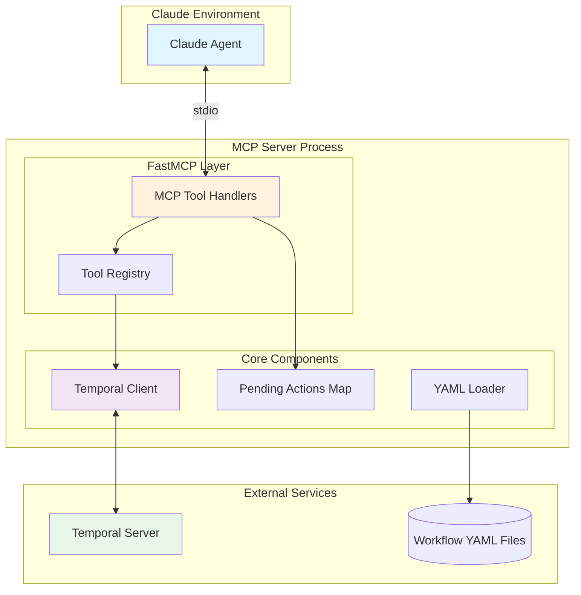

# Phase 1: Core Foundation & MCP Protocol Layer

## Overview
This phase establishes the foundational MCP server infrastructure that will serve as the base for the Temporal workflow system. The implementation focuses on creating a minimal but complete MCP server using FastMCP, establishing Temporal connectivity, and implementing the basic tools required for workflow management.

## Terminology & Concepts

### Core Terms
| Term | Definition |
|------|------------|
| **MCP (Model Context Protocol)** | Communication protocol between Claude and external tools/servers |
| **FastMCP** | Python framework for building MCP servers with automatic tool registration |
| **Temporal** | Workflow orchestration platform providing state persistence and reliability |
| **Pending Action** | A workflow step that requires Claude's execution before the workflow can continue |
| **Workflow ID** | Unique identifier for a running workflow instance in Temporal |
| **Task Queue** | Temporal queue where workflow and activity tasks are dispatched |

### Architectural Components
| Component | Purpose | Storage Type |
|-----------|---------|--------------|
| **MCP Server Process** | Single Python process handling all MCP communication | In-memory |
| **Temporal Client** | Connection to Temporal server for workflow operations | Connection pool |
| **Pending Actions Map** | Tracks actions awaiting Claude execution | In-memory dict |
| **YAML Cache** | Stores parsed workflow definitions | In-memory LRU with TTL |

## Architecture



## Implementation Details

### 1. Project Structure

```
/src/aromcp/workflow_server/
├── __init__.py                 # Package initialization
├── server.py                   # Main MCP server entry point
├── config.py                   # Configuration management
├── temporal_client.py          # Temporal connection management
├── pending_actions.py          # Pending actions storage
├── yaml_loader.py             # Basic YAML loading
└── tools/
    ├── __init__.py            # Tool registration
    └── main_workflow.py       # Core workflow tools
```

### 2. Configuration Schema

```python
# config.py
from dataclasses import dataclass
from typing import Optional

@dataclass
class WorkflowServerConfig:
    # Temporal Configuration
    temporal_host: str = "localhost:7233"
    temporal_namespace: str = "default"
    temporal_task_queue: str = "mcp-workflows"
    
    # MCP Server Configuration
    server_name: str = "temporal-workflow"
    transport: str = "stdio"
    max_message_size: int = 10_000_000  # 10MB
    timeout: int = 30  # seconds
    
    # Workflow Configuration
    workflow_definitions_path: str = "./workflows/"
    max_pending_actions: int = 50
    yaml_cache_ttl: int = 300  # seconds
    worker_threads: int = 10
    
    # Runtime Configuration
    debug_mode: bool = False
    log_level: str = "INFO"
```

### 3. Core MCP Tools

#### Tool: `start_workflow`
**Purpose**: Initiate a new Temporal workflow execution

```python
@dataclass
class StartWorkflowRequest:
    workflow_name: str  # Name of workflow definition to execute
    inputs: dict[str, Any] | None = None  # Input parameters
    workflow_id: str | None = None  # Optional custom workflow ID

@dataclass
class StartWorkflowResponse:
    workflow_id: str  # Unique workflow identifier
    status: str  # "pending_action" | "running" | "completed"
    action: dict[str, Any] | None = None  # First action if any
    result: Any | None = None  # Final result if completed
    error: str | None = None  # Error message if failed
```

**Implementation Logic**:
1. Load and validate YAML definition
2. Validate inputs against schema
3. Generate workflow ID if not provided
4. Start Temporal workflow execution
5. Execute until first Claude-required action
6. Store pending action if workflow suspends
7. Return workflow ID and status/action

#### Tool: `submit_result`
**Purpose**: Submit result for a pending workflow action

```python
@dataclass
class SubmitResultRequest:
    workflow_id: str  # Workflow to resume
    result: Any  # Result of the executed action

@dataclass
class SubmitResultResponse:
    workflow_id: str
    status: str  # "pending_action" | "running" | "completed"
    action: dict[str, Any] | None = None  # Next action if any
    result: Any | None = None  # Final result if completed
    error: str | None = None
```

**Implementation Logic**:
1. Retrieve pending action from map
2. Validate result against expected schema
3. Signal Temporal workflow with result
4. Workflow resumes execution
5. Execute until next Claude action or completion
6. Update pending actions map
7. Return status and next action/result

#### Tool: `get_workflow_status`
**Purpose**: Query current workflow state

```python
@dataclass
class GetWorkflowStatusRequest:
    workflow_id: str

@dataclass
class GetWorkflowStatusResponse:
    workflow_id: str
    status: str  # "pending_action" | "running" | "completed" | "failed"
    current_step: str | None = None  # Current step being executed
    pending_action: dict[str, Any] | None = None
    state: dict[str, Any] | None = None  # Current workflow state
    error: str | None = None
```

**Implementation Logic**:
1. Query Temporal for workflow status
2. Check pending actions map
3. Return comprehensive status info

### 4. Temporal Client Setup

```python
# temporal_client.py
from temporalio.client import Client
from temporalio.worker import Worker
import asyncio

class TemporalManager:
    def __init__(self, config: WorkflowServerConfig):
        self.config = config
        self.client: Client | None = None
        self.worker: Worker | None = None
        
    async def connect(self):
        """Establish connection to Temporal server"""
        self.client = await Client.connect(
            self.config.temporal_host,
            namespace=self.config.temporal_namespace
        )
        
    async def health_check(self) -> bool:
        """Verify Temporal connection is healthy"""
        try:
            # Simple workflow list query to test connection
            await self.client.list_workflows(
                query="WorkflowType='HealthCheck'",
                page_size=1
            )
            return True
        except Exception:
            return False
            
    async def start_workflow(
        self, 
        workflow_type: str,
        workflow_id: str,
        args: list[Any],
        task_queue: str | None = None
    ):
        """Start a new workflow execution"""
        return await self.client.start_workflow(
            workflow_type,
            args,
            id=workflow_id,
            task_queue=task_queue or self.config.temporal_task_queue
        )
```

### 5. Pending Actions Manager

```python
# pending_actions.py
from dataclasses import dataclass, field
from datetime import datetime
from typing import Any, Dict
import threading

@dataclass
class PendingAction:
    workflow_id: str
    step_id: str
    action_type: str  # "shell" | "mcp_call" | "prompt" | "wait" | "delegate"
    parameters: dict[str, Any]
    created_at: datetime = field(default_factory=datetime.now)
    
class PendingActionsManager:
    def __init__(self, max_actions: int = 50):
        self._actions: Dict[str, PendingAction] = {}
        self._lock = threading.Lock()
        self._max_actions = max_actions
        
    def add(self, action: PendingAction) -> None:
        """Add a new pending action"""
        with self._lock:
            if len(self._actions) >= self._max_actions:
                # Remove oldest action if at capacity
                oldest = min(
                    self._actions.items(), 
                    key=lambda x: x[1].created_at
                )
                del self._actions[oldest[0]]
            self._actions[action.workflow_id] = action
            
    def get(self, workflow_id: str) -> PendingAction | None:
        """Retrieve pending action for workflow"""
        with self._lock:
            return self._actions.get(workflow_id)
            
    def remove(self, workflow_id: str) -> None:
        """Remove completed action"""
        with self._lock:
            self._actions.pop(workflow_id, None)
            
    def list_all(self) -> list[PendingAction]:
        """List all pending actions"""
        with self._lock:
            return list(self._actions.values())
```

### 6. Main Server Implementation

```python
# server.py
from fastmcp import FastMCP
import asyncio
import logging
from .config import WorkflowServerConfig
from .temporal_client import TemporalManager
from .pending_actions import PendingActionsManager
from .tools import register_workflow_tools

logger = logging.getLogger(__name__)

class WorkflowServer:
    def __init__(self, config: WorkflowServerConfig | None = None):
        self.config = config or WorkflowServerConfig()
        self.mcp = FastMCP(self.config.server_name)
        self.temporal = TemporalManager(self.config)
        self.pending_actions = PendingActionsManager(
            self.config.max_pending_actions
        )
        
    async def initialize(self):
        """Initialize server components"""
        # Connect to Temporal
        await self.temporal.connect()
        
        # Verify connection
        if not await self.temporal.health_check():
            raise RuntimeError("Failed to connect to Temporal server")
            
        # Register MCP tools
        register_workflow_tools(
            self.mcp, 
            self.temporal,
            self.pending_actions,
            self.config
        )
        
        logger.info(f"Workflow server initialized: {self.config.server_name}")
        
    async def run(self):
        """Run the MCP server"""
        await self.initialize()
        
        # Start MCP server on stdio
        await self.mcp.run()

def main():
    """Entry point for the workflow server"""
    import sys
    
    # Setup logging
    logging.basicConfig(
        level=logging.INFO,
        format='%(asctime)s - %(name)s - %(levelname)s - %(message)s'
    )
    
    # Load configuration from environment or file
    config = WorkflowServerConfig()
    
    # Create and run server
    server = WorkflowServer(config)
    
    try:
        asyncio.run(server.run())
    except KeyboardInterrupt:
        logger.info("Server shutdown requested")
        sys.exit(0)
    except Exception as e:
        logger.error(f"Server failed: {e}")
        sys.exit(1)

if __name__ == "__main__":
    main()
```

### 7. Tool Registration

```python
# tools/__init__.py
from fastmcp import FastMCP
from .main_workflow import (
    start_workflow_tool,
    submit_result_tool, 
    get_workflow_status_tool
)

def register_workflow_tools(
    mcp: FastMCP,
    temporal_manager,
    pending_actions,
    config
):
    """Register all workflow MCP tools"""
    
    # Register main workflow tools
    mcp.tool(start_workflow_tool(temporal_manager, pending_actions, config))
    mcp.tool(submit_result_tool(temporal_manager, pending_actions))
    mcp.tool(get_workflow_status_tool(temporal_manager, pending_actions))
    
    return mcp
```

## Testing Strategy

### Unit Tests

1. **Temporal Connection Tests**
   - Test successful connection
   - Test connection failure handling
   - Test health check functionality

2. **Pending Actions Tests**
   - Test add/get/remove operations
   - Test thread safety
   - Test capacity limits

3. **Tool Tests**
   - Mock Temporal client
   - Test each tool with valid inputs
   - Test error handling

### Integration Tests

1. **End-to-End MCP Tests**
   - Start server with test configuration
   - Send MCP tool calls via stdio
   - Verify responses

2. **Temporal Integration Tests**
   - Requires running Temporal server
   - Test actual workflow start
   - Test workflow signaling

## Deployment Requirements

### Dependencies

```toml
# pyproject.toml additions
[tool.poetry.dependencies]
fastmcp = "^2.10.0"
temporalio = "^1.5.0"
pyyaml = "^6.0"
cachetools = "^5.3.0"
```

### Environment Variables

```bash
# Temporal Configuration
TEMPORAL_HOST=localhost:7233
TEMPORAL_NAMESPACE=default
TEMPORAL_TASK_QUEUE=mcp-workflows

# Server Configuration
WORKFLOW_DEFINITIONS_PATH=./workflows/
MAX_PENDING_ACTIONS=50
DEBUG_MODE=false
```

### Docker Compose for Development

```yaml
# docker-compose.yml
version: '3.8'

services:
  temporal:
    image: temporalio/auto-setup:latest
    ports:
      - "7233:7233"
    environment:
      - DB=postgresql
      - DB_PORT=5432
      - POSTGRES_USER=temporal
      - POSTGRES_PWD=temporal
      - POSTGRES_SEEDS=postgresql
    depends_on:
      - postgresql

  postgresql:
    image: postgres:14
    environment:
      POSTGRES_USER: temporal
      POSTGRES_PASSWORD: temporal
    volumes:
      - temporal_data:/var/lib/postgresql/data

volumes:
  temporal_data:
```

## Performance Metrics

### Target Performance
| Metric | Target | Measurement Method |
|--------|--------|-------------------|
| Server startup time | < 2 seconds | Time from launch to ready |
| Tool call latency | < 50ms | MCP request to response |
| Temporal connection | < 500ms | Initial connection time |
| Workflow start | < 100ms | start_workflow call |
| Result submission | < 50ms | submit_result call |
| Memory baseline | < 50MB | Base server memory usage |
| Concurrent connections | 100+ | Simultaneous MCP clients |

### Benchmarking Code
```python
# tests/workflow_server/benchmark_phase1.py
import time
import asyncio
from aromcp.workflow_server.server import WorkflowServer

async def benchmark_startup():
    start = time.time()
    server = WorkflowServer()
    await server.initialize()
    return time.time() - start

async def benchmark_tool_call(server, tool_name, params):
    start = time.time()
    result = await server.mcp.call_tool(tool_name, params)
    return time.time() - start
```

## Success Criteria

1. ✅ MCP server starts and responds to tool calls
2. ✅ Temporal connection established and verified
3. ✅ All three core tools functional with mock workflows
4. ✅ Pending actions properly tracked in memory
5. ✅ Thread-safe operations for concurrent access
6. ✅ Comprehensive error handling and logging
7. ✅ Unit test coverage > 80%
8. ✅ Integration tests pass with real Temporal
9. ✅ Performance metrics meet targets

## Common Issues & Solutions

| Issue | Solution |
|-------|----------|
| Temporal connection timeout | Verify Temporal server is running and accessible |
| MCP tool registration fails | Check FastMCP version compatibility |
| Pending actions memory leak | Implement TTL-based cleanup |
| Concurrent access errors | Ensure proper locking in shared state |

## Next Phase Dependencies

This phase provides:
- Basic MCP server infrastructure
- Temporal connectivity
- Pending action management
- Tool registration framework

Required for Phase 2 (YAML System) and Phase 4 (Temporal Integration).