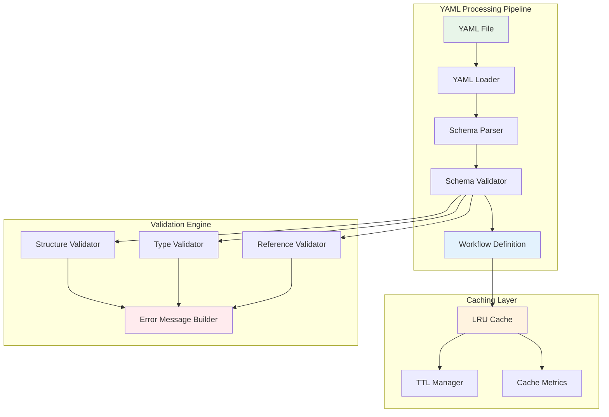

# Phase 2: YAML Parser & Workflow Definition System

## Overview
This phase implements the complete YAML parsing, validation, and caching system for workflow definitions. The system provides robust schema validation, helpful error messages, and efficient caching to minimize file I/O operations. All workflow definitions are validated against a strict schema before execution.

## Objectives
- Parse YAML workflow definitions into structured Python objects
- Validate workflows against schema and semantic rules
- Cache parsed definitions for performance
- Provide helpful error messages with suggestions
- Support all step types defined in the design document

## Architecture



## Key Components

### 1. Workflow Definition Model (`workflow_definition.py`)

**Purpose**: Data structures representing workflow definitions

**Classes to implement**:
- `InputParameter`: Represents workflow input with type, default, validation
- `WorkflowStep`: Individual step with type, parameters, control flow
- `WorkflowDefinition`: Complete workflow with steps, inputs, initial state

**Key methods**:
- `get_step(step_id)`: Retrieve step by ID
- `validate_state_references()`: Check all state references are valid
- `get_dependencies()`: Find step dependencies for execution order

**Data fields**:
- Required: name, version, description, steps
- Optional: inputs, initial_state, metadata
- Runtime: file_path, loaded_at, schema_version

### 2. Schema Validator (`schema_validator.py`)

**Purpose**: Validate workflow definitions against rules

**Validation layers**:
1. **Structure validation**: Required fields, correct types
2. **Schema validation**: Against JSON schema
3. **Step validation**: Valid step types, required parameters
4. **Reference validation**: State and variable references exist
5. **Semantic validation**: No circular dependencies, reachable steps

**Error handling**:
- Return `ValidationError` objects with path, message, code, suggestion
- Return `ValidationWarning` for non-blocking issues
- Use `difflib.get_close_matches` for suggestions

**Step type requirements**:
| Step Type | Required Fields | Optional Fields |
|-----------|----------------|-----------------|
| condition | if | then, else |
| set_state | updates | - |
| foreach | items, task | agent |
| return | value | - |
| shell | command | timeout |
| mcp_call | tool, parameters | - |
| prompt | message | type |
| wait | duration_seconds | message |
| delegate | instructions | agent |

### 3. LRU Cache (`cache.py`)

**Purpose**: Cache parsed workflows with TTL

**Features**:
- LRU eviction when full (default 100 entries)
- TTL-based expiration (default 300 seconds)
- Thread-safe with `threading.RLock`
- Cache key based on file path + mtime + size

**Operations**:
- `get(file_path)`: Retrieve cached definition
- `put(file_path, value, ttl)`: Store definition
- `invalidate(file_path)`: Remove from cache
- `cleanup_expired()`: Remove expired entries
- `get_metrics()`: Cache hit/miss statistics

**Metrics tracked**:
- hits, misses, evictions, expirations
- hit rate percentage
- current size vs max size

### 4. YAML Parser (`yaml_parser.py`)

**Purpose**: Main interface for loading workflows

**Workflow**:
1. Find workflow file in configured directories
2. Check cache for valid cached version
3. Parse YAML using `yaml.safe_load`
4. Validate using SchemaValidator
5. Build WorkflowDefinition objects
6. Perform additional semantic validation
7. Cache successful parse result

**File discovery patterns**:
- `{name}.yaml` in workflow_dir
- `{name}.yml` in workflow_dir  
- `workflows/{name}.yaml`
- Support both with/without .yaml extension

**Error aggregation**:
- Collect all validation errors before failing
- Return tuple: (definition, errors, warnings)
- Log successful loads at INFO level

### 5. Validation Error Types (`validation_errors.py`)

**Classes**:
- `ValidationError`: Blocking error with context
- `ValidationWarning`: Non-blocking issue
- `ParsingError`: YAML parsing exception

**Error codes**:
- `MISSING_REQUIRED_FIELD`
- `INVALID_NAME_FORMAT`
- `INVALID_VERSION_FORMAT`
- `UNKNOWN_STEP_TYPE`
- `UNDEFINED_REFERENCE`
- `CIRCULAR_DEPENDENCY`
- `YAML_PARSE_ERROR`

## Implementation Requirements

### Configuration
- `workflow_dir`: Base directory for YAML files
- `cache_enabled`: Enable/disable caching
- `cache_ttl`: Default TTL in seconds
- `strict_mode`: Fail on warnings
- `max_cache_size`: Maximum cached entries

### Thread Safety
- Use `threading.RLock` for cache operations
- Ensure validator is stateless or thread-safe
- Parser instances can be shared across threads

### Performance Targets
- Parse typical workflow in < 100ms
- Cache hit rate > 90% in normal operation
- Support workflows up to 1000 steps
- Validation completes in < 50ms

### Error Message Quality
- Include exact path to error (e.g., `$.steps[2].then[0].if`)
- Provide helpful suggestions for typos
- Show available options for invalid values
- Include error code for programmatic handling

## Testing Strategy

### Unit Tests
1. **Parser Tests**
   - Valid workflow parsing
   - Missing required fields
   - Invalid step types
   - Malformed YAML

2. **Validator Tests**
   - Each validation rule
   - Error message format
   - Suggestion generation

3. **Cache Tests**
   - LRU eviction
   - TTL expiration
   - Thread safety
   - Metrics accuracy

### Integration Tests
- Parse real workflow examples
- End-to-end validation
- Cache persistence across reloads
- Performance benchmarks

### Test Coverage Requirements
- Minimum 90% code coverage
- All error paths tested
- All step types validated
- Thread safety verified

## Dependencies
- `pyyaml`: YAML parsing
- `jsonschema`: Optional schema validation
- `cachetools`: Optional for advanced caching
- Standard library: `pathlib`, `threading`, `hashlib`, `difflib`

## Workflow Validation Script

### Standalone Validator (`scripts/validate_workflow.py`)

**Purpose**: Command-line tool to validate workflow YAML files

**Features**:
- Validate single workflow or directory of workflows
- Check schema compliance
- Verify step references and dependencies
- Validate state field usage
- Report errors with line numbers

**Usage**:
```bash
# Validate single workflow
python scripts/validate_workflow.py workflows/interactive-planning.yaml

# Validate all workflows
python scripts/validate_workflow.py workflows/

# Verbose output with warnings
python scripts/validate_workflow.py --verbose workflows/

# Output JSON report
python scripts/validate_workflow.py --json workflows/ > validation-report.json
```

**Implementation structure**:
```python
# scripts/validate_workflow.py
import sys
import yaml
from pathlib import Path
from aromcp.workflow_server.yaml_parser import WorkflowParser
from aromcp.workflow_server.schema_validator import SchemaValidator

def validate_workflow(file_path: Path) -> tuple[bool, list[str]]:
    """Validate a single workflow file"""
    errors = []
    
    try:
        # Parse YAML
        with open(file_path) as f:
            data = yaml.safe_load(f)
        
        # Schema validation
        validator = SchemaValidator()
        schema_errors = validator.validate_structure(data)
        errors.extend(schema_errors)
        
        # Step validation
        step_errors = validator.validate_steps(data.get('steps', []))
        errors.extend(step_errors)
        
        # Reference validation
        ref_errors = validator.validate_references(data)
        errors.extend(ref_errors)
        
        # Task definitions validation
        if 'tasks' in data:
            for task_name, task_def in data['tasks'].items():
                task_errors = validator.validate_structure(task_def)
                errors.extend([f"Task '{task_name}': {e}" for e in task_errors])
        
        return len(errors) == 0, errors
        
    except Exception as e:
        return False, [f"Parse error: {str(e)}"]

def main():
    # Command-line interface implementation
    pass
```

**Validation checks**:
1. **Schema compliance**: Required fields, correct types
2. **Step validation**: Valid step types, required parameters
3. **Reference validation**: State fields, task references
4. **Expression validation**: Valid Jinja2 syntax
5. **Circular dependency detection**: No infinite loops
6. **Task definition validation**: Foreach tasks exist

## Success Criteria
1. ✅ All workflow examples from design doc parse successfully
2. ✅ Validation catches all specified error conditions
3. ✅ Error messages include helpful suggestions
4. ✅ Cache improves performance by >5x for repeated loads
5. ✅ Thread-safe operation verified
6. ✅ Parse time < 100ms for typical workflows
7. ✅ Memory usage < 100MB for 100 cached workflows
8. ✅ Validation script catches all error types

## Interface for Other Phases

**Exports**:
- `WorkflowParser`: Main parser class
- `WorkflowDefinition`: Parsed workflow model
- `WorkflowStep`: Step model
- `ValidationError`, `ValidationWarning`: Error types

**Used by**:
- Phase 3: Expression engine uses step.needs_state
- Phase 4: Temporal integration uses WorkflowDefinition
- Phase 5: Control flow uses step type information
- Phase 6: External actions use step parameters

## Risk Mitigation
- **Large workflows**: Implement streaming parser if needed
- **Complex validation**: Add validation levels (basic, full)
- **Cache invalidation**: Use file watching if real-time updates needed
- **Schema evolution**: Version schemas, support migration