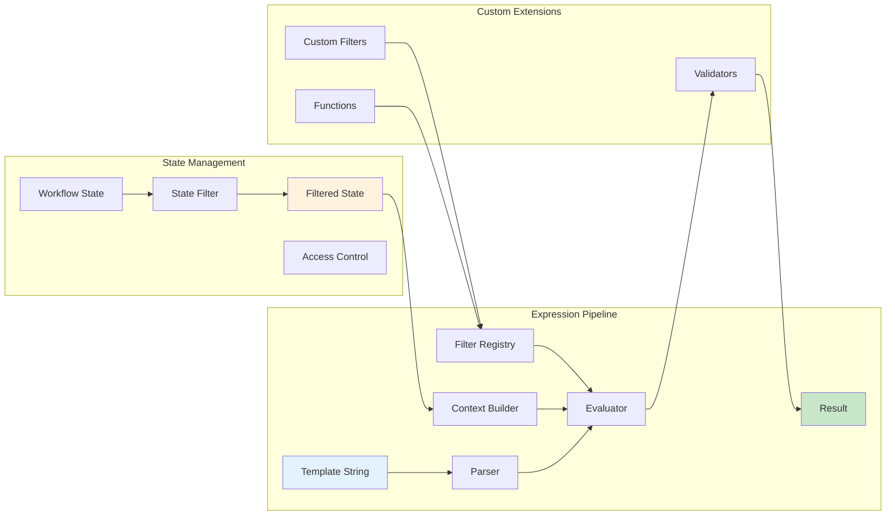

# Phase 3: Expression Engine & State Management

## Overview
This phase implements the Jinja2-based expression evaluation system with state filtering and access control. The system evaluates template expressions, enforces state access restrictions via needs_state declarations, and provides custom filters for workflow-specific operations.

## Objectives
- Implement Jinja2 expression evaluation with custom filters
- Enforce state access control through needs_state filtering
- Provide workflow-specific functions and filters
- Support safe expression evaluation with error handling
- Enable both synchronous evaluation and template rendering

## Architecture



## Key Components

### 1. Expression Engine (`expression_engine.py`)

**Purpose**: Core Jinja2 evaluation with custom environment

**Configuration**:
- Sandbox environment for security
- Custom undefined handler for better errors
- Strict mode to catch undefined variables
- Auto-escaping disabled (not generating HTML)

**Key methods**:
- `evaluate(template, context)`: Evaluate expression to value
- `render(template, context)`: Render template to string
- `validate_syntax(template)`: Check template syntax
- `extract_variables(template)`: Find all variable references

**Error handling**:
- Catch Jinja2 exceptions and wrap in workflow errors
- Provide context about which step failed
- Suggest fixes for common mistakes

### 2. State Manager (`state_manager.py`)

**Purpose**: Filter and control access to workflow state

**State filtering logic**:
```
For each step:
1. Get needs_state declaration
2. Filter workflow state to only declared fields
3. Add "inputs" (read-only)
4. Add "item" if in foreach context
5. Pass filtered state to expression engine
```

**Key methods**:
- `filter_state(full_state, needs_state)`: Apply access control
- `merge_contexts(state, inputs, item)`: Build evaluation context
- `validate_access(expression, allowed_fields)`: Check access
- `track_access(step_id, accessed_fields)`: Audit logging

**Access control rules**:
- Empty needs_state = no state access
- `["*"]` = full state access (warning in logs)
- Specific fields = only those fields
- Nested access supported (e.g., "user.name")

### 3. Custom Filters (`custom_filters.py`)

**Purpose**: Workflow-specific Jinja2 filters and functions

**Standard filters** (from Jinja2):
- String: `split`, `strip`, `upper`, `lower`, `replace`, `truncate`
- List: `select`, `selectattr`, `list`, `length`, `first`, `last`, `join`, `map`
- Value: `default`, `int`, `float`, `string`, `bool`, `round`, `abs`
- Comparison: `equalto`, `greaterthan`, `lessthan`

**Custom filters to implement**:

| Filter | Purpose | Example |
|--------|---------|---------|
| `parse_json` | Parse JSON string | `{{ response \| parse_json }}` |
| `tojson` | Convert to JSON | `{{ data \| tojson(indent=2) }}` |
| `regex_search` | Find regex pattern | `{{ text \| regex_search('\\d+') }}` |
| `regex_findall` | Find all matches | `{{ text \| regex_findall('\\w+') }}` |
| `regex_replace` | Replace pattern | `{{ text \| regex_replace('old', 'new') }}` |
| `hash` | Generate hash | `{{ value \| hash }}` |
| `base64_encode` | Encode base64 | `{{ data \| base64_encode }}` |
| `base64_decode` | Decode base64 | `{{ encoded \| base64_decode }}` |

**Custom functions to implement**:

| Function | Purpose | Return Type | Example |
|----------|---------|-------------|---------|
| `now()` | Current datetime object | Python datetime | `{{ now() }}` → `2025-08-19 14:30:00` |
| `env(name, default=None)` | Get environment variable | String or None | `{{ env('API_KEY') }}` → `sk-...` |
| `random(min=0, max=1)` | Random number in range | Float or Int | `{{ random(1, 100) }}` → `42` |
| `uuid()` | Generate UUID v4 | String | `{{ uuid() }}` → `a1b2c3d4-e5f6-...` |

**Date/Time functions** (using `now()`):

| Function | Purpose | Example |
|----------|---------|---------|
| `now().isoformat()` | ISO 8601 formatted string | `{{ now().isoformat() }}` → `2025-08-19T14:30:00` |
| `now().strftime(format)` | Custom formatted datetime | `{{ now().strftime('%Y%m%d-%H%M%S') }}` → `20250819-143000` |
| `now().timestamp()` | Unix timestamp | `{{ now().timestamp() }}` → `1754923800.0` |
| `now().date()` | Date portion only | `{{ now().date() }}` → `2025-08-19` |
| `now().time()` | Time portion only | `{{ now().time() }}` → `14:30:00` |
| `now() + timedelta(days=N)` | Date arithmetic | `{{ (now() + timedelta(days=7)).date() }}` → `2025-08-26` |

**Implementation details**:

```python
# custom_filters.py
import json
import re
import hashlib
import base64
import uuid as uuid_lib
import random as random_lib
from datetime import datetime, timedelta
import os

class CustomFunctions:
    @staticmethod
    def now():
        """Return current datetime with timezone awareness"""
        return datetime.now()
    
    @staticmethod
    def env(name: str, default=None):
        """Get environment variable with optional default"""
        return os.environ.get(name, default)
    
    @staticmethod
    def random(min_val=0, max_val=1):
        """Generate random number in range"""
        if isinstance(min_val, int) and isinstance(max_val, int):
            return random_lib.randint(min_val, max_val)
        return random_lib.uniform(min_val, max_val)
    
    @staticmethod
    def uuid():
        """Generate UUID v4 string"""
        return str(uuid_lib.uuid4())

def register_custom_functions(env):
    """Register all custom functions with Jinja2 environment"""
    env.globals.update({
        'now': CustomFunctions.now,
        'env': CustomFunctions.env,
        'random': CustomFunctions.random,
        'uuid': CustomFunctions.uuid,
        'timedelta': timedelta,  # For date arithmetic
    })
```

### 4. Expression Context Builder (`context_builder.py`)

**Purpose**: Build evaluation context for expressions

**Context structure**:
```python
{
    "state": {...},      # Filtered workflow state
    "inputs": {...},     # Read-only workflow inputs
    "item": ...,         # Current foreach item (if applicable)
    "loop": {            # Loop context (if applicable)
        "index": 0,
        "index0": 0,
        "first": true,
        "last": false,
        "length": 10
    }
}
```

**Special contexts**:
- **Main workflow**: state + inputs
- **Foreach child**: item + limited parent state
- **Condition branch**: Inherits parent context
- **Delegate task**: Custom context from instructions

**Context validation**:
- Ensure read-only fields aren't modified
- Validate type consistency
- Prevent injection attacks

### 5. Expression Validator (`expression_validator.py`)

**Purpose**: Validate expressions before execution

**Validation checks**:
1. **Syntax validation**: Valid Jinja2 syntax
2. **Variable validation**: Referenced variables exist
3. **Type validation**: Operations are type-compatible
4. **Security validation**: No dangerous operations
5. **Complexity validation**: Not too deeply nested

**Security restrictions**:
- No access to `__` attributes
- No imports or exec/eval
- No file system access
- Limited iteration depth
- Timeout on evaluation

## Implementation Requirements

### Performance Optimization
- Cache compiled templates
- Reuse Jinja2 environments
- Lazy evaluation where possible
- Minimize state copying

### Error Messages
- Show expression that failed
- Highlight problematic part
- Suggest corrections
- Include available variables

### Template Syntax Support
- `{{ expression }}`: Evaluate and insert
- ``: Conditional blocks
- ``: Iteration
- `{# comment #}`: Comments

### Type Coercion
- String to number when needed
- List/string for iteration
- Boolean conversion rules
- None handling

## Testing Strategy

### Unit Tests
1. **Expression Tests**
   - Basic evaluation
   - Complex expressions
   - Error cases
   - All custom filters

2. **State Filter Tests**
   - Access control enforcement
   - Nested field access
   - Wildcard access
   - Invalid access attempts

3. **Context Tests**
   - Context building
   - Read-only enforcement
   - Special contexts

### Integration Tests
- Real workflow expressions
- Performance benchmarks
- Security validation
- Error message quality

### Security Tests
- Injection attempts
- Sandbox escape attempts
- Resource exhaustion
- Infinite loops

## Dependencies
- `jinja2`: Template engine
- `regex`: Enhanced regex support
- Standard library: `json`, `base64`, `hashlib`, `uuid`

## Success Criteria
1. ✅ All expressions from design doc evaluate correctly
2. ✅ State access control enforced strictly
3. ✅ Custom filters work as specified
4. ✅ Expression evaluation < 10ms typical
5. ✅ Helpful error messages with context
6. ✅ No security vulnerabilities
7. ✅ 100% test coverage for security paths

## Interface for Other Phases

**Exports**:
- `ExpressionEngine`: Main evaluation class
- `StateManager`: State filtering
- `evaluate_expression()`: Simple evaluation function
- `ExpressionError`: Exception type

**Used by**:
- Phase 4: Evaluate step conditions
- Phase 5: Control flow decisions
- Phase 6: Parameter templates
- Phase 7: Instruction rendering

## Risk Mitigation
- **Performance**: Cache compiled templates
- **Security**: Use Jinja2 sandbox strictly
- **Complexity**: Limit nesting depth
- **Debugging**: Log all evaluations in debug mode