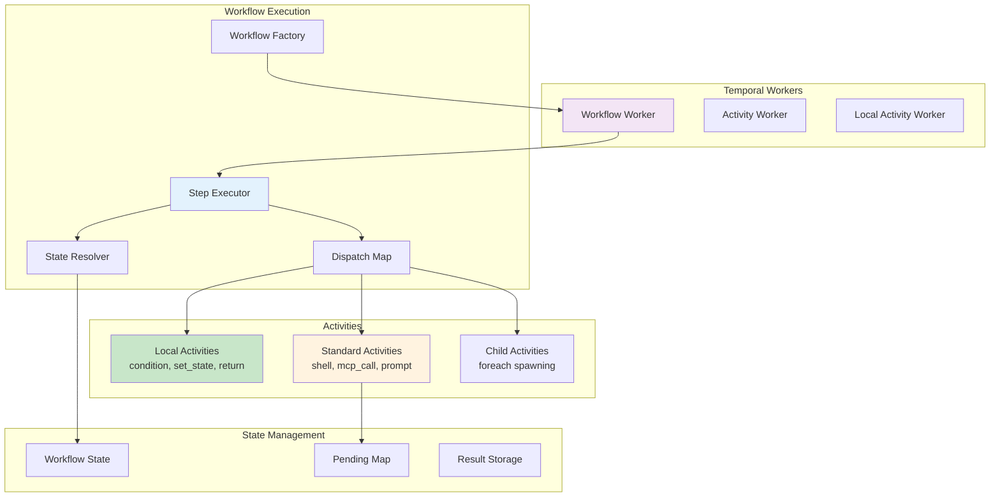

# Phase 4: Temporal Workflow Integration

## Overview
This phase creates the Temporal workflow execution framework that translates YAML workflow definitions into running Temporal workflows. It implements the workflow factory pattern, step executor with dispatch mapping, and both local and standard activities for different step types.

## Objectives
- Dynamically generate Temporal workflows from YAML definitions
- Implement step executor with proper dispatch logic
- Create local activities for server-side steps
- Create standard activities for Claude-required steps
- Handle workflow suspension and resumption for external actions

## Architecture



## Key Components

### 1. Workflow Factory (`workflow_factory.py`)

**Purpose**: Dynamically create Temporal workflow classes from YAML definitions

**Key responsibilities**:
- Generate unique workflow type name from definition
- Create workflow class with proper decorators
- Register workflow with Temporal
- Handle workflow versioning

**Workflow generation pattern**:
```python
def create_workflow_class(definition: WorkflowDefinition):
    @workflow.defn(name=f"{definition.name}:{definition.version}")
    class DynamicWorkflow:
        @workflow.run
        async def run(self, inputs: dict):
            # Initialize state
            # Execute steps via StepExecutor
            # Return final result
```

**Registration process**:
1. Load workflow definition
2. Generate workflow class
3. Register with worker
4. Store in registry for lookup

### 2. Step Executor (`step_executor.py`)

**Purpose**: Execute workflow steps in sequence with proper dispatch

**Execution flow**:
1. Get next step from definition
2. Check "when" condition if present
3. Filter state based on needs_state
4. Dispatch to appropriate handler
5. Update state with output_to
6. Handle errors per step config

**Dispatch map**:
| Step Type | Execution Mode | Handler |
|-----------|---------------|---------|
| condition | Local Activity | `execute_condition_local` |
| set_state | Local Activity | `execute_set_state_local` |
| foreach | Child Workflow | `spawn_foreach_children` |
| return | Local Activity | `execute_return_local` |
| shell | Standard Activity | `create_shell_action` |
| mcp_call | Standard Activity | `create_mcp_action` |
| prompt | Standard Activity | `create_prompt_action` |
| wait | Standard Activity | `create_wait_action` |
| delegate | Standard Activity | `create_delegate_action` |

**Step lifecycle**:
1. Pre-execution validation
2. State filtering
3. Expression evaluation
4. Step execution
5. Result processing
6. State update
7. Post-execution hooks

### 3. Local Activities (`local_activities.py`)

**Purpose**: Execute server-side steps without Claude

**Activities to implement**:

**`execute_condition_local`**:
- Evaluate "if" expression
- Return branch to execute (then/else)
- No workflow suspension

**`execute_set_state_local`**:
- Evaluate update expressions
- Apply atomic state updates
- Return updated fields

**`execute_return_local`**:
- Evaluate return value
- Signal workflow completion
- Clean up resources

**Characteristics**:
- Execute in workflow task
- No network calls
- Fast execution (< 1ms)
- No retry needed

### 4. Standard Activities (`standard_activities.py`)

**Purpose**: Create actions for Claude to execute

**Activities to implement**:

**`create_shell_action`**:
- Build shell command from template
- Set timeout and working directory
- Return pending action structure

**`create_mcp_action`**:
- Specify tool and parameters
- Handle tool-specific formatting
- Return MCP call action

**`create_prompt_action`**:
- Format message with state
- Set prompt type (info/confirm/text/choice)
- Return user interaction action

**`create_wait_action`**:
- Set duration in seconds
- Optional message during wait
- Return wait action

**`create_delegate_action`**:
- Render instruction template
- Specify target agent
- Return delegation action

**Action structure**:
```python
{
    "type": "shell|mcp_call|prompt|wait|delegate",
    "step_id": "step-123",
    "parameters": {...},
    "timeout": 30,
    "retry_policy": {...}
}
```

### 5. Child Workflow Management (`child_workflows.py`)

**Purpose**: Handle foreach parallel execution

**Foreach execution**:
1. Evaluate items expression
2. Create child workflow per item
3. Set child execution context
4. Spawn children in parallel
5. Wait for all completion
6. Collect and merge results

**Child workflow features**:
- Isolated state context
- Parent workflow ID tracking
- Result aggregation
- Error propagation options
- Cancellation handling

**Delegation modes**:
- No agent: Direct execution
- `@task`: Route to task agent
- `@{agent-name}`: Route to specific agent

### 6. Workflow Suspension (`suspension_handler.py`)

**Purpose**: Handle workflow pause/resume for external actions

**Suspension flow**:
1. Activity returns pending action
2. Store action in pending map
3. Workflow signals suspension
4. Return action to Claude
5. Wait for signal with result
6. Resume from suspension point

**Signal handling**:
- `submit_result`: Resume with result
- `cancel_workflow`: Clean termination
- `update_timeout`: Extend wait time

**State preservation**:
- Save workflow state before suspension
- Restore on resume
- Handle partial updates
- Maintain step history

## Implementation Requirements

### Temporal Configuration
- Worker configuration for workflow and activities
- Task queue assignment
- Retry policies per activity type
- Timeouts and heartbeat intervals

### State Consistency
- Atomic state updates
- Versioning for long-running workflows
- Deterministic replay support
- State snapshot capabilities

### Error Handling
- Activity retry with exponential backoff
- Workflow-level error aggregation
- Compensation for failed steps
- Dead letter queue for failed workflows

### Performance Optimization
- Local activities for fast operations
- Batch child workflow spawning
- Efficient state serialization
- Connection pooling for activities

### Performance Metrics

| Operation | Target | Measurement |
|-----------|--------|-------------|
| Workflow creation | < 50ms | Factory to registered |
| Step dispatch | < 10ms | Dispatch decision time |
| Local activity | < 5ms | Execution overhead |
| Standard activity | < 20ms | Activity creation time |
| Child workflow spawn | < 30ms per child | Foreach child creation |
| State serialization | < 10ms per MB | JSON serialization |
| Workflow suspension | < 20ms | Suspend to pending |
| Workflow resumption | < 30ms | Signal to continue |
| Query latency | < 10ms | Status query response |

## Testing Strategy

### Unit Tests
1. **Factory Tests**
   - Workflow generation
   - Registration process
   - Version handling

2. **Executor Tests**
   - Step dispatch logic
   - State filtering
   - Error handling

3. **Activity Tests**
   - Each activity type
   - Input validation
   - Result formatting

### Integration Tests
- End-to-end workflow execution
- Suspension and resumption
- Child workflow spawning
- Error recovery scenarios

### Temporal-specific Tests
- Replay determinism
- Worker failure recovery
- Signal handling
- Query support

## Dependencies
- `temporalio`: Temporal Python SDK
- Phase 2: WorkflowDefinition model
- Phase 3: Expression evaluation
- Standard library: `asyncio`, `uuid`, `logging`

## Success Criteria
1. ✅ Workflows execute from YAML definitions
2. ✅ All step types properly dispatched
3. ✅ Suspension/resume works correctly
4. ✅ Child workflows spawn and complete
5. ✅ State consistency maintained
6. ✅ Error handling follows policy
7. ✅ Performance meets targets (< 100ms overhead)

## Interface for Other Phases

**Exports**:
- `WorkflowFactory`: Creates Temporal workflows
- `StepExecutor`: Executes workflow steps
- `start_workflow()`: Helper to start workflows
- `get_workflow_status()`: Query workflow state

**Used by**:
- Phase 1: MCP tools call these functions
- Phase 5: Control flow steps use executor
- Phase 6: External actions use activities
- Phase 7: Sub-agent interface queries workflows

## Risk Mitigation
- **Non-determinism**: Strict activity boundaries
- **Long-running workflows**: Implement versioning
- **Resource leaks**: Proper cleanup in activities
- **Replay storms**: Limit workflow history size