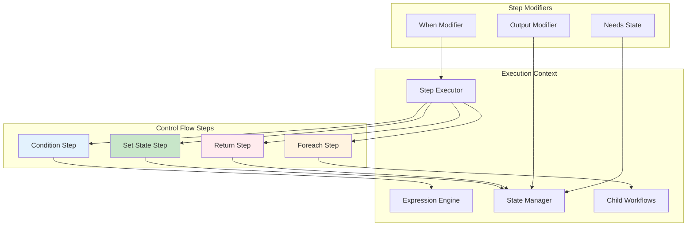

# Phase 5: Control Flow Steps Implementation

## Overview
This phase implements all server-side control flow step types that execute without Claude's involvement. These steps manipulate workflow state, make branching decisions, spawn parallel operations, and control workflow completion.

## Objectives
- Implement condition step with if/then/else branching
- Implement set_state for atomic state updates
- Implement foreach for parallel iteration with optional delegation
- Implement return step for workflow completion
- Support all step modifiers (when, output_to, needs_state)

## Architecture



## Key Components

### 1. Condition Step (`steps/condition.py`)

**Purpose**: Execute different steps based on runtime conditions

**Execution flow**:
1. Evaluate "if" expression with filtered state
2. Expression must resolve to boolean
3. If true, execute all steps in "then" branch
4. If false, execute all steps in "else" branch (if present)
5. Branches execute sequentially, not in parallel
6. Each branch step can modify state

**YAML structure**:
```yaml
- id: check-approval
  type: condition
  needs_state: ["approval_status", "approver_count"]
  if: "{{ state.approval_status == 'approved' and state.approver_count >= 2 }}"
  then:
    - id: deploy
      type: shell
      command: "kubectl apply -f deploy.yaml"
  else:
    - id: notify
      type: mcp_call
      tool: "slack.notify"
      parameters:
        message: "Deployment needs approval"
```

**Implementation requirements**:
- Branches are full step arrays, support nesting
- Branch steps inherit parent's state context
- Support nested conditions within branches
- Track execution path for debugging
- Handle missing else branch gracefully

**Error handling**:
- Invalid expression: Stop workflow
- Non-boolean result: Type coercion or error
- Branch execution failure: Propagate up

### 2. Set State Step (`steps/set_state.py`)

**Purpose**: Update workflow state with computed values

**Update operations**:
```yaml
- id: calculate-metrics
  type: set_state
  needs_state: ["test_results", "build_time"]
  updates:
    # Direct assignment
    total_tests: "{{ state.test_results | length }}"
    
    # Computed values
    pass_rate: "{{ (passed_tests / total_tests * 100) | round(2) }}"
    
    # Complex objects
    summary:
      tests: "{{ total_tests }}"
      passed: "{{ passed_tests }}"
      failed: "{{ failed_tests }}"
      
    # List operations
    all_errors: "{{ state.errors + new_errors }}"
```

**Features**:
- Evaluate all expressions before applying
- Atomic updates (all or nothing)
- Support nested object updates
- Create new state fields
- Overwrite existing fields

**Expression context**:
- Access to filtered state
- Access to inputs (read-only)
- Can reference other updates in same step
- Expressions evaluated in declaration order

**Validation**:
- Validate all expressions before execution
- Type checking for updates
- Prevent circular references
- Limit update size

### 3. Foreach Step (`steps/foreach.py`)

**Purpose**: Process collections in parallel or sequentially using sub-workflows

**Execution modes**:

| Mode | Configuration | Behavior | Use Case |
|------|--------------|----------|----------|
| **Parallel** | `sequential: false` (default) | All items processed simultaneously | Batch processing, independent tasks |
| **Sequential** | `sequential: true` | Items processed one at a time | Order-dependent tasks, rate-limited APIs |

**Delegation modes**:

| Mode | Agent Field | Behavior |
|------|------------|----------|
| Standard | Not set | Execute task workflow directly |
| Task delegation | `@task` | Delegate to sub-agent via workflow server |
| Specialized | `@agent-name` | Delegate to specific agent |

**Parallel execution flow**:
1. Evaluate "items" expression to get array
2. If `sequential: false` (default):
   - Create all child workflows simultaneously
   - Execute in parallel up to concurrency limit
3. If `sequential: true`:
   - Create and execute child workflows one at a time
   - Wait for each to complete before starting next
4. Each child receives:
   - Its item as input
   - No access to parent state (isolation)
   - Task definition to execute
5. Parent workflow waits for all children
6. Collect results in order (regardless of completion order)
7. Write results array to output_to

**YAML structure**:
```yaml
# Parallel execution (default)
- id: process-files
  type: foreach
  needs_state: ["file_list"]
  items: "{{ state.file_list }}"
  task: "analyze_file"  # References task definition
  agent: "@task"  # Optional delegation
  output_to: "analysis_results"

# Sequential execution
- id: progressive-research
  type: foreach
  needs_state: ["research_topics"]
  items: "{{ state.research_topics }}"
  task: "research_topic"
  agent: "@task"
  sequential: true  # Process one at a time
  output_to: "research_findings"
```

**Child workflow context**:
```python
{
    "item": current_item,
    "index": item_index,
    "total": total_items,
    "is_first": item_index == 0,
    "is_last": item_index == total_items - 1
}
```

**Sequential execution implementation**:
```python
async def execute_foreach_sequential(items, task_def, agent):
    results = []
    for index, item in enumerate(items):
        child_context = {
            "item": item,
            "index": index,
            "total": len(items),
            "is_first": index == 0,
            "is_last": index == len(items) - 1
        }
        
        # Start child workflow
        child_handle = await start_child_workflow(
            task_def,
            child_context,
            parent_id=workflow_id,
            child_id=f"{workflow_id}_child_{index}"
        )
        
        # Wait for completion before continuing
        result = await child_handle.result()
        results.append(result)
        
        # Optional: Pass result to next iteration context
        if index < len(items) - 1:
            # Can influence next iteration if needed
            pass
            
    return results
```

**Features**:
- Parallel or sequential execution modes
- Concurrency limit for parallel mode (default: 10)
- Ordered result collection
- Error handling per child
- Progress tracking with index context
- Cancellation support
- State isolation between children

**Task definition**:
- Separate YAML file or inline definition
- Full workflow with steps
- Access to item context
- Can return values

### 4. Return Step (`steps/return_step.py`)

**Purpose**: Complete workflow or sub-task with final value

**Execution**:
1. Evaluate value expression
2. Set as workflow result
3. Immediately terminate workflow
4. No subsequent steps execute

**YAML structure**:
```yaml
- id: early-exit
  type: return
  needs_state: ["error_count", "processed_items"]
  value:
    success: false
    reason: "Too many errors"
    processed: "{{ state.processed_items }}"
    errors: "{{ state.error_count }}"
```

**Contexts**:
- Main workflow: Sets final workflow result
- Sub-task in foreach: Returns to parent
- Child workflow: Returns to parent foreach

**Value types**:
- Scalar values (string, number, boolean)
- Objects (dictionaries)
- Arrays
- Null for early termination

### 5. Step Modifiers (`step_modifiers.py`)

**Purpose**: Common functionality for all step types

**When Modifier**:
- Conditional step execution
- Evaluated before step runs
- Skip step if false
- Available on all step types

```yaml
- id: conditional-cleanup
  type: shell
  when: "{{ state.needs_cleanup }}"
  command: "rm -rf temp/*"
```

**Output_to Modifier**:
- Store step result in state
- Create or overwrite field
- Available on all steps except return

```yaml
- id: get-version
  type: shell
  command: "git describe --tags"
  output_to: "version"
```

**Needs_state Modifier**:
- Declare state access requirements
- Enforced by state filter
- Security and documentation
- Required for state access

## Implementation Requirements

### Execution Semantics
- Steps execute sequentially unless parallel
- State updates visible to subsequent steps
- Failed steps stop workflow (unless configured)
- When conditions evaluated per step

### State Consistency
- Thread-safe state updates
- Atomic operations
- No partial updates
- State versioning for debugging

### Performance Targets
- Condition evaluation < 5ms
- State updates < 10ms
- Foreach child spawn < 50ms per child
- Return immediate

### Error Handling
- Clear error messages with step context
- Graceful degradation where possible
- Rollback capabilities for state
- Timeout handling for long operations

## Testing Strategy

### Unit Tests
1. **Condition Tests**
   - True/false branches
   - Nested conditions
   - Missing else branch
   - Complex expressions

2. **Set State Tests**
   - Simple updates
   - Nested objects
   - Computed values
   - Atomic behavior

3. **Foreach Tests**
   - Parallel execution
   - Result collection
   - Error in child
   - Delegation modes

4. **Return Tests**
   - Value types
   - Early exit
   - From nested context

### Integration Tests
- Complex control flows
- State consistency
- Performance under load
- Error propagation

## Dependencies
- Phase 3: Expression evaluation
- Phase 4: Temporal activities
- Standard library: `asyncio`, `copy`

## Success Criteria
1. ✅ All control flow steps execute correctly
2. ✅ State updates are atomic and consistent
3. ✅ Foreach parallelism works with limits
4. ✅ Step modifiers work on all steps
5. ✅ Nested control flows supported
6. ✅ Performance meets targets
7. ✅ Clear error messages with context

## Interface for Other Phases

**Exports**:
- `ConditionStep`: Condition implementation
- `SetStateStep`: State update implementation
- `ForeachStep`: Parallel iteration
- `ReturnStep`: Workflow completion
- `StepModifiers`: Common modifier logic

**Used by**:
- Phase 4: Step executor dispatches to these
- Phase 6: External steps use modifier logic
- Phase 7: Sub-agents execute control flows

## Risk Mitigation
- **State races**: Use locks for updates
- **Infinite loops**: Limit nesting depth
- **Memory usage**: Stream large collections
- **Deadlocks**: Timeout on all operations