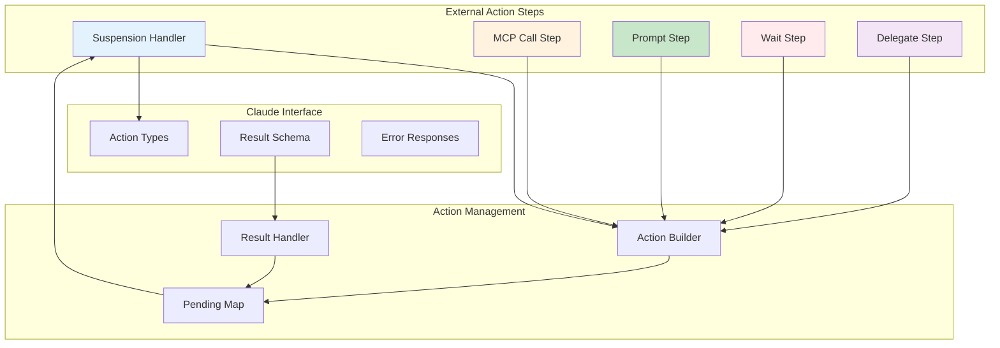

# Phase 6: External Action Steps & Claude Integration

## Overview
This phase implements all Claude-required action step types that suspend the workflow and return actions for Claude to execute. These steps handle shell commands, MCP tool calls, user interactions, timed pauses, and sub-agent delegation.

## Objectives
- Implement shell command execution requests
- Implement MCP tool invocation requests
- Implement user interaction prompts
- Implement timed wait operations
- Implement sub-agent task delegation
- Handle workflow suspension and result submission

## Architecture



## Key Components

### 1. Shell Step (`steps/shell.py`)

**Purpose**: Execute shell commands in Claude's environment

**Action generation**:
```python
{
    "type": "shell",
    "step_id": "run-tests",
    "command": "cd /project && npm test --coverage",
    "timeout": 120,
    "working_dir": "/project",
    "env": {
        "NODE_ENV": "test"
    }
}
```

**YAML structure**:
```yaml
- id: run-tests
  type: shell
  needs_state: ["test_directory"]
  command: "cd {{ state.test_directory }} && npm test"
  timeout: 120  # seconds
  output_to: "test_results"
```

**Features**:
- Template command with state values
- Configure timeout (default 120s)
- Set working directory
- Environment variables
- Capture stdout, stderr, exit code

**Result structure**:
```python
{
    "stdout": "...",
    "stderr": "...",
    "exit_code": 0,
    "duration": 1.23,
    "truncated": false
}
```

### 2. MCP Call Step (`steps/mcp_call.py`)

**Purpose**: Call MCP tools available in Claude's environment

**Action generation**:
```python
{
    "type": "mcp_call",
    "step_id": "create-issue",
    "tool": "github.create_issue",
    "parameters": {
        "repo": "myorg/myrepo",
        "title": "Build failed",
        "body": "Error details...",
        "labels": ["bug", "ci"]
    }
}
```

**YAML structure**:
```yaml
- id: create-github-issue
  type: mcp_call
  needs_state: ["error_details", "repository"]
  tool: "github.create_issue"
  parameters:
    repo: "{{ state.repository }}"
    title: "Build failed: {{ state.error_details.message }}"
    body: |
      Error at: {{ state.error_details.timestamp }}
      Exit code: {{ state.error_details.exit_code }}
    labels: ["bug", "ci-failure"]
  output_to: "issue"
```

**Features**:
- Any MCP tool available to Claude
- Template parameters with state
- Tool-specific result structure
- Error handling per tool
- Async tool support

**Common MCP tools**:
- `github.*`: GitHub operations
- `slack.*`: Slack messaging
- `file.*`: File operations
- `web.*`: Web requests

### 3. Prompt Step (`steps/prompt.py`)

**Purpose**: Display information or collect user input

**Prompt types**:

| Type | Purpose | Result |
|------|---------|--------|
| info | Display message | `{acknowledged: true}` |
| confirm | Yes/No question | `{confirmed: true/false}` |
| text | Text input | `{input: "user text"}` |
| choice | Select option | `{selected: "option"}` |

**Action generation**:
```python
{
    "type": "prompt",
    "step_id": "confirm-deploy",
    "prompt_type": "confirm",
    "message": "Deploy version 2.0.1 to production?",
    "options": None  # For choice type: ["option1", "option2"]
}
```

**YAML structure**:
```yaml
- id: get-user-confirmation
  type: prompt
  needs_state: ["version", "environment"]
  message: |
    Deploy version {{ state.version }} to {{ state.environment }}?
    This action cannot be undone.
  type: "confirm"
  output_to: "user_decision"
```

**Features**:
- Template message with state
- Different interaction types
- Multi-line messages
- Choice options for selection
- Timeout handling

### 4. Wait Step (`steps/wait.py`)

**Purpose**: Pause workflow execution for specified duration

**Action generation**:
```python
{
    "type": "wait",
    "step_id": "wait-for-dns",
    "duration_seconds": 30,
    "message": "Waiting for DNS propagation..."
}
```

**YAML structure**:
```yaml
- id: wait-for-propagation
  type: wait
  duration_seconds: 30
  message: "Waiting for DNS changes to propagate..."
  output_to: "wait_complete"
```

**Features**:
- Fixed duration wait
- Optional status message
- No user interaction required
- Automatic resume after duration
- Can be cancelled

**Result structure**:
```python
{
    "waited": true,
    "duration": 30,
    "cancelled": false
}
```

### 5. Delegate Step (`steps/delegate.py`)

**Purpose**: Delegate a task to a Claude sub-agent

**Action generation**:
```python
{
    "type": "delegate",
    "step_id": "research-task",
    "agent": "@codebase-researcher",
    "instructions": "Analyze the authentication system...",
    "context": {
        "codebase_summary": "...",
        "requirements": [...]
    }
}
```

**YAML structure**:
```yaml
- id: research-architecture
  type: delegate
  needs_state: ["codebase_summary", "requirements"]
  instructions: |
    Analyze this codebase and suggest improvements.
    
    Current architecture:
    {{ state.codebase_summary }}
    
    Requirements:
    {{ state.requirements | join('\n') }}
  agent: "@codebase-researcher"
  output_to: "analysis"
```

**Features**:
- Template instructions with state
- Route to specific agents
- Pass context to sub-agent
- Structured result return
- Sub-agent isolation

**Agent types**:
- `@task`: General task execution
- `@codebase-researcher`: Code analysis
- `@code-standards-reviewer`: Standards check
- Custom agents as configured

### 6. Action Builder (`action_builder.py`)

**Purpose**: Build consistent action structures

**Responsibilities**:
- Generate unique action IDs
- Apply templates with state
- Validate action parameters
- Set default values
- Track action metadata

**Action structure**:
```python
{
    "workflow_id": "wf-123",
    "step_id": "step-456",
    "type": "shell|mcp_call|prompt|wait|delegate",
    "parameters": {...},
    "metadata": {
        "created_at": "2024-01-01T00:00:00Z",
        "timeout": 120,
        "retry_count": 0
    }
}
```

### 7. Suspension Handler (`suspension_handler.py`)

**Purpose**: Manage workflow suspension for actions

**Suspension flow**:
1. Step creates action via builder
2. Store in pending actions map
3. Create Temporal signal handler
4. Return action to Claude
5. Workflow suspends (Temporal)
6. Wait for submit_result signal

**Signal handling**:
```python
async def handle_submit_result(workflow_id: str, result: dict):
    # Retrieve pending action
    # Validate result against schema
    # Signal workflow to resume
    # Pass result to workflow
    # Remove from pending map
```

**Timeout handling**:
- Default timeout per action type
- Configurable per step
- Timeout signal to workflow
- Cleanup on timeout

### 8. Result Handler (`result_handler.py`)

**Purpose**: Process and validate action results

**Validation**:
- Check result structure
- Validate against step schema
- Type coercion if needed
- Error message extraction

**Result processing**:
- Extract relevant fields
- Transform to workflow format
- Handle partial results
- Error to exception conversion

## Implementation Requirements

### Action Schemas
Define strict schemas for:
- Each action type
- Each result type
- Error responses
- Metadata fields

### State Management
- Track pending actions
- Prevent duplicate submissions
- Handle concurrent results
- Clean up on completion

### Error Handling
- Invalid result format
- Timeout exceeded
- User cancellation
- Network failures

### Security
- Validate commands
- Sanitize parameters
- Limit resource usage
- Audit action execution

## Testing Strategy

### Unit Tests
1. **Step Tests**
   - Action generation
   - Template rendering
   - Parameter validation

2. **Handler Tests**
   - Suspension flow
   - Result processing
   - Timeout handling

3. **Builder Tests**
   - Action structure
   - ID generation
   - Metadata

### Integration Tests
- Full suspend/resume cycle
- Multiple pending actions
- Error recovery
- Timeout scenarios

## Dependencies
- Phase 3: Expression evaluation for templates
- Phase 4: Temporal suspension mechanism
- Phase 1: Pending actions map
- Standard library: `uuid`, `datetime`

## Success Criteria
1. ✅ All external action types implemented
2. ✅ Workflow suspension works correctly
3. ✅ Result submission resumes workflow
4. ✅ Templates render with state
5. ✅ Timeouts handled gracefully
6. ✅ Clear action/result schemas
7. ✅ Sub-agent delegation works

## Interface for Other Phases

**Exports**:
- Step implementations for each type
- `ActionBuilder`: Create actions
- `SuspensionHandler`: Manage suspension
- `ResultHandler`: Process results

**Used by**:
- Phase 4: Step executor uses these
- Phase 1: MCP tools trigger actions
- Phase 7: Sub-agents receive delegated tasks

## Risk Mitigation
- **Result loss**: Persist pending actions
- **Timeout issues**: Configurable timeouts
- **Schema mismatch**: Strict validation
- **Security**: Command sanitization