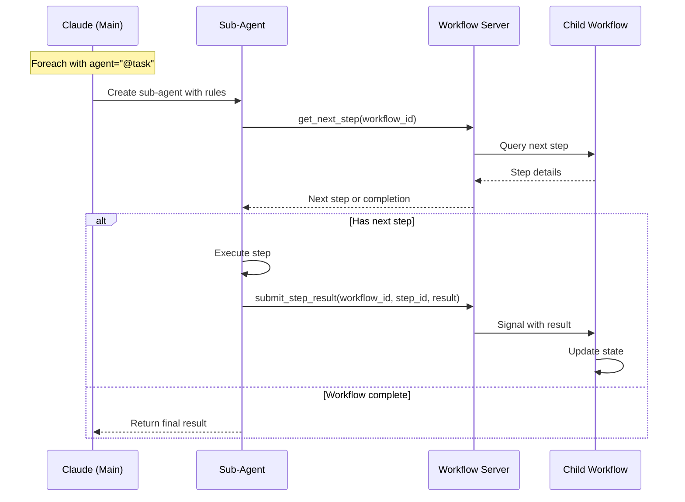

# Phase 7: Sub-Agent Workflow Server Interface

## Overview
This phase builds the workflow server interface that enables sub-agents to execute delegated tasks step-by-step. Sub-agents interact with the workflow server to get next steps, submit results, and complete task workflows without knowledge of the parent workflow context.

## Objectives
- Implement get_next_step tool for sub-agents
- Implement submit_step_result tool for results
- Implement get_workflow_state debugging tool
- Generate runtime prompts for sub-agents
- Manage workflow-server-rules protocol
- Ensure state isolation for child workflows

## Architecture



## Key Components

### 1. Sub-Agent MCP Tools (`tools/subagent.py`)

**Purpose**: MCP tools for sub-agent interaction

**Tool: get_next_step**
```python
@dataclass
class GetNextStepRequest:
    workflow_id: str

@dataclass  
class GetNextStepResponse:
    status: str  # "pending_step" | "complete" | "error"
    step: Optional[StepDetails] = None
    final_result: Optional[Any] = None
    error: Optional[str] = None

@dataclass
class StepDetails:
    step_id: str
    type: str  # "shell" | "mcp_call" | "set_state" | etc
    parameters: dict[str, Any]
    timeout: Optional[int] = None
```

**Tool: submit_step_result**
```python
@dataclass
class SubmitStepResultRequest:
    workflow_id: str
    step_id: str
    result: Any

@dataclass
class SubmitStepResultResponse:
    status: str  # "accepted" | "error"
    message: Optional[str] = None
```

**Tool: get_workflow_state**
```python
@dataclass
class GetWorkflowStateRequest:
    workflow_id: str
    
@dataclass
class GetWorkflowStateResponse:
    workflow_id: str
    current_step: Optional[str]
    state: dict[str, Any]
    completed_steps: list[str]
    remaining_steps: int
```

### 2. Workflow Server Interface (`subagent_interface.py`)

**Purpose**: Bridge between sub-agents and child workflows

**Responsibilities**:
- Track active child workflows
- Map workflow IDs to Temporal handles
- Queue steps for sub-agent execution
- Process sub-agent results
- Handle workflow completion

**Workflow tracking**:
```python
class WorkflowTracker:
    def __init__(self):
        self.active_workflows: dict[str, WorkflowHandle] = {}
        self.step_queues: dict[str, Queue[StepDetails]] = {}
        self.pending_results: dict[str, Any] = {}
        
    def register_child(self, workflow_id: str, handle: WorkflowHandle):
        # Register new child workflow
        
    def queue_step(self, workflow_id: str, step: StepDetails):
        # Add step to sub-agent queue
        
    def get_next_step(self, workflow_id: str) -> Optional[StepDetails]:
        # Retrieve next queued step
        
    def submit_result(self, workflow_id: str, step_id: str, result: Any):
        # Process step result
```

### 3. Prompt Generator (`prompt_generator.py`)

**Purpose**: Generate runtime prompts for sub-agents

**Prompt components**:
1. **System rules**: How to interact with workflow server
2. **Task context**: What task is being executed
3. **Available tools**: MCP tools accessible
4. **State context**: Current workflow state (if allowed)
5. **Success criteria**: What constitutes completion

**Template structure**:
```markdown
<workflow-server-rules>
You are executing a workflow task through the Temporal workflow server.
You must call the workflow server to get each next step to execute.

## How to interact with the workflow server:
1. Call `get_next_step(workflow_id)` to receive the next workflow step
2. Execute the step based on its type:
   - shell: Execute the command and return stdout/stderr/exit_code
   - mcp_call: Call the specified MCP tool with parameters
   - set_state: Acknowledge state updates (server handles internally)
   - return: Acknowledge completion
3. Call `submit_step_result(workflow_id, step_id, result)` with the result
4. Repeat until you receive {status: "complete"}

## Workflow Context:
- Workflow ID: {workflow_id}
- Task: {task_name}
- Input: {item_from_foreach}
</workflow-server-rules>

Begin by calling get_next_step with your workflow ID.
```

**Prompt generation logic**:
- Use task definition metadata
- Include relevant context
- Customize per agent type
- Add debugging hints if enabled

### 4. Child Workflow Manager (`child_workflow.py`)

**Purpose**: Manage child workflow execution for sub-agents

**Child workflow lifecycle**:
1. Parent foreach spawns child
2. Child registered with tracker
3. Steps queued for sub-agent
4. Sub-agent executes steps
5. Results update child state
6. Completion returns to parent

**State isolation**:
```python
class ChildWorkflowContext:
    def __init__(self, item: Any, index: int, total: int):
        self.state = {
            "item": item,
            "index": index,
            "total": total
        }
        self.completed_steps = []
        self.current_step = None
        
    def get_filtered_state(self, needs_state: list[str]) -> dict:
        # Return only requested state fields
        
    def update_state(self, updates: dict):
        # Apply state updates from step
```

**Step execution modes**:

| Step Type | Sub-Agent Execution |
|-----------|-------------------|
| shell | Sub-agent runs command |
| mcp_call | Sub-agent calls tool |
| prompt | Sub-agent shows to user |
| set_state | Server updates, agent acknowledges |
| condition | Server evaluates, queues branch |
| return | Server handles, sends completion |

### 5. Step Queue Manager (`step_queue.py`)

**Purpose**: Queue and dispatch steps to sub-agents

**Queue operations**:
- Add steps from workflow execution
- Retrieve next step for sub-agent
- Handle step dependencies
- Manage parallel step execution

**Step prioritization**:
```python
class StepQueue:
    def __init__(self):
        self.pending: list[StepDetails] = []
        self.in_progress: dict[str, StepDetails] = {}
        self.completed: set[str] = set()
        
    def enqueue(self, step: StepDetails, priority: int = 0):
        # Add step with priority
        
    def dequeue(self) -> Optional[StepDetails]:
        # Get highest priority ready step
        
    def mark_complete(self, step_id: str):
        # Mark step as done
```

### 6. Result Processor (`result_processor.py`)

**Purpose**: Process and validate sub-agent results

**Result processing flow**:
1. Receive result from sub-agent
2. Validate against step schema
3. Transform to workflow format
4. Update child workflow state
5. Check for workflow completion
6. Return status to sub-agent

**Validation per step type**:
```python
def validate_shell_result(result: dict) -> bool:
    required = ["stdout", "stderr", "exit_code"]
    return all(k in result for k in required)
    
def validate_mcp_result(result: dict) -> bool:
    # Tool-specific validation
    return "data" in result or "error" in result
    
def validate_prompt_result(prompt_type: str, result: dict) -> bool:
    if prompt_type == "confirm":
        return "confirmed" in result
    elif prompt_type == "text":
        return "input" in result
    # etc...
```

## Implementation Requirements

### Protocol Compliance
- Follow workflow-server-rules exactly
- Consistent response formats
- Clear error messages
- Idempotent operations

### State Management
- Isolation between children
- No parent state leakage
- Consistent state updates
- State snapshot capability

### Error Handling
- Invalid workflow ID
- Step already completed
- Result validation failure
- Workflow already complete

### Performance
- Queue operations O(1)
- State updates atomic
- Minimal latency
- Efficient serialization

## Testing Strategy

### Unit Tests
1. **Tool Tests**
   - Request/response format
   - Error conditions
   - Edge cases

2. **Queue Tests**
   - Priority ordering
   - Concurrent access
   - Empty queue

3. **State Tests**
   - Isolation verification
   - Update atomicity
   - Filtered access

### Integration Tests
- Full sub-agent workflow
- Multiple concurrent sub-agents
- Error recovery
- State consistency

### Protocol Tests
- Message format compliance
- Response timing
- Retry handling
- Timeout behavior

## Dependencies
- Phase 4: Child workflow spawning
- Phase 5: Control flow execution
- Phase 6: External action handling
- Standard library: `queue`, `threading`

## Success Criteria
1. ✅ Sub-agents can execute complete workflows
2. ✅ State isolation maintained
3. ✅ Steps execute in correct order
4. ✅ Results properly processed
5. ✅ Errors handled gracefully
6. ✅ Multiple sub-agents supported
7. ✅ Clear debugging capabilities

## Interface for Other Phases

**Exports**:
- Sub-agent MCP tools
- `WorkflowTracker`: Track child workflows
- `PromptGenerator`: Generate sub-agent prompts
- `StepQueue`: Manage step execution

**Used by**:
- Phase 5: Foreach delegates to sub-agents
- Phase 6: Delegate step uses this interface
- Phase 1: MCP tools include sub-agent tools

## Risk Mitigation
- **State leakage**: Strict isolation enforcement
- **Queue overflow**: Limit queue size
- **Orphaned workflows**: Timeout and cleanup
- **Result conflicts**: Version checking