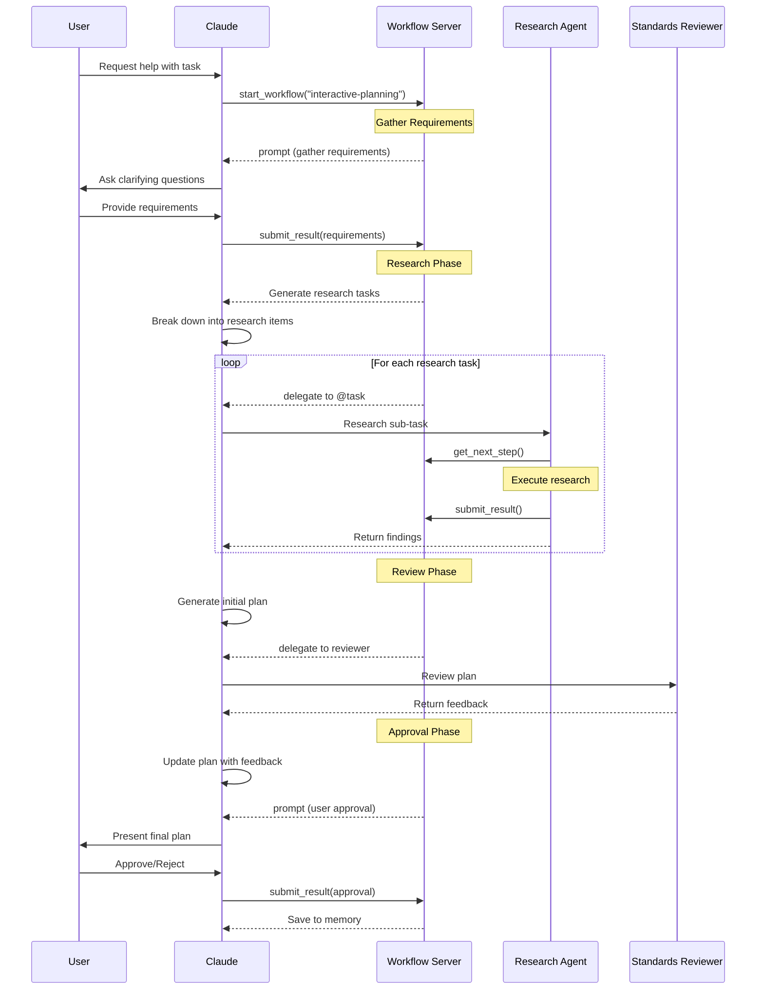

# Phase 8: MVP Workflow & End-to-End Testing

## Overview
This phase implements and tests the complete Interactive Planning Workflow, which serves as the MVP demonstrating all system capabilities. This workflow showcases user interaction, dynamic task generation, parallel research with sub-agents, multi-stage review, and persistent memory integration.

## Objectives
- Implement the Interactive Planning Workflow from the design document
- Create comprehensive end-to-end test suite
- Establish performance benchmarks
- Document deployment procedures
- Validate all integrated components work together

## MVP Workflow: Interactive Planning

### Workflow Overview



### Workflow Definition (`workflows/interactive-planning.yaml`)

```yaml
name: planning:interactive
version: 1.0.0
description: Interactive planning workflow with research and review

inputs:
  task_description:
    type: string
    required: true
    description: Initial task from user
    
  max_research_tasks:
    type: number
    default: 5
    description: Maximum parallel research tasks
    
  require_approval:
    type: boolean
    default: true
    description: Require user approval before execution

initial_state:
  requirements: null
  research_tasks: []
  research_results: []
  initial_plan: null
  review_feedback: null
  final_plan: null
  approved: false

steps:
  # Phase 1: Gather Requirements
  - id: gather-requirements
    type: prompt
    message: |
      I'll help you with: {{ inputs.task_description }}
      
      Please provide additional requirements:
      - What are the key objectives?
      - Any constraints or preferences?
      - Expected timeline?
    type: text
    output_to: requirements

  # Phase 2: Generate Research Tasks
  - id: generate-research-tasks
    type: set_state
    needs_state: ["requirements"]
    updates:
      research_tasks: |
        {{ generate_research_tasks(
          inputs.task_description,
          state.requirements
        ) }}

  # Phase 3: Execute Research (Parallel)
  - id: research-phase
    type: foreach
    needs_state: ["research_tasks"]
    items: "{{ state.research_tasks[:inputs.max_research_tasks] }}"
    task: research_task
    agent: "@task"
    output_to: research_results

  # Phase 4: Generate Initial Plan
  - id: create-plan
    type: delegate
    needs_state: ["requirements", "research_results"]
    instructions: |
      Based on the research findings, create a detailed plan:
      
      Requirements: {{ state.requirements }}
      
      Research Results:
      {{ state.research_results | tojson(indent=2) }}
      
      Generate a structured plan with:
      1. Overview
      2. Step-by-step approach
      3. Risk mitigation
      4. Success criteria
    agent: "@task"
    output_to: initial_plan

  # Phase 5: Review Plan
  - id: review-plan
    type: delegate
    needs_state: ["initial_plan"]
    instructions: |
      Review this plan for:
      - Technical correctness
      - Security considerations
      - Best practices
      - Completeness
      
      Plan:
      {{ state.initial_plan }}
      
      Provide specific feedback and suggestions.
    agent: "@code-standards-reviewer"
    output_to: review_feedback

  # Phase 6: Incorporate Feedback
  - id: update-plan
    type: set_state
    needs_state: ["initial_plan", "review_feedback"]
    updates:
      final_plan: |
        {{ merge_plan_with_feedback(
          state.initial_plan,
          state.review_feedback
        ) }}

  # Phase 7: Get Approval (Conditional)
  - id: approval-check
    type: condition
    needs_state: []
    if: "{{ inputs.require_approval }}"
    then:
      - id: request-approval
        type: prompt
        needs_state: ["final_plan"]
        message: |
          Final Plan:
          {{ state.final_plan }}
          
          Do you approve this plan?
        type: confirm
        output_to: approval_response
        
      - id: set-approval
        type: set_state
        needs_state: ["approval_response"]
        updates:
          approved: "{{ state.approval_response.confirmed }}"
    else:
      - id: auto-approve
        type: set_state
        updates:
          approved: true

  # Phase 8: Save Results
  - id: save-to-memory
    type: mcp_call
    needs_state: ["final_plan", "approved"]
    tool: "memory.save"
    parameters:
      key: "plan_{{ inputs.task_description | hash }}"
      value:
        plan: "{{ state.final_plan }}"
        approved: "{{ state.approved }}"
        timestamp: "{{ now() }}"
    output_to: memory_result

  # Phase 9: Return Result
  - id: complete
    type: return
    needs_state: ["final_plan", "approved", "memory_result"]
    value:
      success: true
      plan: "{{ state.final_plan }}"
      approved: "{{ state.approved }}"
      saved: "{{ state.memory_result.success }}"
```

### Sub-Task Definition (`workflows/research_task.yaml`)

```yaml
name: planning:research_task
version: 1.0.0
description: Individual research task execution

initial_state:
  query: "{{ item }}"  # From foreach
  results: null

steps:
  - id: search-web
    type: mcp_call
    needs_state: ["query"]
    tool: "web.search"
    parameters:
      query: "{{ state.query }}"
      max_results: 5
    output_to: search_results

  - id: analyze-results
    type: set_state
    needs_state: ["search_results"]
    updates:
      results: |
        {{ analyze_search_results(state.search_results) }}

  - id: save-research
    type: mcp_call
    needs_state: ["query", "results"]
    tool: "memory.add"
    parameters:
      category: "research"
      content:
        query: "{{ state.query }}"
        findings: "{{ state.results }}"
    output_to: save_result

  - id: return-findings
    type: return
    needs_state: ["query", "results"]
    value:
      query: "{{ state.query }}"
      findings: "{{ state.results }}"
      sources: "{{ state.search_results.sources }}"
```

## End-to-End Test Suite

### 1. Integration Test Framework (`tests/workflow_server/test_e2e.py`)

**Test structure**:
```python
class TestInteractivePlanning:
    @pytest.fixture
    async def workflow_server(self):
        # Start Temporal
        # Start MCP server
        # Load workflows
        # Return configured server
        
    async def test_full_planning_workflow(self, workflow_server):
        # Start workflow
        # Simulate user inputs
        # Verify research execution
        # Check plan generation
        # Validate approval flow
        # Assert final state
        
    async def test_research_parallelism(self, workflow_server):
        # Start with multiple research tasks
        # Verify parallel execution
        # Check result aggregation
        
    async def test_approval_rejection(self, workflow_server):
        # Test rejection path
        # Verify workflow termination
        
    async def test_error_recovery(self, workflow_server):
        # Inject failures
        # Verify recovery mechanisms
```

### 2. Performance Benchmarks (`tests/workflow_server/test_performance.py`)

**Metrics to measure**:
- Workflow startup time
- Step execution latency
- State update overhead
- Memory usage per workflow
- Concurrent workflow capacity

**Benchmark targets**:
```python
PERFORMANCE_TARGETS = {
    "workflow_start": 100,  # ms
    "step_execution": 50,   # ms
    "state_update": 10,     # ms
    "memory_per_workflow": 10,  # MB
    "concurrent_workflows": 100
}
```

### 3. Load Testing (`tests/workflow_server/test_load.py`)

**Load scenarios**:
- 10 concurrent workflows
- 100 parallel foreach items
- 1000 state updates
- Long-running workflows (1 hour)
- Rapid start/stop cycles

### 4. Failure Testing (`tests/workflow_server/test_failures.py`)

**Failure scenarios**:
- Temporal server disconnect
- MCP tool failures
- Sub-agent timeouts
- Invalid user inputs
- State corruption

## Deployment Configuration

### 1. Docker Deployment (`docker-compose.yml`)

```yaml
version: '3.8'

services:
  temporal:
    image: temporalio/auto-setup:latest
    ports:
      - "7233:7233"
    environment:
      - DB=postgresql
      - POSTGRES_USER=temporal
      - POSTGRES_PWD=temporal
    depends_on:
      - postgresql

  postgresql:
    image: postgres:14
    environment:
      POSTGRES_USER: temporal
      POSTGRES_PASSWORD: temporal
    volumes:
      - temporal_data:/var/lib/postgresql/data

  workflow-server:
    build: .
    environment:
      - TEMPORAL_HOST=temporal:7233
      - MCP_FILE_ROOT=/workflows
      - LOG_LEVEL=INFO
    volumes:
      - ./workflows:/workflows
    depends_on:
      - temporal
    command: python -m aromcp.workflow_server

volumes:
  temporal_data:
```

### 2. Environment Configuration (`.env`)

```bash
# Temporal Configuration
TEMPORAL_HOST=localhost:7233
TEMPORAL_NAMESPACE=default
TEMPORAL_TASK_QUEUE=mcp-workflows

# MCP Configuration
MCP_FILE_ROOT=/home/user/workflows
WORKFLOW_DEFINITIONS_PATH=./workflows

# Performance Tuning
MAX_CONCURRENT_WORKFLOWS=50
WORKER_THREADS=10
CACHE_SIZE=100
CACHE_TTL=300

# Logging
LOG_LEVEL=INFO
LOG_FORMAT=json
```

### 3. Production Checklist

**Pre-deployment**:
- [ ] All tests passing
- [ ] Performance benchmarks met
- [ ] Security review complete
- [ ] Documentation updated
- [ ] Workflows validated

**Deployment**:
- [ ] Temporal server running
- [ ] Database initialized
- [ ] Workers started
- [ ] Health checks passing
- [ ] Monitoring enabled

**Post-deployment**:
- [ ] Smoke tests passing
- [ ] Metrics flowing
- [ ] Logs aggregating
- [ ] Alerts configured
- [ ] Backup verified

## Monitoring & Observability

### Metrics to Track
- Workflow start rate
- Workflow completion rate
- Step execution time (P50, P95, P99)
- Error rate by step type
- Cache hit rate
- Memory usage
- CPU usage

### Logging Strategy
- Structured JSON logs
- Correlation IDs for tracing
- Debug logs for development
- Info logs for production
- Error logs with full context

### Health Checks
- Temporal connectivity
- Worker status
- Cache status
- Memory usage
- Queue depths

## Success Criteria

1. ✅ Interactive Planning Workflow executes end-to-end
2. ✅ All components integrate correctly
3. ✅ Performance meets targets
4. ✅ Error handling works as designed
5. ✅ Sub-agent delegation successful
6. ✅ State management consistent
7. ✅ User interactions smooth
8. ✅ Memory persistence functional
9. ✅ Load tests pass
10. ✅ Deployment automated

## Documentation Deliverables

1. **User Guide**: How to create and run workflows
2. **API Reference**: All MCP tools and parameters
3. **Workflow Examples**: Sample workflows for common tasks
4. **Troubleshooting Guide**: Common issues and solutions
5. **Performance Tuning**: Optimization guidelines

## Risk Mitigation

- **Complex workflows**: Start with simple, add complexity gradually
- **Performance issues**: Profile and optimize hot paths
- **Integration failures**: Comprehensive integration tests
- **Production issues**: Staged rollout with monitoring

## Next Steps

After MVP completion:
1. Implement `goto` step type for loops
2. Add more MCP tool integrations
3. Enhance error handling and retry logic
4. Build workflow composition features
5. Create workflow marketplace/library